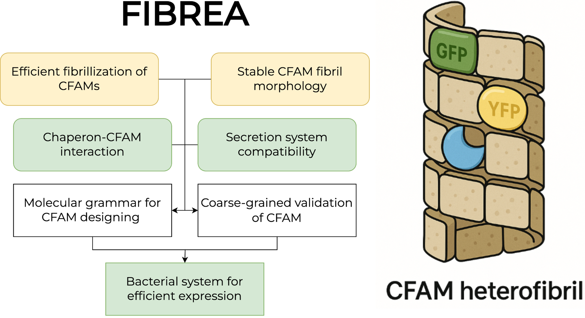
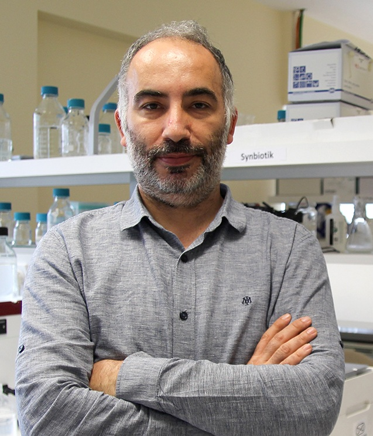
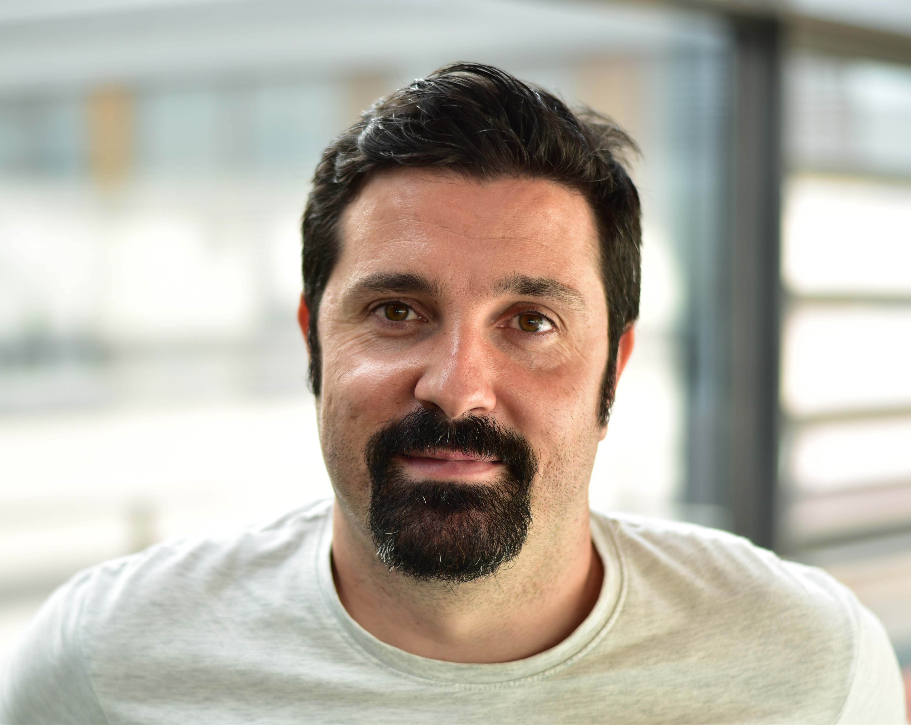

M-ERA.NET Call 2025 – Functional materials Duration: 36 months · TRL 1 → 3   
  
**Coordinator:** Medical University of Białystok, Poland

Designing programmable, curli-based amyloid materials through molecular grammar, simulations and biofabrication.

------------------------------------------------------------------------

## Project overview

FIBREA tackles a central challenge in functional materials: **how to design amyloid-based biomaterials rationally**, rather than by trial and error.

We focus on **curli-based functional amyloid materials (CFAMs)**, engineered variants of CsgA that:

- self-assemble into fibrils with **controllable morphology**  
- remain compatible with **bacterial secretion** and **intracellular inhibition**  
- carry modular **functional domains** such as fluorophores or enzymes

The core idea is to learn a **molecular grammar** that links CFAM sequence features to fibril properties, co-assembly behavior, and production constraints.

### Project at a glance

- **Acronym:** FIBREA  
- **Call:** M-ERA.NET 2025 – functional materials  
- **Duration:** 36 months  
- **TRL:** 1 → 3  
- **Main outputs:**
  - Molecular grammar for CFAM design  
  - Coarse-grained simulation framework (CALVADOS-based)  
  - Optimized bacterial expression system  
  - Fluorescent and catalytic CFAM prototypes  

------------------------------------------------------------------------

## Objectives

FIBREA builds a full **design–build–test–learn** loop for amyloid materials.

- Develop a **generalizable molecular grammar** for stable CFAMs with tunable self-assembly.
- Encode compatibility with:
  - **curli secretion machinery (CsgEFG)**
  - **intracellular chaperones** (CsgC, Spy)
- Model CFAM assembly and inhibition using **coarse-grained simulations** (CALVADOS).
- Optimize a **bacterial expression system** for high-yield CFAM production.
- Demonstrate:
  - **fluorescent CFAMs** (GFP/YFP, including FRET-based co-assembly)
  - **enzymatic CFAMs** for multi-step catalytic cascades.
- Advance the overall system from **TRL 1 to TRL 3**.

------------------------------------------------------------------------

## Concept and approach

FIBREA combines **AI**, **physics-based simulations** and **wet-lab validation** into a single workflow.

- **Molecular grammar (WP1)**
  - Conditional denoising diffusion model trained on \> 43 000 curli operons.  
  - Encodes secretion compatibility, inhibition susceptibility, and fibrillization behavior.
- **Coarse-grained simulations (WP2)**
  - CALVADOS used to simulate nucleation, growth, and polymorphism of CFAM fibrils.  
  - Outputs structural descriptors (contact maps, stiffness, solvent exposure) feeding back into the grammar.
- **Expression and production (WP3)**
  - Artificial gene design, codon optimization, fermentation strategy comparison, purification workflows.
- **Structural and biophysical validation (WP4)**
  - ThT, Congo Red, Amytracker, CD, FTIR, TEM, AFM, cryo-EM.  
  - In vitro testing of CsgC variants as inhibitors.
- **Functional CFAMs (WP5)**
  - Fluorescent CFAMs for tracking and FRET analyses.  
  - Dual-enzyme CFAMs as **molecular assembly lines**.

Only **independently reproduced fibrillization results** (Lithuanian labs) are used to refine the grammar, enforcing robustness.

------------------------------------------------------------------------

## Impact

####  Scientific

- Establishes **design rules** linking sequence → structure → function in amyloid materials.  
- Bridges machine learning, coarse-grained physics, and experiments.  
- Provides new insight into the **curli system** and **CsgC-mediated inhibition**.

####  Economic

- Lays the foundation for **industrial CFAM applications**: biosensing, catalysis, filtration, remediation.  
- Enables **bio-based, programmable materials** as alternatives to petroleum-derived polymers.

####  Societal and environmental

- Promotes **biodegradable, low-toxicity materials** from microbial systems.  
- Implements **FAIR data**, Open Science, and Responsible Research and Innovation (RRI).  
- Engages the public to show amyloids beyond their disease associations.

------------------------------------------------------------------------

## Consortium

FIBREA unites complementary expertise across **bioinformatics, simulations, amyloid biology and synthetic biology**.

Medical University of Białystok (PL)

Coordinator · WP1 and WP6 Leader

Computational design

Project management

Leads molecular grammar development and overall coordination. Expertise in protein informatics, machine learning for amyloids and peptides and FAIR/DOME-compliant data workflows.

Leader:

Michał Burdukiewicz

Vilnius University (LT)

WP4 Leader

Aggregation assays

cryo-EM / TEM / AFM

Experimental amyloid specialists performing biophysical characterization, structural validation and independent reproducibility checks.

Leader:

Darius Šulskis

University of Copenhagen (DK)

WP2 Leader

Coarse-grained simulations

Developers of CALVADOS and world leaders in protein folding and aggregation modeling. Provide physics-based constraints and structural descriptors for CFAMs.

Leader:

Kresten Lindorff-Larsen

Bilkent University – UNAM (TR)

WP3 Leader

Curli expression systems

Experts in curli-based nanomaterials and biofilm engineering. Optimize host strains, codon usage, fermentation and purification for CFAM production.

Leader:

Urartu Ozgur Safak Seker / Urartu Özgür Şafak Şeker

Autonomous University of Barcelona (ES)

WP5 Leader

Functional amyloids

Focus on functional CFAMs carrying fluorescent and enzymatic modules. Demonstrate catalytic CFAMs and FRET-based co-assembly.

Leader:

Javier Garcia Pardo

------------------------------------------------------------------------

## Work packages

The work plan is organized into six interlinked WPs, forming a closed design–build–test–learn loop.

WP1

Design of the molecular grammar for CFAMs

Lead: PL · Type: research (TRL 1–2)

AI and sequence design

- Define biological constraints for secretion-competent constructs.
- Learn CsgA variability and co-evolution with CsgC.
- Develop conditional diffusion models for CFAM design.
- Integrate feedback from simulations (WP2) and experiments (WP3–5).

WP2

Coarse-grained modeling of CFAMs

Lead: DK · Type: research (TRL 1–2)

CALVADOS

- Set up CALVADOS simulations for CFAMs and inhibitors.
- Screen engineered sequences in silico.
- Extract structural descriptors for morphology and stability.
- Calibrate against data from WP3 and WP4.

WP3

Optimization of the CFAM expression system

Lead: TR · Type: development (TRL 2–3)

Bioprocess

- Select host systems and design synthetic genes.
- Optimize codon usage and expression constructs.
- Compare batch vs continuous fermentation.
- Improve purification and confirm functional integrity.

WP4

Assessment of uniform amyloid fibrillation

Lead: LT · Type: research (TRL 2–3)

Structure

- Biophysical assays (ThT, Congo Red, Amytracker, CD, FTIR).
- TEM and AFM imaging of fibrils.
- Cryo-EM structures of selected CFAM fibrils.
- Inhibition studies with CsgC variants.

WP5

Harnessing material properties of CFAMs

Lead: ES · Type: development and demo (TRL 3)

Function

- Assess amyloid aggregation of functional CFAM fusions.
- Validate GFP/YFP-based co-assembly and FRET.
- Demonstrate dual-enzyme CFAM catalytic cascades.
- Test inter-lab reproducibility of fibrillization and activity.

WP6

Consortium management and dissemination

Lead: PL

Coordination

- Scientific, administrative, and financial coordination.
- Mattermost-based internal communication and data sharing.
- Open Science, FAIR data, and RRI implementation.
- Website, outreach, and training for early-career researchers.

------------------------------------------------------------------------

## Sustainability, RRI and data management

- **Sustainability:**
  - Protein-based, biodegradable materials; microbial expression; potential for circular use.  
  - Focus on low-energy, resource-efficient production strategies.
- **RRI and ethics:**
  - Ethical review of experimental activities where required.  
  - Biosecurity risk assessment aligned with EU and national regulations.  
  - Public engagement on the constructive uses of amyloids.
- **Data and open science:**
  - FAIR-compliant data, with deposition to public repositories (e.g. Zenodo, NCBI).  
  - Code release (e.g. GitHub) under permissive licenses.  
  - Documentation following the **DOME** recommendations for machine learning in life sciences.

------------------------------------------------------------------------

## Publications and outputs

A detailed list will be maintained as the project progresses. Planned outputs include:

- Articles on:
  - CFAM molecular grammar and generative modeling  
  - CALVADOS-based CFAM simulations  
  - Structural and functional characterization of CFAMs
- Conference presentations and workshops.
- Open-source tools and curated datasets.

------------------------------------------------------------------------

## Contact

**Project Coordinator**  
**Michał Burdukiewicz, PhD**  
Medical University of Białystok  
Jana Kilińskiego 1, 15-089 Białystok, Poland

<michal.burdukiewicz@umb.edu.pl>
