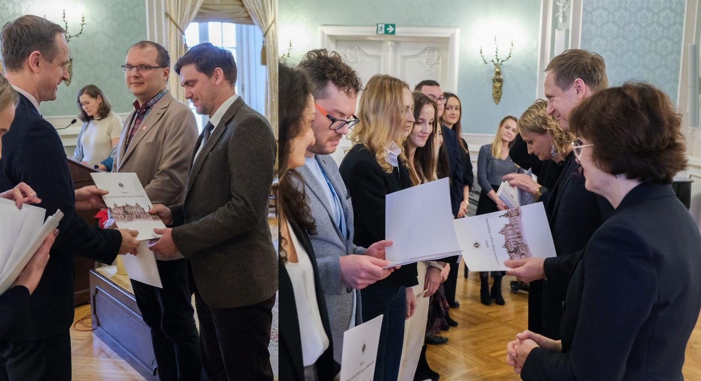
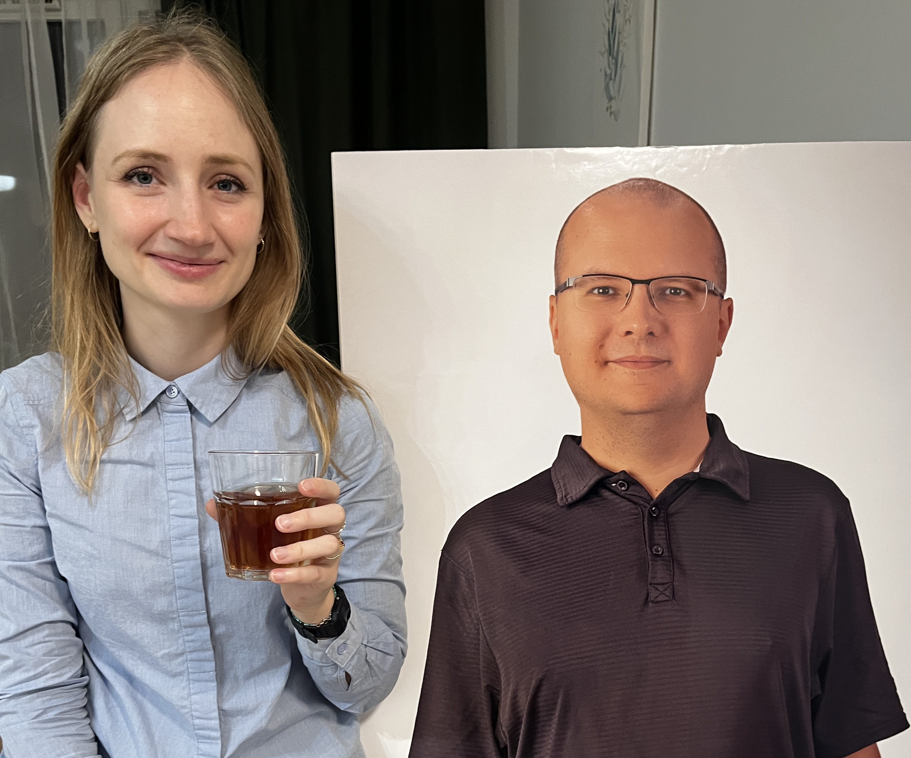
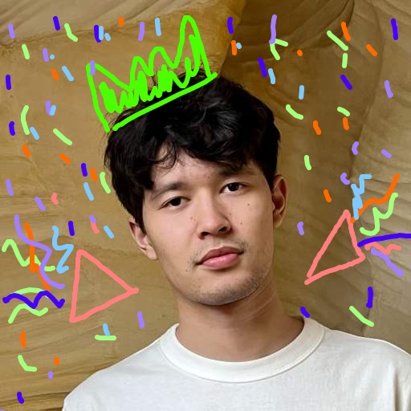
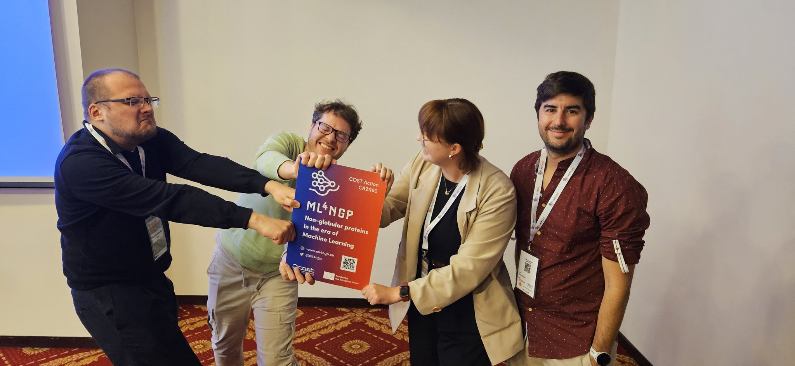

# BioGenies news

##### New BioGenies paper in Bioinformatics - meet HaDeX2! 📄🧬

Our new Bioinformatics paper introduces HaDeX2 🧬 - a tool for multi-dimensional analysis of HDX-MS data. Explore it via web server or R package.

Mar 16, 2026

##### Jarek and Julia escape winter at the ML4NGP Training School in Seville! 🧬🤖🌞🇪🇸

arek and Julia attended the ML4NGP Training School in Seville 🇪🇸, learning about machine learning for non-globular proteins 🧬🤖 and temporarily escaping the -15°C Polish…

Mar 6, 2026

##### BioGenies shine at the Rector’s Awards! 🏆🎓✨

A proud day for BioGenies! 🎉 Michał and Jarek received First Degree Rector’s Awards for publications 🏆📚, Valen earned a Second Degree award, Michał was additionally…

Dec 16, 2025

##### Oriol visits BioGenies from sunny Barcelona! 🇪🇸🧬🕷️

Our collaborator Oriol from the Autonomous University of Barcelona 🇪🇸 visited Białystok through the NAWA STER programme 🇵🇱 to work with Michał on StriFi — a…

Dec 8, 2025

##### Michał hacks away at BioHackathon Europe 2025 in Berlin! 💻🧬🚀

Michał joined BioHackathon Europe 2025 in Berlin, organised by ELIXIR Europe 💻🧬, an intense week of coding, data wrangling and open science, and a huge opportunity for…

Nov 13, 2025

##### Weronika defends her PhD with distinction! 🎓🌟

Huge congratulations to Weronika, who defended her PhD thesis on high-resolution H/D exchange MS data 🎓🔬 with distinction! Weronika celebrated first at IBB PAS and then…

Nov 12, 2025

##### BioGenies at PTBI 2025 in Białystok! 🧬🎤🥞

BioGenies rocked PTBI 2025 in Białystok! 🎉 Michał and Valen gave talks, Mariia, Asia and Jarek flash talks + posters, we joined PTBI 🇵🇱, voted for a new CEO 🗳, and…

Sep 18, 2025

##### Mariia starts her PhD at UMB! 🎓🦠

🎉 Huge congratulations to Mariia, who just joined the international PhD programme at the Medical University of Białystok! 🌍 She’ll be developing cutting-edge…

Sep 17, 2025

##### Sonor defends his MSc with flying colors! 🎓🥳

Huge congratulations to Sonor, who just defended his MSc thesis *Biomedical Text Classification with Pre-trained Language Models* with the best possible grade 💯🌟! His work…

Sep 16, 2025

##### From microbes to medicine 💊🦠, Valen’s NCN Miniatura grant success!

Congrats to Valen 🎉 for receiving an NCN Miniatura grant! The LIMAD project will explore how microbes 🦠 influence harmful protein build-up in Alzheimer’s and Parkinson’s…

Sep 15, 2025

##### 🎉 New open-access article in *Genome Biology*!

Our collaborative study led by Carlos is out—providing gold-standard LLPS datasets and evaluation tools! 🧠🧬🎉

Jul 9, 2025

##### 🎓 Career highlights: Mariia at UMB and Jarek’s NCN Poland Miniatura grant!

Big news, Mariia starts at UMB and applies for a PhD, while Jarek gets NCN Miniatura to grow his imputomics project! 🎉

Jul 4, 2025

##### 🏅 Ronja wins BTU Women’s Advancement Award! 🌟!

Celebrating Ronja Tittel’s outstanding contribution in her praxissemester with us and her award at BTU Cottbus-Senftenberg!

Jul 2, 2025

##### 🌡️ Jarek, Michał & Krysia at Metabolomics 2025 in Prague!

Our team flew out to Prague for the Metabolomics 2025 meeting—posters, gifts, air conditioning and plenty of food!

Jul 1, 2025

##### 🌳 BioGenies retreat in Wrocław from June 4 till 7, 2025

Team fun and productivity at our Wrocław retreat: pizzas, sta,p hunt at Arboretum, seminars, hiking, cocktails (healthy, non-alchocholic) and more 😄

Jun 23, 2025

##### 🌍 Welcoming Krzysztof Poterlowicz from ELIXIR‑UK! 🚀

Excited to host Prof. Krzysztof Poterlowicz (University of Bradford & ELIXIR‑UK) to support our lab’s journey toward full ELIXIR integration.

Jun 18, 2025

##### 🌟 Highlights from the 3rd ML4NGP Conference in Vilnius!🌟

Michał, Jarek, Valen and Mariia presented posters at the ML4NGP Meeting, a fantastic mix of science, food and networking!

Jun 17, 2025

##### 📢 New review article published in *Protein Science*!

We explore how experimental methods help unravel amyloid cross-interactions, a key aspect in understanding amyloid behavior in health and disease.

May 21, 2025

##### 🎉 OneTick project awarded MSCA Staff Exchanges grant!

Another huge win for BioGenies! Our first MSCA Staff Exchanges project, OneTick, officially funded by the European Commission!

May 20, 2025

##### 🎉 Jarek awarded Horizon Europe ERA Talents grant!

From MSCA near-miss to ERA Talents success, BioGenies score again! 🇪🇺💪 . Next stop: Life Sciences Center at Vilnius University

May 19, 2025

##### Jakub joins Google! 🚀 Our ML beast in the big leagues

From BioGenies to Google, Jakub is now working on C++ projects for OpenAI but he’s still part of the family!

May 18, 2025

##### Ticks, trails & travel – Science and short city break adventures 🧬🧗‍♀️🌍

Michał shared urban tick research in Weimar, while Jarek, Weronika, and Krysia took a well-earned adventure break in Montpellier!

Apr 1, 2025

##### Farewell to Ronja – our first Erasmus+ student! 🇩🇪💙

Ronja’s Praxissemester with us has come to an end. From food feasts to cultural trips and a dramatic train station farewell – here’s how we spent the last days together!

Feb 24, 2025

##### OneTick proposal submitted & Michał’s well-deserved break! 🚀🌴

We’ve officially submitted our OneTick proposal for MSCA Staff Exchanges, and Michał is finally taking a holiday after seven years!

Feb 10, 2025

##### Farewell to Eva – our first departing Erasmus+ student! 🎓💙

After an amazing Erasmus experience, Eva says goodbye to our lab. A week full of memories, pierogi, karaoke, and adventures!

Jan 30, 2025

##### Valen Featured on NAWA Podcast! 🎙️

Valen discusses our lab’s exciting science and research projects on the NAWA podcast.

Jan 10, 2025

##### Writing OneTick Grant for Marie Skłodowska-Curie Actions (MSCA) Staff Exchanges 🎯

Michał, Jarek, and Valen are hard at work preparing a OneTick grant for the MSCA Staff Exchanges application with a potential consortium of 11 participants!

Jan 9, 2025

##### Michał receives First Degree Award from Rector of Medical University of Białystok 🎉

Congratulations to Michał on being honored with the prestigious First Degree Award for his outstanding publications from 2023!

Dec 6, 2024

##### Celebrating our successes 🎉

On November 14 Michał organised a small party to celebrate our achievements and thank amazing people supporting our journey!

Nov 19, 2024

##### Welcome Mariia, from BTU to the BioGenies!

We’re excited to welcome Mariia Solovianova from BTU, a biotechnology master with wet lab expertise, joining our lab to work on a bioinformatics project involving antibodies…

Nov 12, 2024

##### Welcome Eva Arribas to the Lab!

We’re thrilled to welcome Eva Arribas, a master’s graduate from Salvador Ventura’s lab at the Universitat Autònoma de Barcelona, as she joins us for her Erasmus traineeship!

Nov 4, 2024

##### Michał and Jarek secure PARP ‘Granty na Eurogranty’ grant! 🎉

Exciting news! Michał and Jarek have received a grant from PARP (Polish Agency for Enterprise Development) to support the preparation of their MSCA Staff Exchanges…

Nov 1, 2024

##### Our publication **Aggregating amyloid resources** is online!

Our latest comprehensive review of databases on amyloid-like aggregation, now published in Computational and Structural Biotechnology Journal.

Oct 30, 2024

##### HUPO 2024 Conference Wrap-Up

Highlights from an inspiring week in Dresden with the BioGenies team, filled with scientific sessions, networking, and a taste of Dresden’s culture.

Oct 28, 2024

##### 🎉 Valen signs a contract with Medical University of Białystok! 🎉

From now on, Valen is an official employee of the Clinical Research Centre at the Medical University of Białystok 🏢🎓.

Oct 18, 2024

##### Post-doc position in the AmyloGraph 2.0 project

We are looking for a post-doc to join our team in AmyloGraph 2.0 project (2023/51/D/NZ7/02847)

Oct 1, 2024

##### Arrival of Ronja - our new collaborator

Welcoming Ronja, our new collaborator from Brandenburg University of Technology Cottbus-Senftenberg, who joins our group for her practical semester.

Sep 30, 2024

##### PTBI 2024 Conference wrap-up

The PTBI 2024 conference brought together brilliant minds 🧠, exciting discussions 💬, and memorable moments with colleagues 🤝. From insightful talks 🎤 to fun reunions 🎉…

Sep 13, 2024

##### BioGenies are heading to Warsaw!

🌟 BioGenies will reunite at the PTBI conference in Warsaw! 🇵🇱🌟

Sep 4, 2024

##### Big annoucement!

We are thrilled to announce that we are looking for two talented students to join our team for AmyloGraph 2.0 project (2023/51/D/NZ7/02847)

Aug 27, 2024

##### BioGenies on adventure

Jarek and Krysia conquer the Dolomites on their short summer vacations!

Aug 12, 2024

##### BioGenies went to Canada for a conference

Krysia and Weronika at Intelligent Systems for Molecular Biology (ISMB) conference

Jul 17, 2024

##### 🎓 Celebrating Eva’s MSc Defense! 🎓

We are thrilled to announce that Eva has successfully defended her MSc thesis! 🏆📚

Jul 12, 2024

##### BioGenies from University of Wrocław and Institute of Biochemistry and Biophysics, PAS visit BioGenies HQ in Białystok

🌟 BioGenies reunion at HQ and visit beyond! 🌟

Jul 4, 2024

##### BioGenies went to Japan on a conference

Krysia attends Metabolomics 2024 in Osaka, Japan! 🌏🇯🇵

Jun 21, 2024

##### BioGenies visit to our colleagues from the Group of Amyloid Research at Vilnius University

🌍 🇱🇹 BioGenies on the move: Visiting Vilnius University and Trakai Island Castle!

Jun 5, 2024

##### 🎉 Exciting news: Michał awarded NCN Sonata 19 Grant! 🎉

Results of the Sonata 19 grant contest organized by the National Science Center Poland were announced today!

May 24, 2024

##### 2nd Machine Learning 4 Non-Globular Proteins Meeting 2024

Michał, Valen and Jarek went on a conference 🏛🔱🌊🇬🇷

May 18, 2024

##### Official beginning of Bioinformatics and Multiomics Analysis Laboratory

🎉 Official launch of Bioinformatics and Multiomics Analysis Laboratory! 🎉

May 1, 2024
