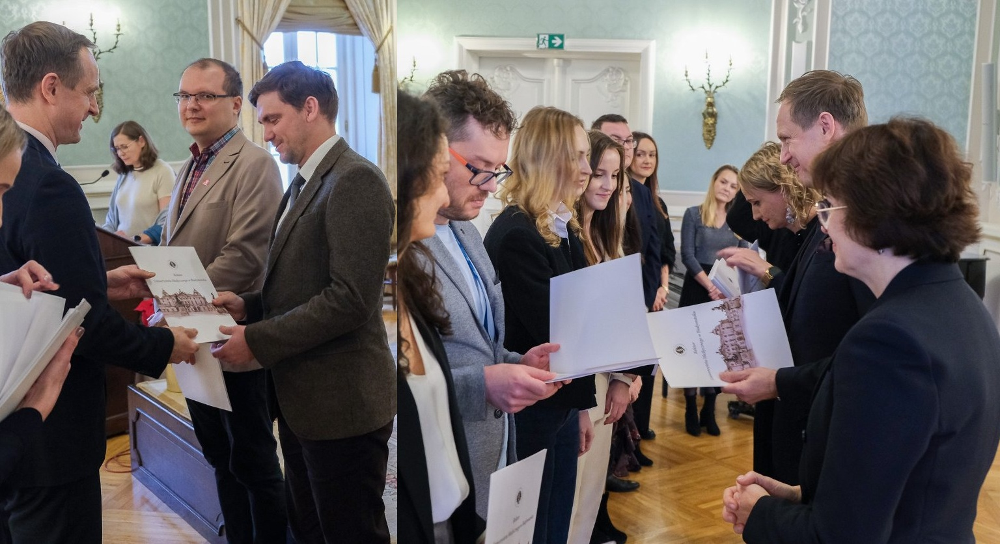
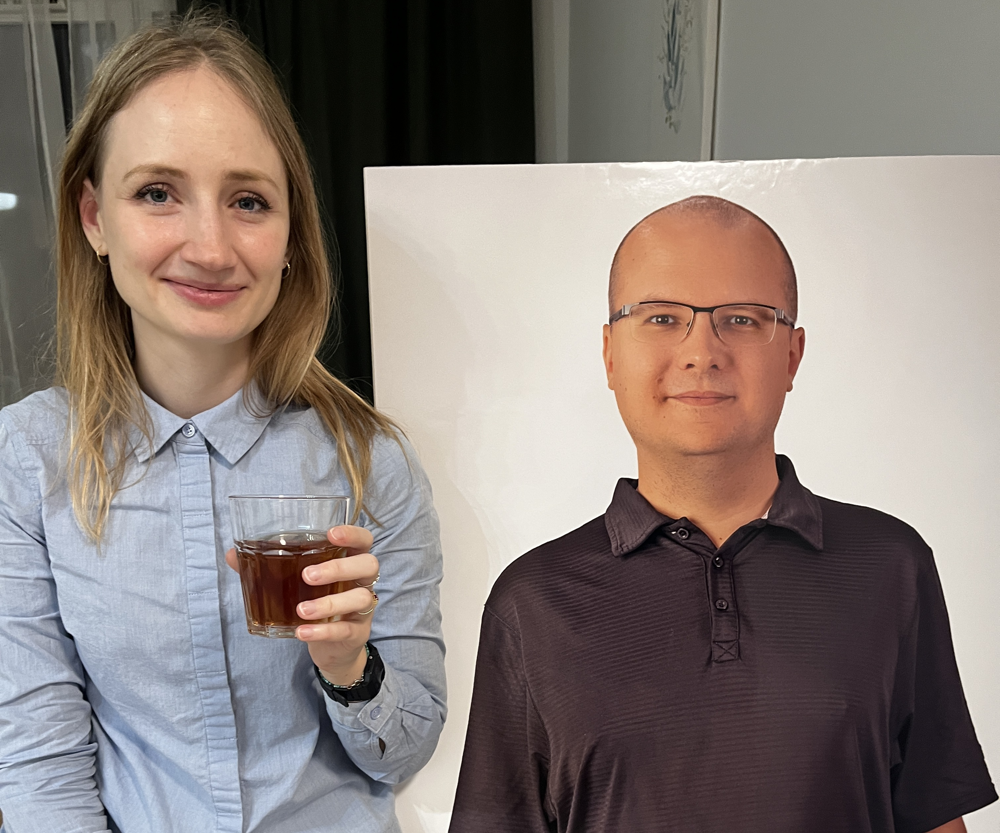
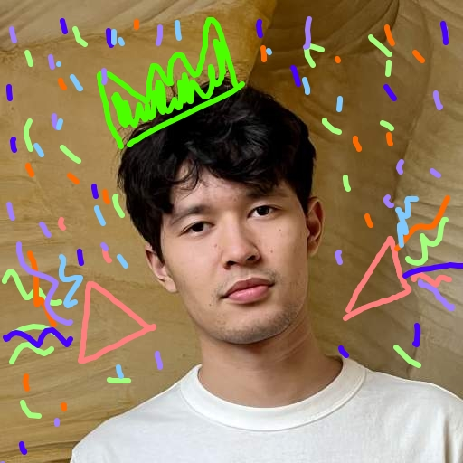

# BioGenies news

##### Next stop, Geneva! Krysia is heading for a postdoc 🇨🇭🎓🚀

Krysia will soon begin a postdoc at the University of Geneva, working with Jeffrey Näf 🇨🇭📊! We’re celebrating her next scientific chapter, while trying to work out how to…

BioGenies Lab

Sep 21, 2026

##### BioGenies at PTBI 2026 in Poznań! 🧬🎤🇵🇱

Michał, Krysia, Valen and Mariia represented BioGenies at PTBI 2026 in Poznań 🇵🇱🎤! From AI governance to amyloid–antibody interactions, imputation scoring and TickPacket.…

BioGenies Lab

Sep 18, 2026

##### Asia conquers the SLOPE and defends her MSc! 🎓📊🥳

Asia has successfully defended her MSc thesis at the University of Wrocław! 🎓📊 Her work brings Adaptive Bayesian SLOPE to binary classification, with Michał as…

BioGenies Lab

Sep 11, 2026

##### Michał talks reproducibility at Bioinformatics Community Meetup \#5 💻🧬 🇵🇱

Michał joined Bioinformatics Community Meetup \#5 in Kraków 🇵🇱 as a panelist discussing reproducible bioinformatics research. From good code and data sharing to the…

BioGenies Lab

Jul 11, 2026

##### BioGenies at the 4th ML4NGP Meeting in Warsaw! 🧬🤖🇵🇱

Valen, Jarek, Mariia, Damian and Oriol joined the 4th ML4NGP Meeting in Warsaw 🇵🇱 - with posters, Oriol’s Thursday talk, sightseeing, craft beers, social dinner, good…

BioGenies Lab

Jun 8, 2026

##### HaDeX2: HDX-MS analysis tool for protein dynamics (Bioinformatics 2026) 🧬

HaDeX2 is a bioinformatics tool for hydrogen–deuterium exchange mass spectrometry (HDX-MS) data analysis, enabling multi-dimensional statistical analysis and visualization…

BioGenies Lab

Mar 16, 2026

##### Jarek and Julia escape winter at the ML4NGP Training School in Seville! 🧬🤖🌞🇪🇸

Jarek and Julia attended the ML4NGP Training School in Seville 🇪🇸, learning about machine learning for non-globular proteins 🧬🤖 and temporarily escaping the -15°C Polish…

BioGenies Lab

Mar 6, 2026

##### BioGenies shine at the Rector’s Awards! 🏆🎓✨

A proud day for BioGenies! 🎉 Michał and Jarek received First Degree Rector’s Awards for publications 🏆📚, Valen earned a Second Degree award, Michał was additionally…

BioGenies Lab

Dec 16, 2025

##### Oriol visits BioGenies from sunny Barcelona! 🇪🇸🧬🕷️

Our collaborator Oriol from the Autonomous University of Barcelona 🇪🇸 visited Białystok through the NAWA STER programme 🇵🇱 to work with Michał on StriFi — a…

BioGenies Lab

Dec 8, 2025

##### Michał hacks away at BioHackathon Europe 2025 in Berlin! 💻🧬🚀

Michał joined BioHackathon Europe 2025 in Berlin, organised by ELIXIR Europe 💻🧬, an intense week of coding, data wrangling and open science, and a huge opportunity for…

BioGenies Lab

Nov 13, 2025

##### Weronika defends her PhD with distinction! 🎓🌟

Huge congratulations to Weronika, who defended her PhD thesis on high-resolution H/D exchange MS data 🎓🔬 with distinction! Weronika celebrated first at IBB PAS and then…

BioGenies Lab

Nov 12, 2025

##### BioGenies at PTBI 2025 in Białystok! 🧬🎤🥞

BioGenies rocked PTBI 2025 in Białystok! 🎉 Michał and Valen gave talks, Mariia, Asia and Jarek flash talks + posters, we joined PTBI 🇵🇱, voted for a new CEO 🗳, and…

BioGenies Lab

Sep 18, 2025

##### Mariia starts her PhD at UMB! 🎓🦠

🎉 Huge congratulations to Mariia, who just joined the international PhD programme at the Medical University of Białystok! 🌍 She’ll be developing cutting-edge…

BioGenies Lab

Sep 17, 2025

##### Sonor defends his MSc with flying colors! 🎓🥳

Huge congratulations to Sonor, who just defended his MSc thesis *Biomedical Text Classification with Pre-trained Language Models* with the best possible grade 💯🌟! His work…

BioGenies Lab

Sep 16, 2025

##### From microbes to medicine 💊🦠, Valen’s NCN Miniatura grant success!

Congrats to Valen 🎉 for receiving an NCN Miniatura grant! The LIMAD project will explore how microbes 🦠 influence harmful protein build-up in Alzheimer’s and Parkinson’s…

BioGenies Lab

Sep 15, 2025

##### LLPS datasets & benchmarking: bringing order to condensate chaos 🧬📊

We present curated datasets of proteins involved in liquid–liquid phase separation (LLPS), enabling robust benchmarking and improved machine learning predictions in…

BioGenies Lab

Jul 9, 2025

##### 🎓 Career highlights: Mariia at UMB and Jarek’s NCN Poland Miniatura grant!

Big news, Mariia starts at UMB and applies for a PhD, while Jarek gets NCN Miniatura to grow his imputomics project! 🎉

BioGenies Lab

Jul 4, 2025

##### 🏅 Ronja wins BTU Women’s Advancement Award! 🌟!

Celebrating Ronja Tittel’s outstanding contribution in her praxissemester with us and her award at BTU Cottbus-Senftenberg!

BioGenies Lab

Jul 2, 2025

##### 🌡️ Jarek, Michał & Krysia at Metabolomics 2025 in Prague!

Our team flew out to Prague for the Metabolomics 2025 meeting—posters, gifts, air conditioning and plenty of food!

BioGenies Lab

Jul 1, 2025

##### 🌳 BioGenies retreat in Wrocław from June 4 till 7, 2025

Team fun and productivity at our Wrocław retreat: pizzas, stamp hunt at Arboretum, seminars, hiking, cocktails (healthy, non-alchocholic) and more 😄

BioGenies Lab

Jun 23, 2025

##### 🌍 Welcoming Krzysztof Poterlowicz from ELIXIR‑UK! 🚀

Excited to host Prof. Krzysztof Poterlowicz (University of Bradford & ELIXIR‑UK) to support our lab’s journey toward full ELIXIR integration.

BioGenies Lab

Jun 18, 2025

##### 🌟 Highlights from the 3rd ML4NGP Conference in Vilnius!🌟

Michał, Jarek, Valen and Mariia presented posters at the ML4NGP Meeting, a fantastic mix of science, food and networking!

BioGenies Lab

Jun 17, 2025

##### Amyloid cross-interactions: how proteins influence each other’s aggregation 🧬🧊

A comprehensive review of experimental methods to study amyloid cross-interactions, highlighting how proteins modulate each other’s aggregation and why combining techniques…

BioGenies Lab

May 21, 2025

##### 🎉 OneTick project awarded MSCA Staff Exchanges grant!

Another huge win for BioGenies! Our first MSCA Staff Exchanges project, OneTick, officially funded by the European Commission!

BioGenies Lab

May 20, 2025

##### 🎉 Jarek awarded Horizon Europe ERA Talents grant!

From MSCA near-miss to ERA Talents success, BioGenies score again! 🇪🇺💪 . Next stop: Life Sciences Center at Vilnius University

BioGenies Lab

May 19, 2025

##### HRaDeX: high-resolution HDX–MS analysis made simple ⚙️🧬

A new R package and web server (HRaDeX) enabling high-resolution analysis of HDX–MS data by reconstructing residue-level deuterium uptake rates from peptide-level…

BioGenies Lab

May 19, 2025

##### Jakub joins Google! 🚀 Our ML beast in the big leagues

From BioGenies to Google, Jakub is now working on C++ projects for OpenAI but he’s still part of the family!

BioGenies Lab

May 18, 2025

##### Ticks, trails & travel, Science and short city break adventures 🧬🧗‍♀️🌍

Michał shared urban tick research in Weimar, while Jarek, Weronika, and Krysia took a well-earned adventure break in Montpellier!

BioGenies Lab

Apr 1, 2025

##### Farewell to Ronja, our first Erasmus+ student! 🇩🇪💙

Ronja’s Praxissemester with us has come to an end. From food feasts to cultural trips and a dramatic train station farewell – here’s how we spent the last days together!

BioGenies Lab

Feb 24, 2025

##### OneTick proposal submitted & Michał’s well-deserved break! 🚀🌴

We’ve officially submitted our OneTick proposal for MSCA Staff Exchanges and Michał is finally taking a holiday after seven years!

BioGenies Lab

Feb 10, 2025

##### Farewell to Eva, our first departing Erasmus+ student! 🎓💙

After an amazing Erasmus experience, Eva says goodbye to our lab. A week full of memories, pierogi, karaoke, and adventures!

BioGenies Lab

Jan 30, 2025

##### Valen Featured on NAWA Podcast! 🎙️

Valen discusses our lab’s exciting science and research projects on the NAWA podcast.

BioGenies Lab

Jan 10, 2025

##### Writing OneTick Grant for Marie Skłodowska-Curie Actions (MSCA) Staff Exchanges 🎯

Michał, Jarek, and Valen are hard at work preparing a OneTick grant for the MSCA Staff Exchanges application with a potential consortium of 11 participants!

BioGenies Lab

Jan 9, 2025

##### Michał receives First Degree Award from Rector of Medical University of Białystok 🎉

Congratulations to Michał on being honored with the prestigious First Degree Award for his outstanding publications from 2023!

BioGenies Lab

Dec 6, 2024

##### Celebrating our successes 🎉

On November 14 Michał organised a small party to celebrate our achievements and thank amazing people supporting our journey!

BioGenies Lab

Nov 19, 2024

##### Welcome Mariia, from BTU to the BioGenies!

We’re excited to welcome Mariia Solovianova from BTU, a biotechnology master with wet lab expertise, joining our lab to work on a bioinformatics project involving antibodies…

BioGenies Lab

Nov 12, 2024

##### Welcome Eva Arribas to the Lab!

We’re thrilled to welcome Eva Arribas, a master’s graduate from Salvador Ventura’s lab at the Universitat Autònoma de Barcelona, as she joins us for her Erasmus traineeship!

BioGenies Lab

Nov 4, 2024

##### Michał and Jarek secure PARP ‘Granty na Eurogranty’ grant! 🎉

Exciting news! Michał and Jarek have received a grant from PARP (Polish Agency for Enterprise Development) to support the preparation of their MSCA Staff Exchanges…

BioGenies Lab

Nov 1, 2024

##### Amyloid databases: mapping the aggregation universe 🧬📊

A comprehensive review of amyloid-related databases, highlighting how experimental data and bioinformatics resources drive advances in protein aggregation research.

BioGenies Lab

Oct 30, 2024

##### HUPO 2024 Conference Wrap-Up

Highlights from an inspiring week in Dresden with the BioGenies team, filled with scientific sessions, networking, and a taste of Dresden’s culture.

BioGenies Lab

Oct 28, 2024

##### 🎉 Valen signs a contract with Medical University of Białystok! 🎉

From now on, Valen is an official employee of the Clinical Research Centre at the Medical University of Białystok 🏢🎓.

BioGenies Lab

Oct 18, 2024

##### Post-doc position in the AmyloGraph 2.0 project

We are looking for a post-doc to join our team in AmyloGraph 2.0 project (2023/51/D/NZ7/02847)

BioGenies Lab

Oct 1, 2024

##### Arrival of Ronja, our new collaborator

Welcoming Ronja, our new collaborator from Brandenburg University of Technology Cottbus-Senftenberg, who joins our group for her practical semester.

BioGenies Lab

Sep 30, 2024

##### PTBI 2024 Conference wrap-up

The PTBI 2024 conference brought together brilliant minds 🧠, exciting discussions 💬, and memorable moments with colleagues 🤝. From insightful talks 🎤 to fun reunions 🎉…

BioGenies Lab

Sep 13, 2024

##### BioGenies are heading to Warsaw!

🌟 BioGenies will reunite at the PTBI conference in Warsaw! 🇵🇱🌟

BioGenies Lab

Sep 4, 2024

##### Big annoucement!

We are thrilled to announce that we are looking for two talented students to join our team for AmyloGraph 2.0 project (2023/51/D/NZ7/02847)

BioGenies Lab

Aug 27, 2024

##### BioGenies on adventure

Jarek and Krysia conquer the Dolomites on their short summer vacations!

BioGenies Lab

Aug 12, 2024

##### BioGenies went to Canada for a conference

Krysia and Weronika at Intelligent Systems for Molecular Biology (ISMB) conference

BioGenies Lab

Jul 17, 2024

##### 🎓 Celebrating Eva’s MSc Defense! 🎓

We are thrilled to announce that Eva has successfully defended her MSc thesis! 🏆📚

BioGenies Lab

Jul 12, 2024

##### BioGenies from University of Wrocław and Institute of Biochemistry and Biophysics, PAS visit BioGenies HQ in Białystok

🌟 BioGenies reunion at HQ and visit beyond! 🌟

BioGenies Lab

Jul 4, 2024

##### BioGenies went to Japan on a conference

Krysia attends Metabolomics 2024 in Osaka, Japan! 🌏🇯🇵

BioGenies Lab

Jun 21, 2024

##### ML + metabolomics in the clinic: promise vs reality 🧠🧬

A critical review of machine learning-based clinical decision support systems built on metabolomics data, highlighting opportunities, pitfalls, and future directions.

BioGenies Lab

Jun 18, 2024

##### BioGenies visit to our colleagues from the Group of Amyloid Research at Vilnius University

🌍 🇱🇹 BioGenies on the move: Visiting Vilnius University and Trakai Island Castle!

BioGenies Lab

Jun 5, 2024

##### 🎉 Exciting news: Michał awarded NCN Sonata 19 Grant! 🎉

Results of the Sonata 19 grant contest organized by the National Science Center Poland were announced today!

BioGenies Lab

May 24, 2024

##### 2nd Machine Learning 4 Non-Globular Proteins Meeting 2024

Michał, Valen and Jarek went on a conference 🏛🔱🌊🇬🇷

BioGenies Lab

May 18, 2024

##### Official beginning of Bioinformatics and Multiomics Analysis Laboratory

🎉 Official launch of Bioinformatics and Multiomics Analysis Laboratory! 🎉

BioGenies Lab

May 1, 2024

##### NanoString nCounter data analysis: challenges, workflows & best practices 🧬📊

A comprehensive review of NanoString nCounter data processing workflows, highlighting key steps, challenges and available bioinformatics tools for mRNA and miRNA analysis.

BioGenies Lab

Apr 30, 2024

##### imputomics: taming missing values in metabolomics data 🧬🧩

imputomics is a web server and R package providing a unified interface for 40+ missing value imputation algorithms, enabling robust and reproducible metabolomics data…

BioGenies Lab

Feb 20, 2024

##### aSynPEP-DB: mining peptides against Parkinson’s 🧬🧠

A database of biogenic peptides predicted to inhibit α-synuclein aggregation, enabling peptide-based therapeutic discovery.

BioGenies Lab

Nov 27, 2023

##### Amyloids don’t aggregate alone 🤝🧬 Meet AmyloGraph

AmyloGraph is a curated database of experimentally validated amyloid–amyloid interactions, enabling systematic exploration of cross-seeding and aggregation modulation.

BioGenies Lab

Oct 16, 2023

##### PlastoGram: decoding protein localization inside plastids 🌿🧬

PlastoGram is an ensemble machine learning model for predicting subplastid localization and protein origin, enabling more accurate plastid protein annotation.

BioGenies Lab

May 24, 2023

##### Short amyloids ≠ antimicrobial peptides? 🧬❌🦠

Experimental validation reveals that predicted antimicrobial amyloids lack real activity, highlighting a major gap in AMP datasets.

BioGenies Lab

Jan 2, 2023

##### The peptide prediction ecosystem is exploding 🤯🧬

A large-scale review of peptide activity prediction tools reveals rapid growth, reproducibility issues and emerging trends in ML-based peptide bioinformatics.

BioGenies Lab

Nov 24, 2022

##### Are AMP models lying to us? 🤖🧬 The benchmarking problem

A large-scale study reveals that antimicrobial peptide predictors are heavily biased due to how negative datasets are constructed.

BioGenies Lab

Sep 1, 2022

##### qPCR curves, but make it ML 🤖🧬 Introducing PCRedux

PCRedux is an R toolkit for feature extraction and machine learning on qPCR amplification curves, enabling reproducible and explainable analysis.

BioGenies Lab

Aug 21, 2022

##### Can ML predictors detect mislabeled amyloids? 🧠🧬

A fascinating study showing that amyloid prediction tools can identify misannotated training data, even when those wrong labels were part of the training set.

BioGenies Lab

Apr 26, 2021
