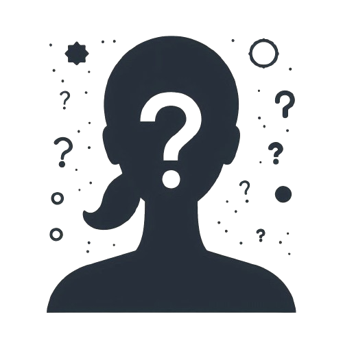
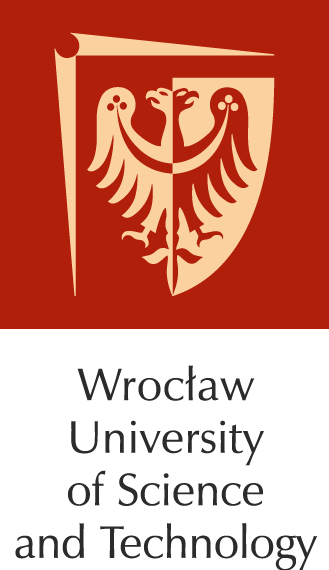
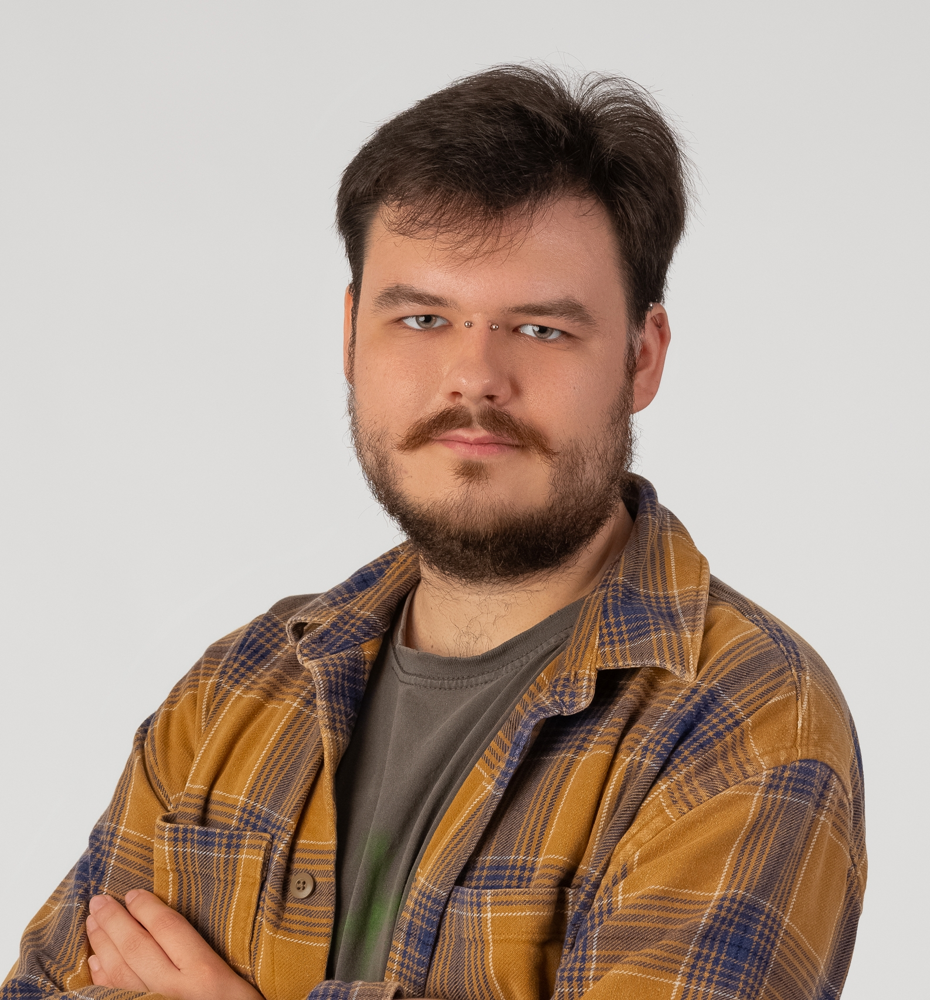
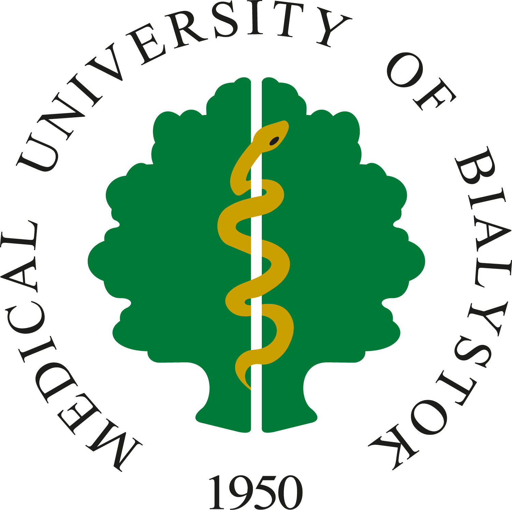
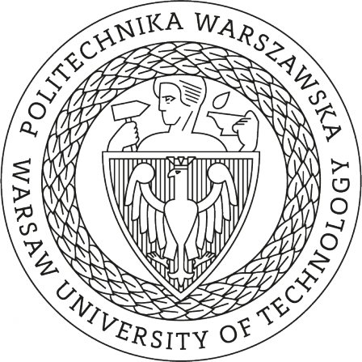

# Former BioGenies members

[ Kubkowski")](team/sk.llms.md)

Sonor Kubkowski 

Agnieszka Barbach 

Filip Gaj 

Katarzyna Hubicka 

Anita Karaszewska 

Dominika Kozakiewicz 

Anna Lassota 

Dominik Nowakowski 

Filip Pietluch 

Natalia Pludra 

Dominik Rafacz 

Joanna Sikorska 

Jadwiga Słowik 
