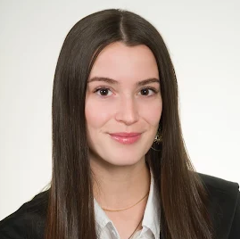
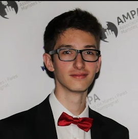
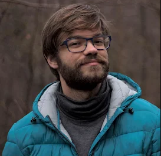
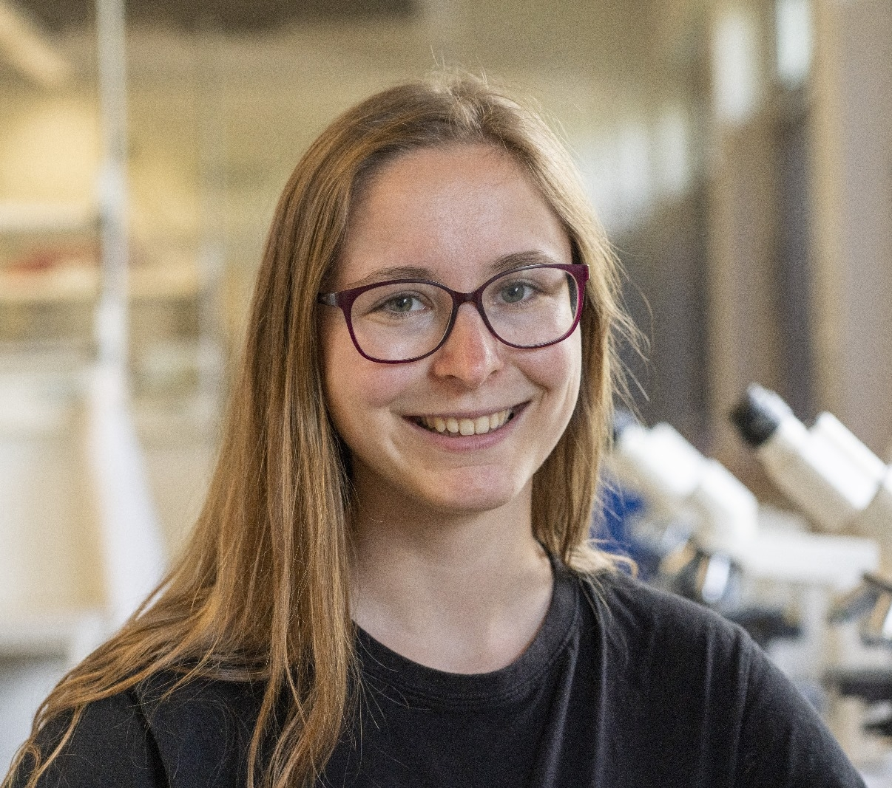
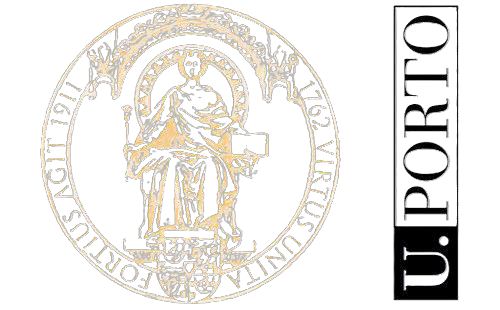
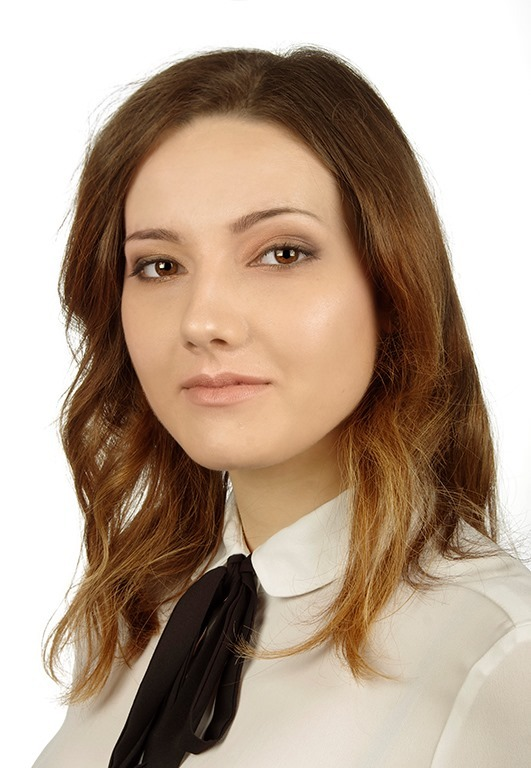
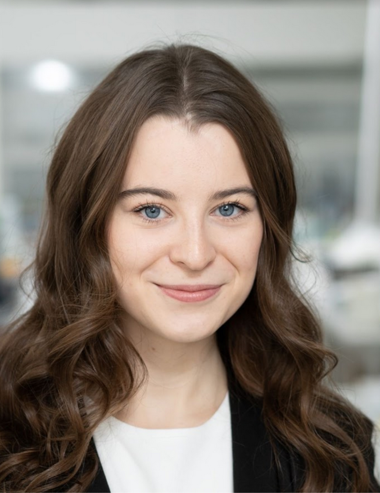
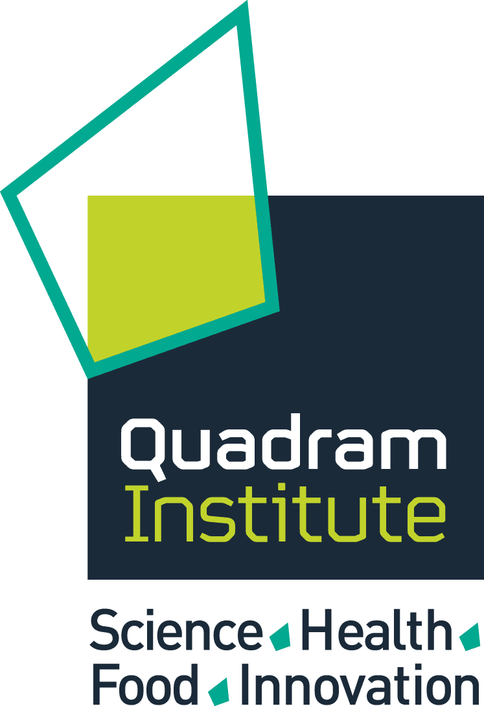

# BioGenies collaborators

###  Autonomous University of Barcelona

Eva Arribas

Oriol Bárcenas

Carlos Pintado-Grima

###  Brandenburg University of Technology Cottbus-Senftenberg

Stefan Rödiger

Ronja Tittel

###  Nencki Institute of Experimental Biology PAS

Kinga Nazaruk

###  University of Porto

Martyna Podlasiak

###  University of Warsaw

Julia Szkóp

###  Quadram Institute

Rafał Kolenda

Katarzyna (Kasia) Sidorczuk
