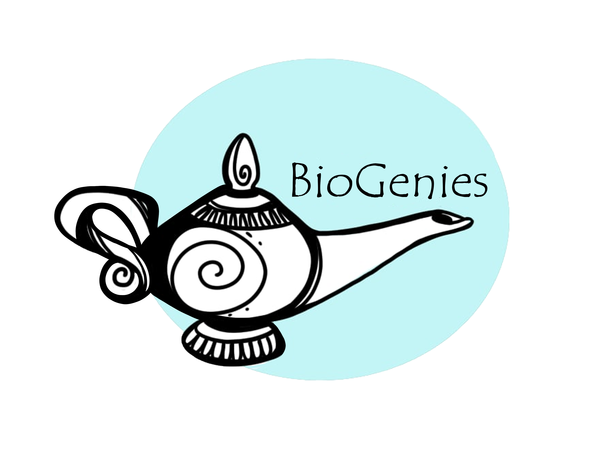

# Official beginning of Bioinformatics and Multiomics Analysis Laboratory

news

🎉 Official launch of Bioinformatics and Multiomics Analysis Laboratory! 🎉

Published

May 1, 2024

We are thrilled to announce the official beginning of our Bioinformatics and Multiomics Analysis Laboratory! 🚀

This state-of-the-art facility is dedicated to unlocking the mysteries of biological data through cutting-edge computational tools and integrative multiomics approaches.

Our mission is to empower researchers and scientists with the resources and expertise to analyze complex biological datasets, bridging the gap between raw data and meaningful insights. Whether it’s genomics, transcriptomics, proteomics, or metabolomics, our lab is equipped to provide comprehensive analysis and innovative solutions.

Stay tuned for exciting research projects, collaborations, and workshops that will shape the future!

🔬 Advancing Science Together!

