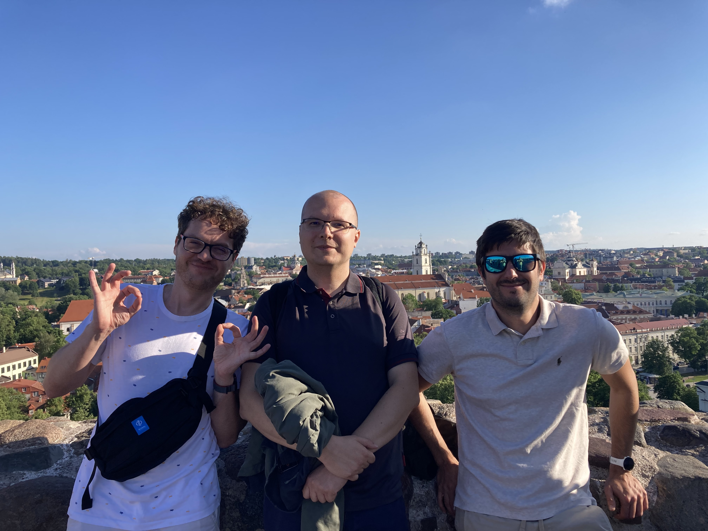

# BioGenies visit to our colleagues from the Group of Amyloid Research at Vilnius University

news

Lithuania

trip

🌍 🇱🇹 BioGenies on the move: Visiting Vilnius University and Trakai Island Castle!

Published

June 5, 2024

BioGenies (Michał, Jarek and Valen) recently had an inspiring visit to Vilnius, where they connected with our esteemed colleagues from the Group of Amyloid Research at Vilnius University. 🧬🤝

This visit was a fantastic opportunity to exchange ideas, explore new collaborations, and dive deep into the latest advancements in amyloid research.

But the adventure didn’t stop there! On the way back, the team took some time to explore the historic Trakai Island Castle, soaking in the rich history and breathtaking views. 🏰

And of course it was eaten, Lithuanian kolduny and potato pancake :)

