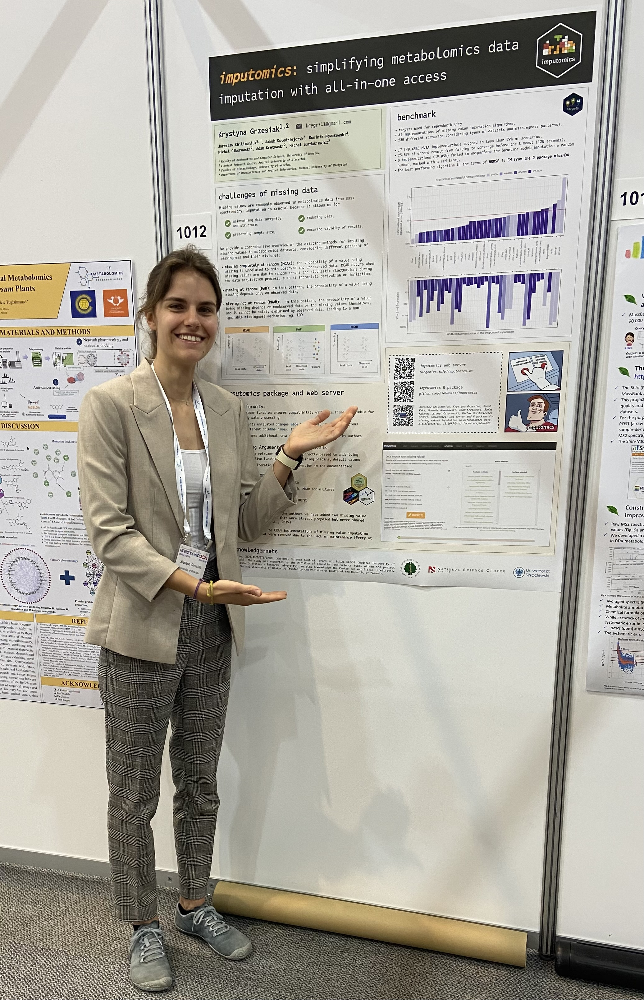
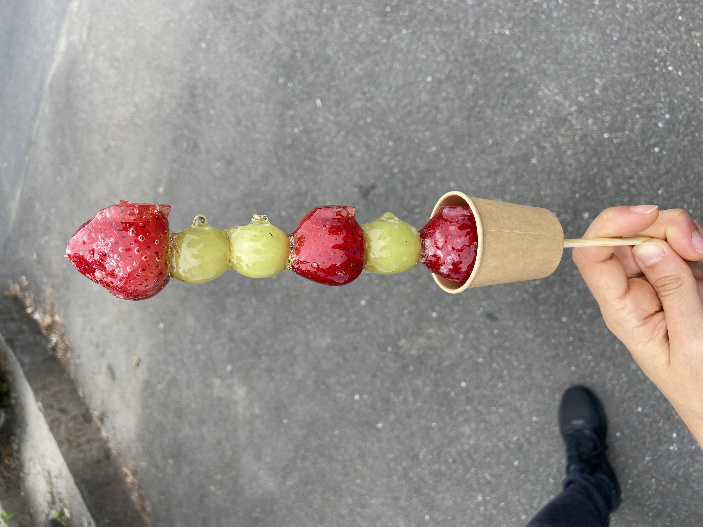

# BioGenies went to Japan on a conference

conference

Metabolomics

Japan

Krysia attends Metabolomics 2024 in Osaka, Japan! 🌏🇯🇵

Published

June 21, 2024

We’re excited to share that Krysia from our BioGenies team has traveled to Osaka, Japan to participate in the Metabolomics 2024 conference! 🧪✨ This event is a gathering of leading minds in the field of metabolomics, offering a platform to explore the latest research, tools, and technologies that are shaping the future of metabolic studies.

Krysia engaged with global experts, presenting our team’s work (imputomics), and brought back invaluable insights to push our research forward.

Some new Japanese food

 and original Takoyaki from Osaka.

