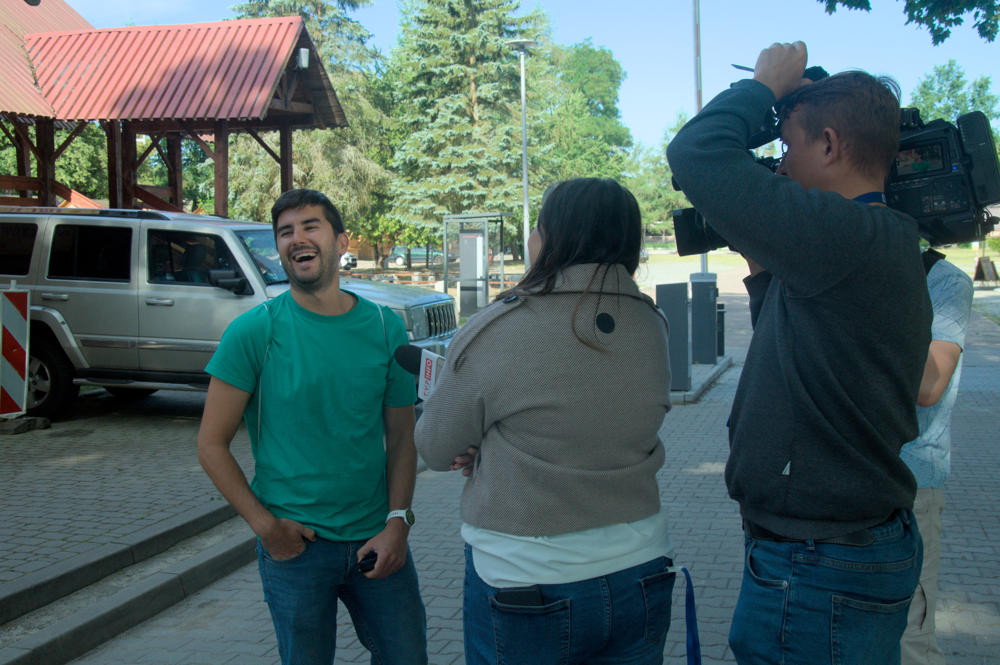
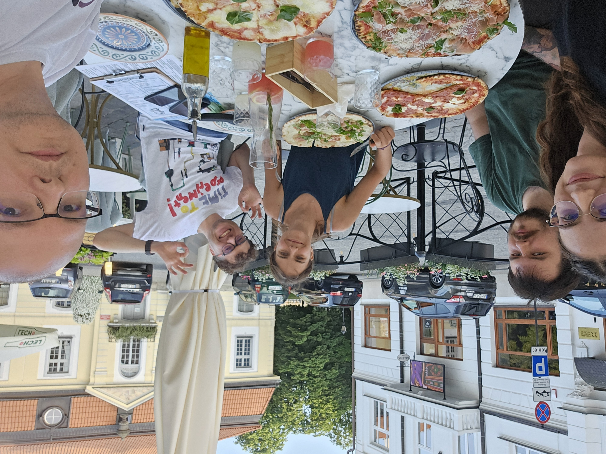
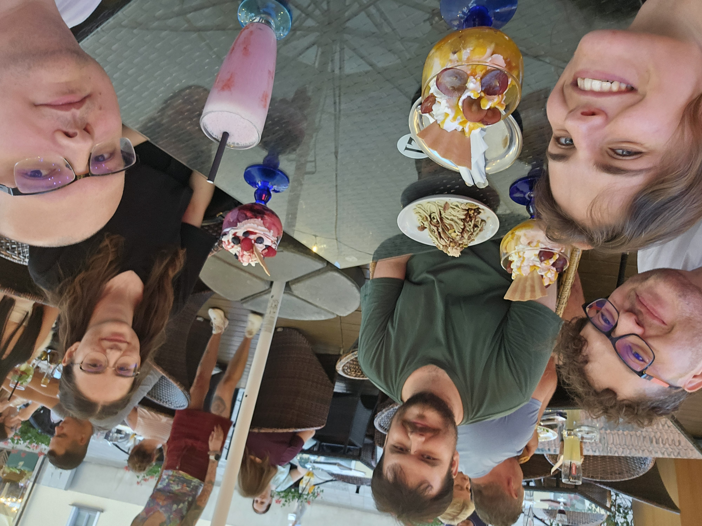

# BioGenies from University of Wrocław and Institute of Biochemistry and Biophysics, PAS visit BioGenies HQ in Białystok

news

reunion

trip

🌟 BioGenies reunion at HQ and visit beyond! 🌟

Published

July 4, 2024

We’re thrilled to share that the BioGenies team from the University of Wrocław (Krysia, Asia, Filip) and Weronika from Institute of Biochemistry and Biophysics recently visited our BioGenies HQ in Białystok! 🏢🤝

During this productive visit, we collaborated on exciting projects and celebrated our hard work.

But that’s not all! The team also took the opportunity to explore the stunning Białowieża Primeval Forest, immersing themselves in its natural beauty and historical significance. 🌳🌲

  

As a highlight of the trip, the team gave an engaging interview on TV but only Krysia was shown. 📺✨

 

As always we ate a lot!

 
