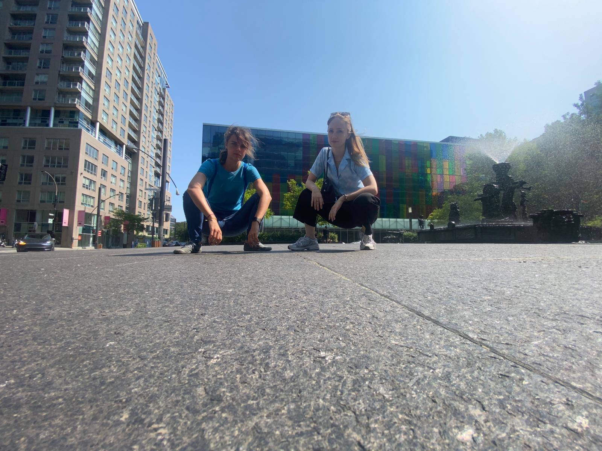

# BioGenies went to Canada for a conference

Conferences & events

ISMB

Canada

Krysia and Weronika at Intelligent Systems for Molecular Biology (ISMB) conference

Author

BioGenies Lab

Published

July 17, 2024

We’re excited to announce that Krysia and Weronika from our BioGenies team went to Montreal, Canada for Intelligent Systems for Molecular Biology (ISMB) 2024 conference! 🧬🤖

Weronika presented her poster \>hadexversum: the family of HDX-MS tools

And Krysia: \>imputomics: web server and R package for missing values imputation in metabolomics data

