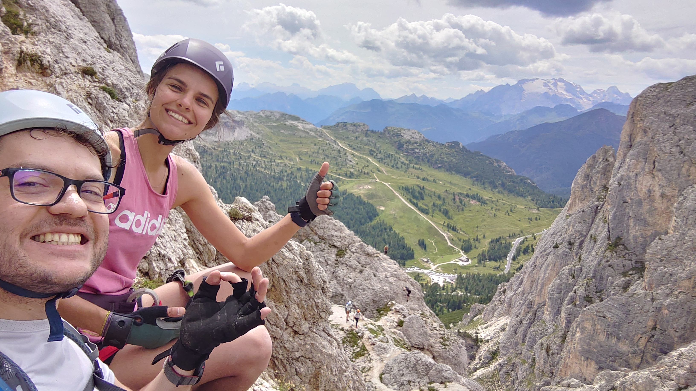
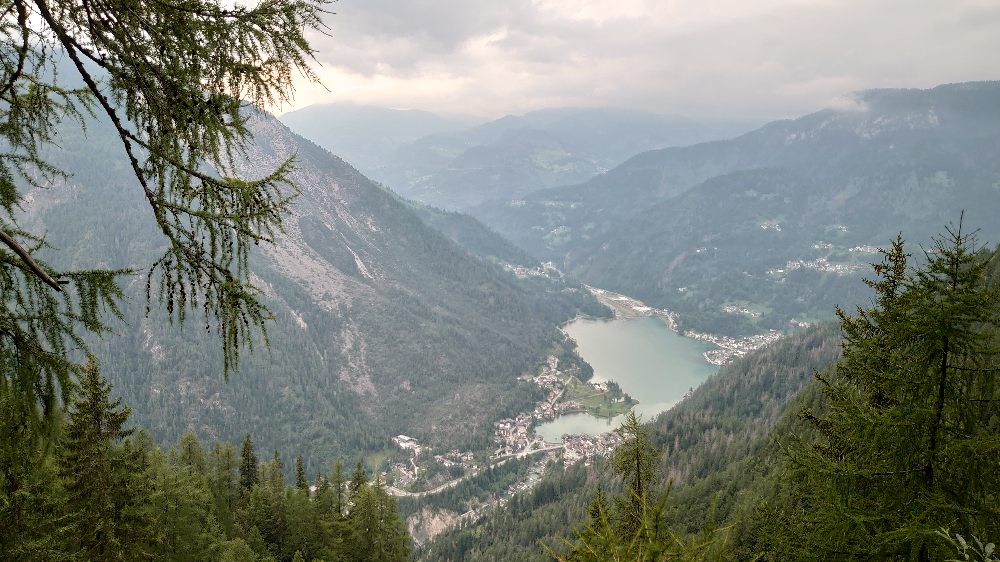
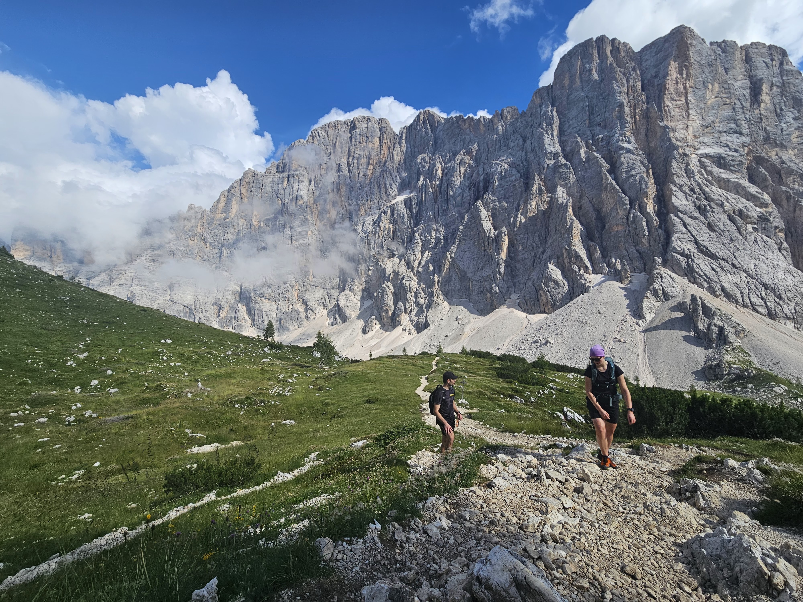
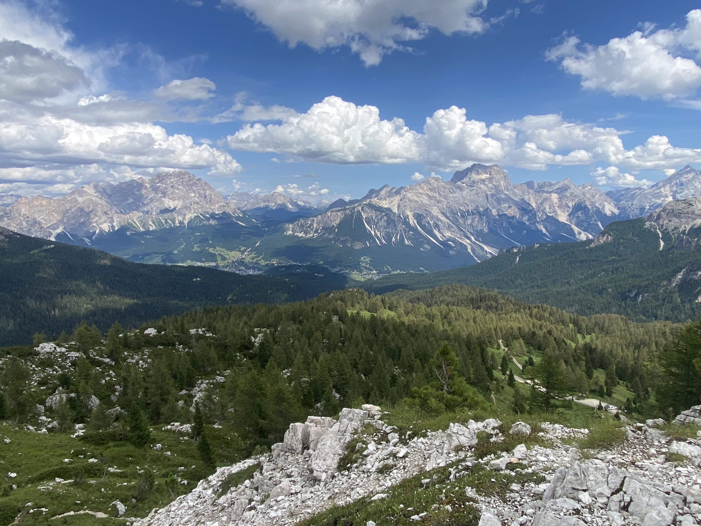
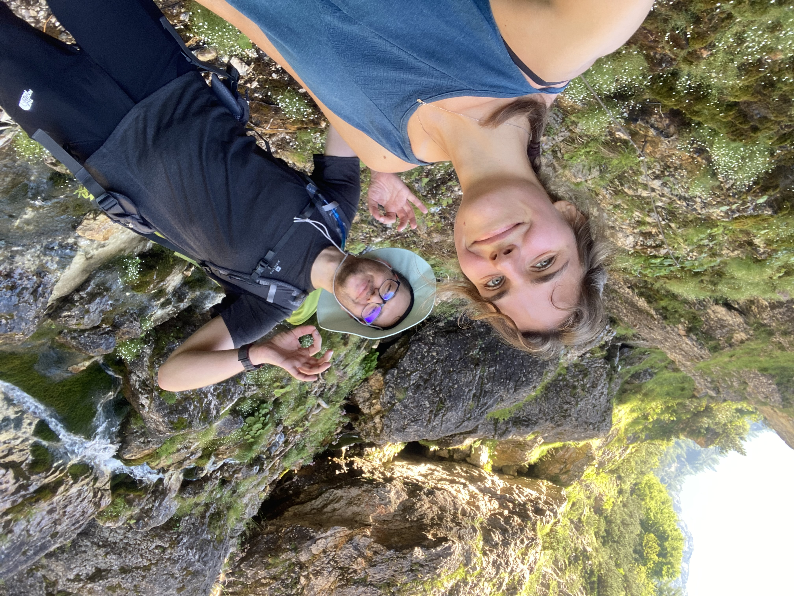
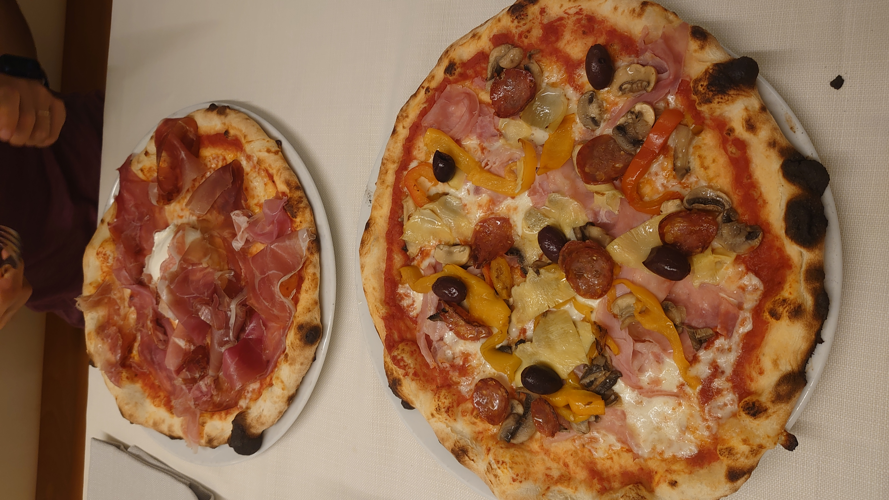

# BioGenies on adventure

trip

holidays

Italy

Dolomites

via ferrata

Jarek and Krysia conquer the Dolomites on their short summer vacations!

Published

August 12, 2024

This summer, Jarek and Krysia from our BioGenies team took their holiday spirit to new heights by tackling the thrilling via ferrata routes in the Dolomites, near the iconic Mount Civetta! 🧗‍♂️⛰️

Amidst breathtaking views and rugged terrain, they embraced the challenge and adventure of these exhilarating mountain trails. It was a perfect blend of adrenaline and nature, offering a well-deserved break from the lab while exploring one of the most stunning landscapes in the world.

   

We didn’t forgot to try Italian pizza! 
