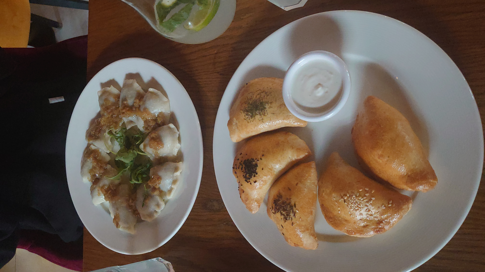
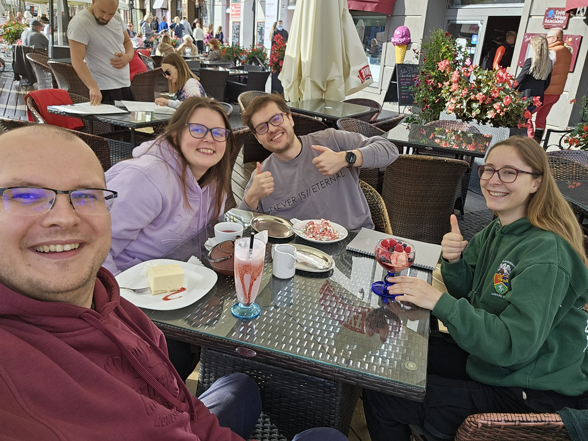

# Arrival of Ronja - our new collaborator

team

Erasmus+

AmyloGraph

Welcoming Ronja, our new collaborator from Brandenburg University of Technology Cottbus-Senftenberg, who joins our group for her practical semester.

Published

September 30, 2024

# 🎉 Welcome Ronja! 🎉

We are thrilled to welcome **Ronja**, our new collaborator from **BTU Cottbus-Senftenberg**, who has joined us for a practical semester here in **Białystok**. Ronja’s internship will be a fantastic opportunity for collaboration, exchange of ideas, and shared learning. 🤝

## First weekend: pierogis 🥟 & sightseeing 🏛️

To kick off her time here, we decided to explore some of the local flavors and landmarks. Over the weekend, we had the chance to indulge in **pierogis** 🥟, a beloved Polish dish.

 

Along with the food, we also did some sightseeing around **Białystok**. From the **Branicki Palace** 🏰 to the scenic parks 🌳, it was a lovely introduction to the city’s history and culture.

## What’s next? 🚀

Ronja will be working closely with our team on the **AmyloGraph 2.0** project, where her contributions will be vital in developing new tools and expanding the database for studying amyloid–amyloid interactions. We’re excited to see the fresh perspectives and energy she will bring to the team. 💡

Welcome, Ronja, and we hope your stay in Białystok will be both professionally rewarding and personally enriching! 🎓🌟
