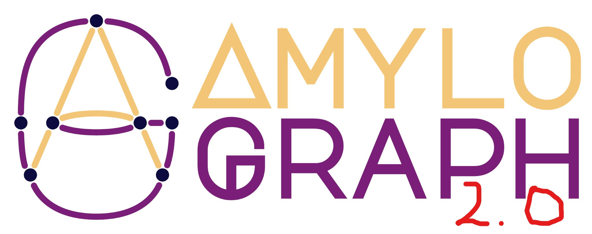

# Post-doc position in the AmyloGraph 2.0 project

news

AmyloGraph

amyloids

hiring

NCN

We are looking for a post-doc to join our team in AmyloGraph 2.0 project (2023/51/D/NZ7/02847)

Published

October 1, 2024

## About the Project

Amyloids are proteins implicated in numerous serious diseases, including Alzheimer’s, Parkinson’s, Creutzfeldt-Jakob’s disease, and type 2 diabetes. These proteins are known for their ability to self-aggregate into unique supramolecular fibrils, a process that plays a critical role in disease progression.

Our team has previously developed AmyloGraph, database of amyloid interactions, which you can explore [here](https://amylograph.com/). In this new phase of our research, we aim to take AmyloGraph to the next level. We will design and implement machine learning-based tools to analyze the data more effectively and revamp the user interface to make it easier for researchers to access the latest information.

But that’s not all. The data collected during this project will be used to train predictive models, with the ultimate goal of designing new chemical compounds that can inhibit amyloid self-aggregation. These compounds hold great promise for the treatment of various amyloid-related diseases.

## Details

###  Employment conditions

 **Place**: [Bioinformatics and Multiomics Analyses Laboratory](https://maps.app.goo.gl/t1rZLKZ1E1CxQrkj7), Medical University of Białystok, Białystok, Poland

![](data:image/svg+xml;base64,PHN2ZyBhcmlhLWhpZGRlbj0idHJ1ZSIgcm9sZT0iaW1nIiB2aWV3Ym94PSIwIDAgNTEyIDUxMiIgc3R5bGU9ImhlaWdodDoxZW07d2lkdGg6MWVtO3ZlcnRpY2FsLWFsaWduOi0wLjEyNWVtO21hcmdpbi1sZWZ0OmF1dG87bWFyZ2luLXJpZ2h0OmF1dG87Zm9udC1zaXplOmluaGVyaXQ7ZmlsbDpwaW5rO292ZXJmbG93OnZpc2libGU7cG9zaXRpb246cmVsYXRpdmU7Ij48cGF0aCBkPSJNMzIwIDk2SDE5MkwxNDQuNiAyNC45QzEzNy41IDE0LjIgMTQ1LjEgMCAxNTcuOSAwSDM1NC4xYzEyLjggMCAyMC40IDE0LjIgMTMuMyAyNC45TDMyMCA5NnpNMTkyIDEyOEgzMjBjMy44IDIuNSA4LjEgNS4zIDEzIDguNEMzODkuNyAxNzIuNyA1MTIgMjUwLjkgNTEyIDQxNmMwIDUzLTQzIDk2LTk2IDk2SDk2Yy01MyAwLTk2LTQzLTk2LTk2QzAgMjUwLjkgMTIyLjMgMTcyLjcgMTc5IDEzNi40bDAgMCAwIDBjNC44LTMuMSA5LjItNS45IDEzLTguNHptODQgODhjMC0xMS05LTIwLTIwLTIwcy0yMCA5LTIwIDIwdjE0Yy03LjYgMS43LTE1LjIgNC40LTIyLjIgOC41Yy0xMy45IDguMy0yNS45IDIyLjgtMjUuOCA0My45Yy4xIDIwLjMgMTIgMzMuMSAyNC43IDQwLjdjMTEgNi42IDI0LjcgMTAuOCAzNS42IDE0bDEuNyAuNWMxMi42IDMuOCAyMS44IDYuOCAyOCAxMC43YzUuMSAzLjIgNS44IDUuNCA1LjkgOC4yYy4xIDUtMS44IDgtNS45IDEwLjVjLTUgMy4xLTEyLjkgNS0yMS40IDQuN2MtMTEuMS0uNC0yMS41LTMuOS0zNS4xLTguNWMtMi4zLS44LTQuNy0xLjYtNy4yLTIuNGMtMTAuNS0zLjUtMjEuOCAyLjItMjUuMyAxMi42czIuMiAyMS44IDEyLjYgMjUuM2MxLjkgLjYgNCAxLjMgNi4xIDIuMWwwIDAgMCAwYzguMyAyLjkgMTcuOSA2LjIgMjguMiA4LjRWNDI0YzAgMTEgOSAyMCAyMCAyMHMyMC05IDIwLTIwVjQxMC4yYzgtMS43IDE2LTQuNSAyMy4yLTljMTQuMy04LjkgMjUuMS0yNC4xIDI0LjgtNDVjLS4zLTIwLjMtMTEuNy0zMy40LTI0LjYtNDEuNmMtMTEuNS03LjItMjUuOS0xMS42LTM3LjEtMTVsMCAwLS43LS4yYy0xMi44LTMuOS0yMS45LTYuNy0yOC4zLTEwLjVjLTUuMi0zLjEtNS4zLTQuOS01LjMtNi43YzAtMy43IDEuNC02LjUgNi4yLTkuM2M1LjQtMy4yIDEzLjYtNS4xIDIxLjUtNWM5LjYgLjEgMjAuMiAyLjIgMzEuMiA1LjJjMTAuNyAyLjggMjEuNi0zLjUgMjQuNS0xNC4ycy0zLjUtMjEuNi0xNC4yLTI0LjVjLTYuNS0xLjctMTMuNy0zLjQtMjEuMS00LjdWMjE2eiIgLz48L3N2Zz4=) **Salary**: 11666.67 PLN gross per month (with workloads for employer and employee, approx. 6,4k net)

 **Planned start date for project work**: 12.11.2024

 **Duration**: 12 months (with a possibility of extension up to 36 months)

###  Important dates

 **Submission deadline**: 07.10.2024, 15:00 (GMT+2)

![](data:image/svg+xml;base64,PHN2ZyBhcmlhLWhpZGRlbj0idHJ1ZSIgcm9sZT0iaW1nIiB2aWV3Ym94PSIwIDAgNjQwIDUxMiIgc3R5bGU9ImhlaWdodDoxZW07d2lkdGg6MS4yNWVtO3ZlcnRpY2FsLWFsaWduOi0wLjEyNWVtO21hcmdpbi1sZWZ0OmF1dG87bWFyZ2luLXJpZ2h0OmF1dG87Zm9udC1zaXplOmluaGVyaXQ7ZmlsbDpwaW5rO292ZXJmbG93OnZpc2libGU7cG9zaXRpb246cmVsYXRpdmU7Ij48cGF0aCBkPSJNODguMiAzMDkuMWM5LjgtMTguMyA2LjgtNDAuOC03LjUtNTUuOEM1OS40IDIzMC45IDQ4IDIwNCA0OCAxNzZjMC02My41IDYzLjgtMTI4IDE2MC0xMjhzMTYwIDY0LjUgMTYwIDEyOHMtNjMuOCAxMjgtMTYwIDEyOGMtMTMuMSAwLTI1LjgtMS4zLTM3LjgtMy42Yy0xMC40LTItMjEuMi0uNi0zMC43IDQuMmMtNC4xIDIuMS04LjMgNC4xLTEyLjYgNmMtMTYgNy4yLTMyLjkgMTMuNS00OS45IDE4YzIuOC00LjYgNS40LTkuMSA3LjktMTMuNmMxLjEtMS45IDIuMi0zLjkgMy4yLTUuOXpNMCAxNzZjMCA0MS44IDE3LjIgODAuMSA0NS45IDExMC4zYy0uOSAxLjctMS45IDMuNS0yLjggNS4xYy0xMC4zIDE4LjQtMjIuMyAzNi41LTM2LjYgNTIuMWMtNi42IDctOC4zIDE3LjItNC42IDI1LjlDNS44IDM3OC4zIDE0LjQgMzg0IDI0IDM4NGM0MyAwIDg2LjUtMTMuMyAxMjIuNy0yOS43YzQuOC0yLjIgOS42LTQuNSAxNC4yLTYuOGMxNS4xIDMgMzAuOSA0LjUgNDcuMSA0LjVjMTE0LjkgMCAyMDgtNzguOCAyMDgtMTc2UzMyMi45IDAgMjA4IDBTMCA3OC44IDAgMTc2ek00MzIgNDgwYzE2LjIgMCAzMS45LTEuNiA0Ny4xLTQuNWM0LjYgMi4zIDkuNCA0LjYgMTQuMiA2LjhDNTI5LjUgNDk4LjcgNTczIDUxMiA2MTYgNTEyYzkuNiAwIDE4LjItNS43IDIyLTE0LjVjMy44LTguOCAyLTE5LTQuNi0yNS45Yy0xNC4yLTE1LjYtMjYuMi0zMy43LTM2LjYtNTIuMWMtLjktMS43LTEuOS0zLjQtMi44LTUuMUM2MjIuOCAzODQuMSA2NDAgMzQ1LjggNjQwIDMwNGMwLTk0LjQtODcuOS0xNzEuNS0xOTguMi0xNzUuOGM0LjEgMTUuMiA2LjIgMzEuMiA2LjIgNDcuOGwwIC42Yzg3LjIgNi43IDE0NCA2Ny41IDE0NCAxMjcuNGMwIDI4LTExLjQgNTQuOS0zMi43IDc3LjJjLTE0LjMgMTUtMTcuMyAzNy42LTcuNSA1NS44YzEuMSAyIDIuMiA0IDMuMiA1LjljMi41IDQuNSA1LjIgOSA3LjkgMTMuNmMtMTctNC41LTMzLjktMTAuNy00OS45LTE4Yy00LjMtMS45LTguNS0zLjktMTIuNi02Yy05LjUtNC44LTIwLjMtNi4yLTMwLjctNC4yYy0xMi4xIDIuNC0yNC43IDMuNi0zNy44IDMuNmMtNjEuNyAwLTExMC0yNi41LTEzNi44LTYyLjNjLTE2IDUuNC0zMi44IDkuNC01MCAxMS44QzI3OSA0MzkuOCAzNTAgNDgwIDQzMiA0ODB6IiAvPjwvc3ZnPg==) **Interviews (MS Teams)**: 14-16.10.2024

### ![](data:image/svg+xml;base64,PHN2ZyBhcmlhLWhpZGRlbj0idHJ1ZSIgcm9sZT0iaW1nIiB2aWV3Ym94PSIwIDAgNTEyIDUxMiIgc3R5bGU9ImhlaWdodDoxZW07d2lkdGg6MWVtO3ZlcnRpY2FsLWFsaWduOi0wLjEyNWVtO21hcmdpbi1sZWZ0OmF1dG87bWFyZ2luLXJpZ2h0OmF1dG87Zm9udC1zaXplOmluaGVyaXQ7ZmlsbDpwaW5rO292ZXJmbG93OnZpc2libGU7cG9zaXRpb246cmVsYXRpdmU7Ij48cGF0aCBkPSJNMTUyLjEgMzguMmM5LjkgOC45IDEwLjcgMjQgMS44IDMzLjlsLTcyIDgwYy00LjQgNC45LTEwLjYgNy44LTE3LjIgNy45cy0xMi45LTIuNC0xNy42LTdMNyAxMTNDLTIuMyAxMDMuNi0yLjMgODguNCA3IDc5czI0LjYtOS40IDMzLjkgMGwyMi4xIDIyLjEgNTUuMS02MS4yYzguOS05LjkgMjQtMTAuNyAzMy45LTEuOHptMCAxNjBjOS45IDguOSAxMC43IDI0IDEuOCAzMy45bC03MiA4MGMtNC40IDQuOS0xMC42IDcuOC0xNy4yIDcuOXMtMTIuOS0yLjQtMTcuNi03TDcgMjczYy05LjQtOS40LTkuNC0yNC42IDAtMzMuOXMyNC42LTkuNCAzMy45IDBsMjIuMSAyMi4xIDU1LjEtNjEuMmM4LjktOS45IDI0LTEwLjcgMzMuOS0xLjh6TTIyNCA5NmMwLTE3LjcgMTQuMy0zMiAzMi0zMkg0ODBjMTcuNyAwIDMyIDE0LjMgMzIgMzJzLTE0LjMgMzItMzIgMzJIMjU2Yy0xNy43IDAtMzItMTQuMy0zMi0zMnptMCAxNjBjMC0xNy43IDE0LjMtMzIgMzItMzJINDgwYzE3LjcgMCAzMiAxNC4zIDMyIDMycy0xNC4zIDMyLTMyIDMySDI1NmMtMTcuNyAwLTMyLTE0LjMtMzItMzJ6TTE2MCA0MTZjMC0xNy43IDE0LjMtMzIgMzItMzJINDgwYzE3LjcgMCAzMiAxNC4zIDMyIDMycy0xNC4zIDMyLTMyIDMySDE5MmMtMTcuNyAwLTMyLTE0LjMtMzItMzJ6TTQ4IDM2OGE0OCA0OCAwIDEgMSAwIDk2IDQ4IDQ4IDAgMSAxIDAtOTZ6IiAvPjwvc3ZnPg==) Tasks

1.  Automating the search for new sources of information.
2.  Developing tools for automated data validation.
3.  Creating tools for automated data acquisition from new sources.
4.  Designing and implementing a new version of the AmyloGraph database.
5.  Implementing the new version of the AmyloGraph database.
6.  Training and conducting a comparative analysis of the prediction model for modulators.
7.  Implementing generative models for designing small molecules.

### ![](data:image/svg+xml;base64,PHN2ZyBhcmlhLWhpZGRlbj0idHJ1ZSIgcm9sZT0iaW1nIiB2aWV3Ym94PSIwIDAgNTc2IDUxMiIgc3R5bGU9ImhlaWdodDoxZW07d2lkdGg6MS4xMmVtO3ZlcnRpY2FsLWFsaWduOi0wLjEyNWVtO21hcmdpbi1sZWZ0OmF1dG87bWFyZ2luLXJpZ2h0OmF1dG87Zm9udC1zaXplOmluaGVyaXQ7ZmlsbDpwaW5rO292ZXJmbG93OnZpc2libGU7cG9zaXRpb246cmVsYXRpdmU7Ij48cGF0aCBkPSJNNDEzLjUgMjM3LjVjLTI4LjIgNC44LTU4LjItMy42LTgwLTI1LjRsLTM4LjEtMzguMUMyODAuNCAxNTkgMjcyIDEzOC44IDI3MiAxMTcuNlYxMDUuNUwxOTIuMyA2MmMtNS4zLTIuOS04LjYtOC42LTguMy0xNC43czMuOS0xMS41IDkuNS0xNGw0Ny4yLTIxQzI1OS4xIDQuMiAyNzkgMCAyOTkuMiAwaDE4LjFjMzYuNyAwIDcyIDE0IDk4LjcgMzkuMWw0NC42IDQyYzI0LjIgMjIuOCAzMy4yIDU1LjcgMjYuNiA4Nkw1MDMgMTgzbDgtOGM5LjQtOS40IDI0LjYtOS40IDMzLjkgMGwyNCAyNGM5LjQgOS40IDkuNCAyNC42IDAgMzMuOWwtODggODhjLTkuNCA5LjQtMjQuNiA5LjQtMzMuOSAwbC0yNC0yNGMtOS40LTkuNC05LjQtMjQuNiAwLTMzLjlsOC04LTE3LjUtMTcuNXpNMjcuNCAzNzcuMUwyNjAuOSAxODIuNmMzLjUgNC45IDcuNSA5LjYgMTEuOCAxNGwzOC4xIDM4LjFjNiA2IDEyLjQgMTEuMiAxOS4yIDE1LjdMMTM0LjkgNDg0LjZjLTE0LjUgMTcuNC0zNiAyNy40LTU4LjYgMjcuNEMzNC4xIDUxMiAwIDQ3Ny44IDAgNDM1LjdjMC0yMi42IDEwLjEtNDQuMSAyNy40LTU4LjZ6IiAvPjwvc3ZnPg==) Skills

- Proficiency in designing machine learning models.
- Experience in creating and implementing databases.
- Advanced knowledge of the R language, particularly within the tidyverse environment and the Shiny package.
- Knowledge of Python and JavaScript is an advantage.
- Familiarity with version control systems.
- Strong teamwork skills and motivation to conduct research.

**Don’t worry if you don’t have all the required skills—if you’re eager to learn, don’t hesitate to apply!**

## How to apply

**Submit your**:

1.  cover letter
2.  Contact details to at least 2 persons who may provide references sent directly to michal.burdukiewicz@umb.edu.pl by persons issuing the references
3.  CV including:

- scholarships, internships, workshops, attended conferences, participation in scientific projects
- certificates confirming skills needed to perform tasks in the project
- current email and phone number

4.  PhD diploma (diplomas from outside of EOG will need to be nostrified)
5.  List of publications confirming experience on project topic including copies of publications in PDF format.
6.  signed [GDPR consent form](../download_files/GDPR_MUB_recruitment.pdf)

**to *biogenies@umb.edu.pl* or *michal.burdukiewicz@umb.edu.pl* with the subject line: “post-doc in project no. 2023/51/D/NZ7/02847”.**

Candidate should present documents confirming achievements and scientific experience included in the CV during the interview.

[Official document with announcement](../download_files/post-doc.pdf)

 
