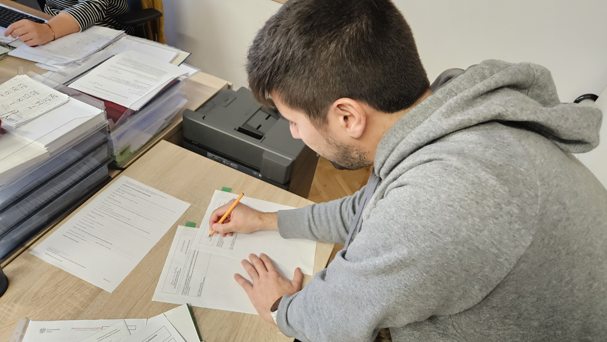
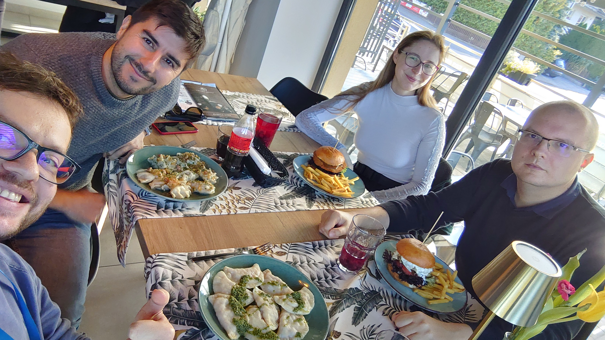

# 🎉 Valen signs a contract with Medical University of Białystok! 🎉

news

MUB

From now on, Valen is an official employee of the Clinical Research Centre at the Medical University of Białystok 🏢🎓.

Published

October 18, 2024

# 🎉 Valen signs a contract with Medical University of Białystok! 🎉

After months of preparation and overcoming several hurdles, we are delighted to announce that **Valen** is now officially part of the Bioinformatics and **Multiomics Analyses Laboratory** in **Clinical Research Centre** at the **Medical University of Białystok**. 🎓📝

While it’s always exciting to welcome new talent to the team, the road to making this happen was challenging. Navigating complexities of **paperwork** 📝 and **bureaucratic processes** 🏢 can often feel like a marathon 🏃💨. Opening the position, getting all the documents in order, and coordinating between many people took plenty of determination 💪! But in the end, we triumphed! 🎉✨

## Food, fun, and festivities 🎉🍽️

To celebrate this exciting milestone, we headed to **Choroszcz** to enjoy some delicious food 🍽️. Known for its famous mental hospital 🏥, the town offered a unique backdrop for our celebration, and we couldn’t have picked a better place to mark the occasion!

## A new beginning: Walentyn Kościelny 🚀

As Valen settles into his new role, we still have to do some stuff at tax office.

But with enough time in **Białystok**, Valen may become so immersed in the Polish way of life that we’ll soon have to start calling him **Walentyn Kościelny**! 😄🇵🇱🥟

Welcome on aboard, **Valen**! 🚀🎉
