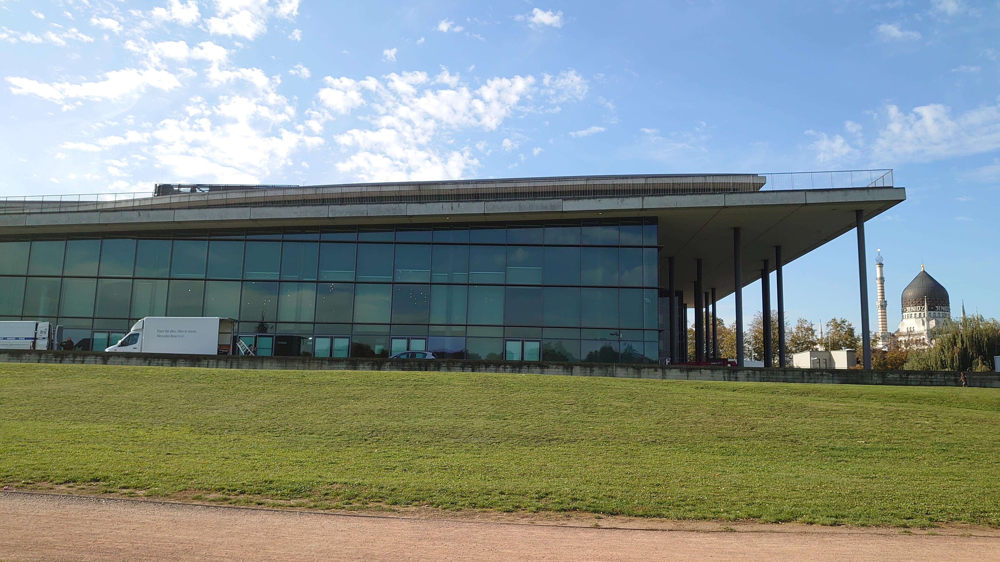
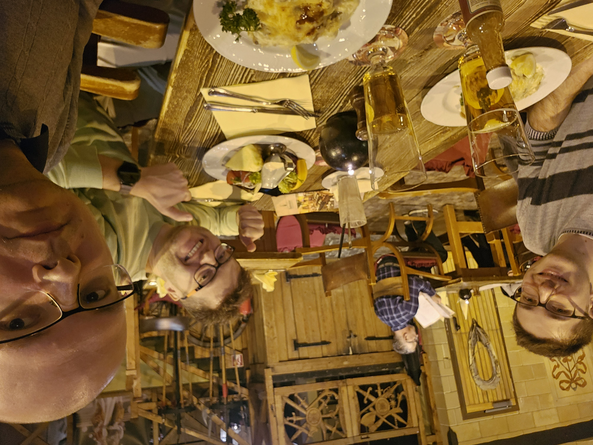
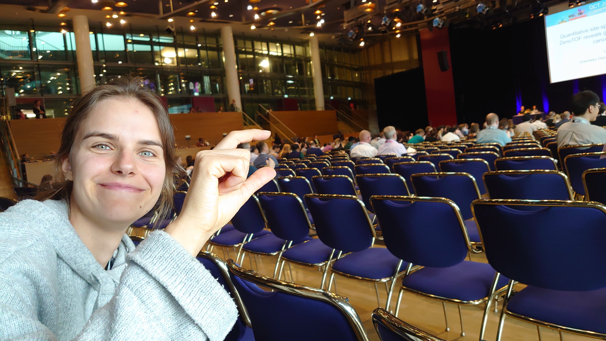
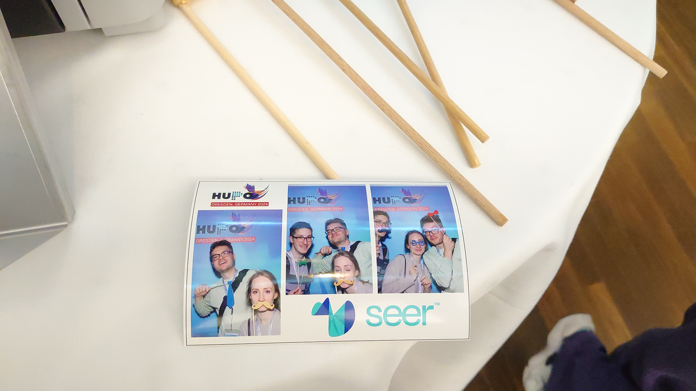
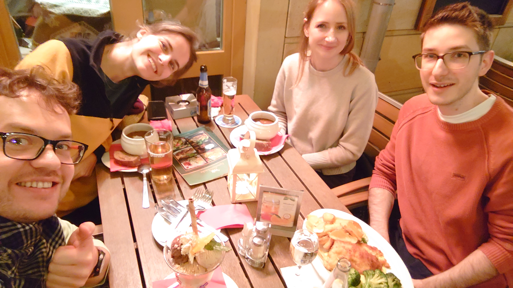
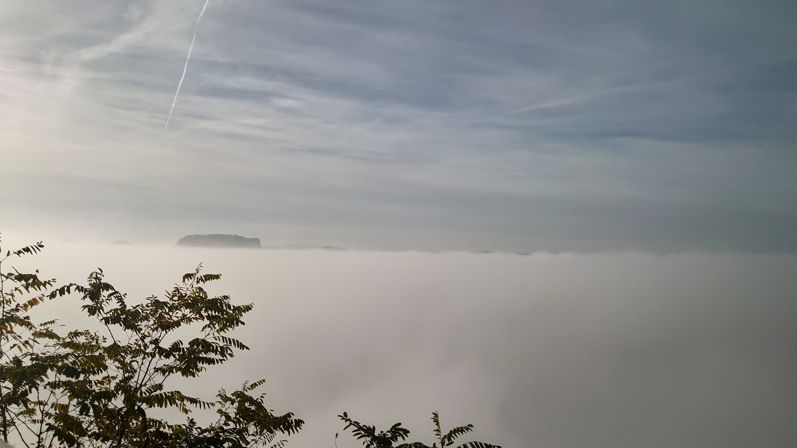
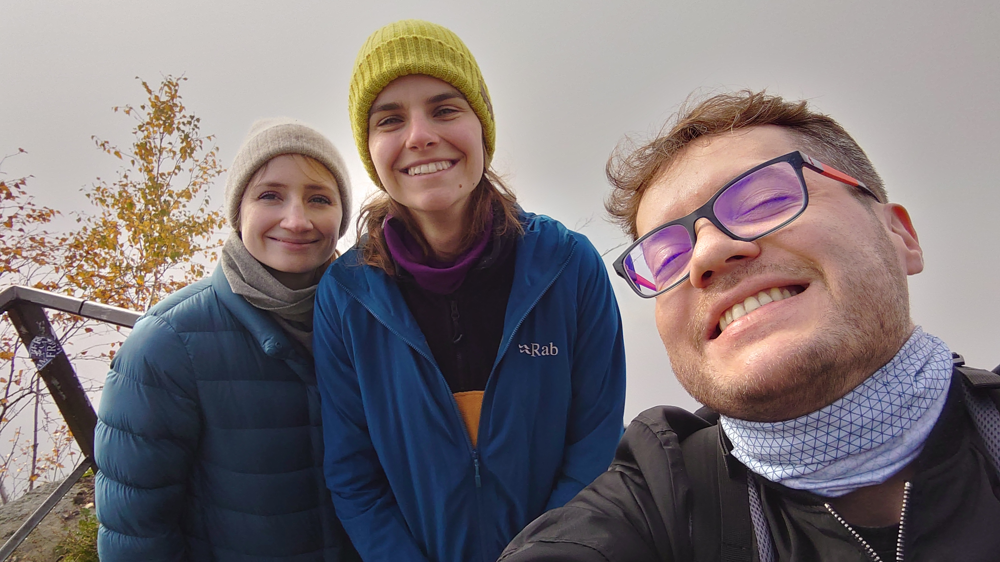
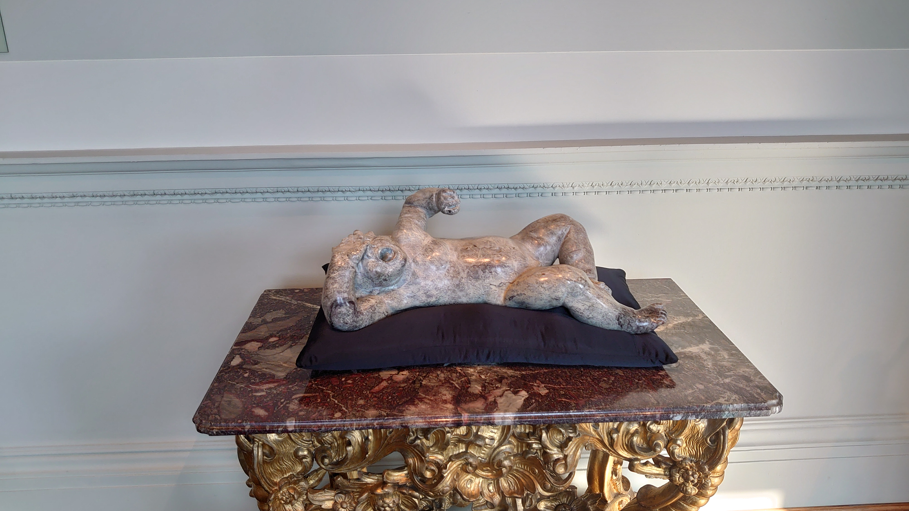

# HUPO 2024 Conference Wrap-Up

conference

HUPO

Germany

reunion

Highlights from an inspiring week in Dresden with the BioGenies team, filled with scientific sessions, networking, and a taste of Dresden’s culture.

Published

October 28, 2024

# 🎉 HUPO 2024 conference wrap-up 🎉

Our BioGenies team – Michał, Jarek, Krysia, Weronika, and Oriol – had an unforgettable week at **HUPO 2024 in Dresden**! Here’s the highlight reel:

## 🏙️ Sunday: arrival & sightseeing

We started the week with a stroll to explore the conference site and snapped a photo of the iconic Yenidze, a former cigarette factory with a unique design 🕌.

That evening, we picked up Oriol from the airport ✈️ and headed to **Sophienkeller** to dive into local Dresden delicacies 🥨🍖.

## 🎊 Opening ceremony & networking

Sunday night kicked off with the **opening ceremony** and welcome reception 🍾, followed by an **Early Career Researchers Networking Night**. Despite the darkness on our boat tour 🌌, we made the most of it by networking with fellow researchers. The highlight? Watching as they joined two boats together – an unexpected twist to the night! 🚢

## 🏒 Monday: air hockey & more connections

Monday saw some friendly rivalry when Jarek and Krysia discovered an **air hockey table**! After an intense game, it ended in a tie 🤝.

Later, Krysia reunited with our colleague Dominik in the plenary hall,

and Jarek, Weronika, and Oriol snapped some fun group photos 📸.

## 📊 Poster sessions & interest

Each of us had poster sessions on different days, and it was exciting to see such strong interest in our research 🧬📈. The steady traffic at our posters highlighted the growing excitement around our work!

## 🍲 Dresden’s culinary gems

Between sessions, we sampled even more homemade Dresden dishes – fueling our research discussions and conference exploration 🥘💪.

## 🌉 Foggy adventure at Bastei Bridge

We carved out some time to visit the famous **Bastei Bridge**. Though the heavy fog limited the view 🌫️, it added a mystique that made for an unforgettable (and chilly) adventure! 🏞️

 

## ✈️ Oriol’s travel twist

Oriol’s return flight was suddenly canceled due to an airport strike 😱. But no worries – Michał, Jarek, and Weronika swooped in 🚗, picking him up from his hotel to drive him back to the airport.

## 🏰 Friday: Dresdner Zwinger exploration

After the conference wrapped up, Weronika and Jarek spent Friday exploring the beautiful **Dresdner Zwinger** – a perfect way to close out a memorable week of science and sightseeing 🏛️✨.

Thanks, **HUPO 2024**, for the inspiring talks, new connections, and unforgettable memories! Until next time, Dresden! 🇩🇪💫
