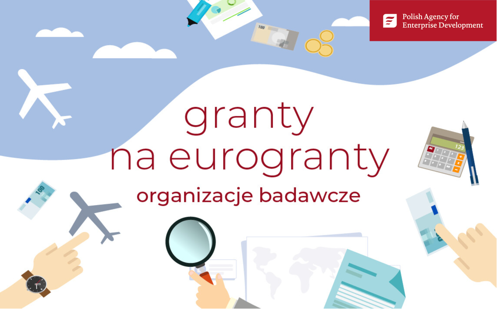

# Michał and Jarek secure PARP ‘Granty na Eurogranty’ grant! 🎉

grants

achievements

MSCA

Exciting news! Michał and Jarek have received a grant from PARP (Polish Agency for Enterprise Development) to support the preparation of their MSCA Staff Exchanges application.

Published

November 1, 2024

# 🎊 Michał and Jarek Win PARP “Granty na Eurogranty”! 🎊

We’re proud to announce that **Michał** and **Jarek** have been awarded a **PARP (Polish Agency for Enterprise Development)** **“Granty na Eurogranty” grant** worth **58,225 PLN**! 💰🎉 This funding will support the preparation of their **Marie Skłodowska-Curie Actions Staff Exchanges** application, paving the way for exciting international collaborations.

Securing this grant is a significant step toward creating impactful research collaborations and broadening the horizons of the **BioGenies** lab.

## 🚀 Boosting MSCA Staff Exchanges

The **MSCA Staff Exchanges** program promotes international and interdisciplinary cooperation between academic and non-academic sectors. With this grant, Michał and Jarek aim to lay the groundwork for a competitive proposal, bringing together partners across Europe and beyond 🌍.

## 🔬 What’s Next?

This funding will help cover essential activities like: - Partner identification and communication 🤝.  
- Proposal writing and consultations ✍️.  
- Administrative support for submission 📑.

