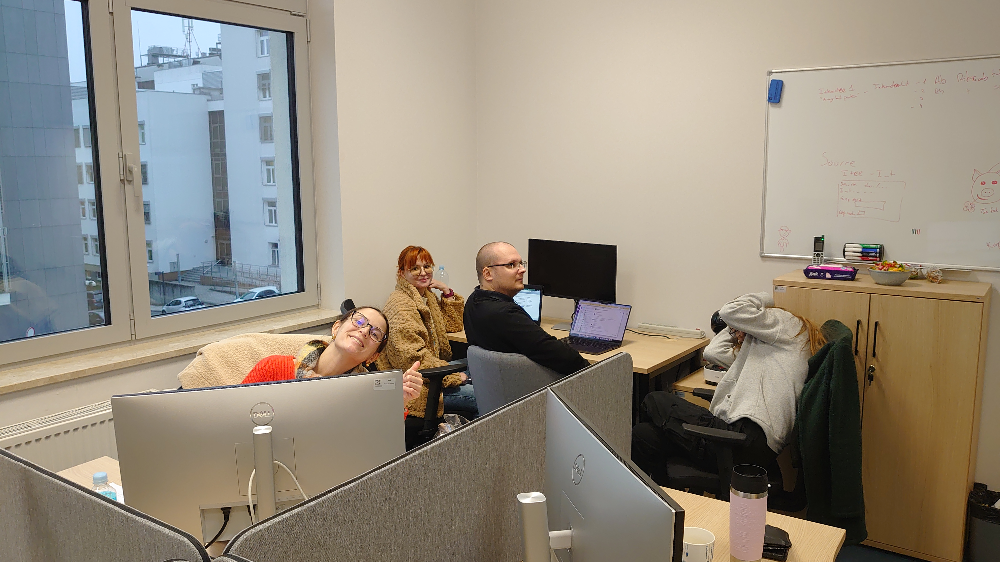

# Welcome Mariia, from BTU to the BioGenies!

team

Erasmus+

LLPS

amyloids

We’re excited to welcome Mariia Solovianova from BTU, a biotechnology master with wet lab expertise, joining our lab to work on a bioinformatics project involving antibodies and amyloids!

Published

November 12, 2024

# 🌟 Welcome, Mariia! 🌟

We’re thrilled to introduce **Mariia Solovianova** to our lab! A **biotechnology master’s graduate** from **BTU Cottbus-Senftenberg** with solid wet lab experience 🧬, Mariia is here to dive into bioinformatics. Her first project? Collaborating with **Valen** and **Ronja** on **amyloid aggregation modulators**!

## 🧑‍💻 Bringing bioinformatics and biotechnology together

Mariia’s hands-on background in biotechnology will be gathering and organizing data on **antibody-amyloid interactions**. This project holds exciting potential for insights into **therapeutic small molecule design** and understanding amyloid diseases at a molecular level. As she transitions to bioinformatics, Mariia will bring her analytical skills into action with our team’s support.

Welcome aboard, Mariia! 🎉 We’re thrilled to have you in the BioGenies and excited to see the discoveries you and Valen will make together.
