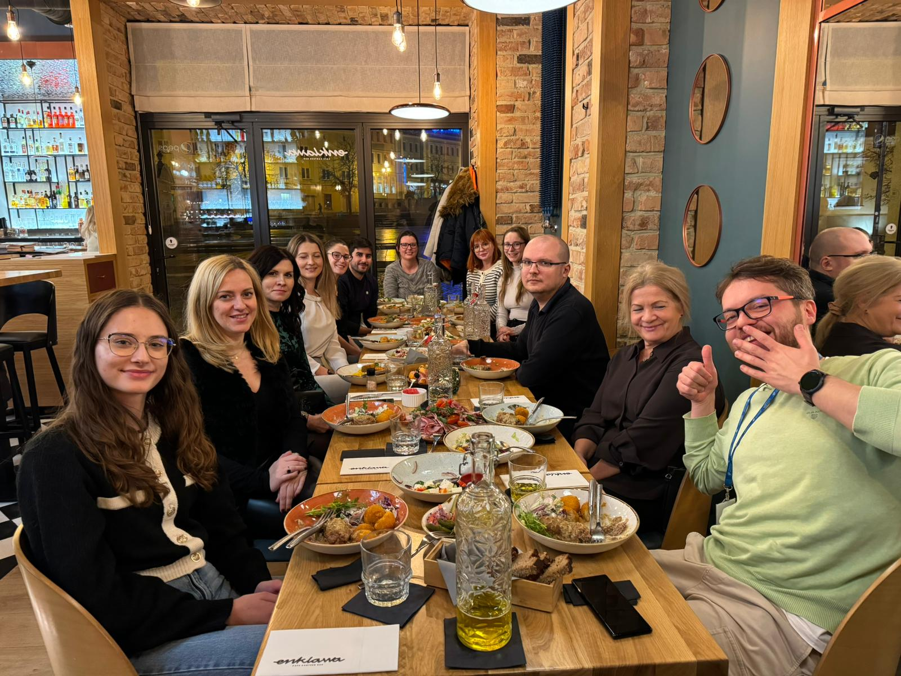
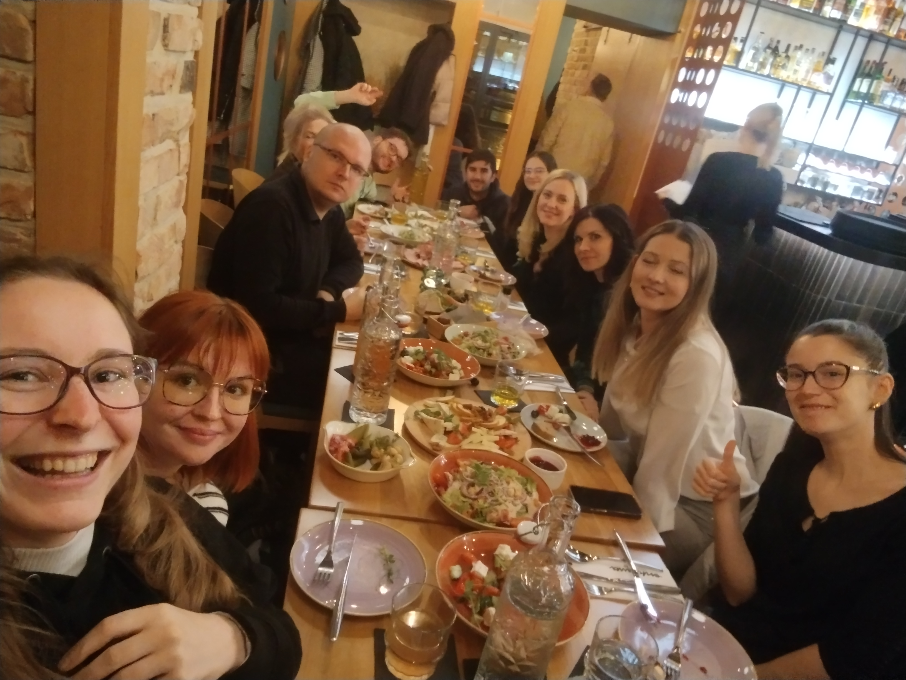
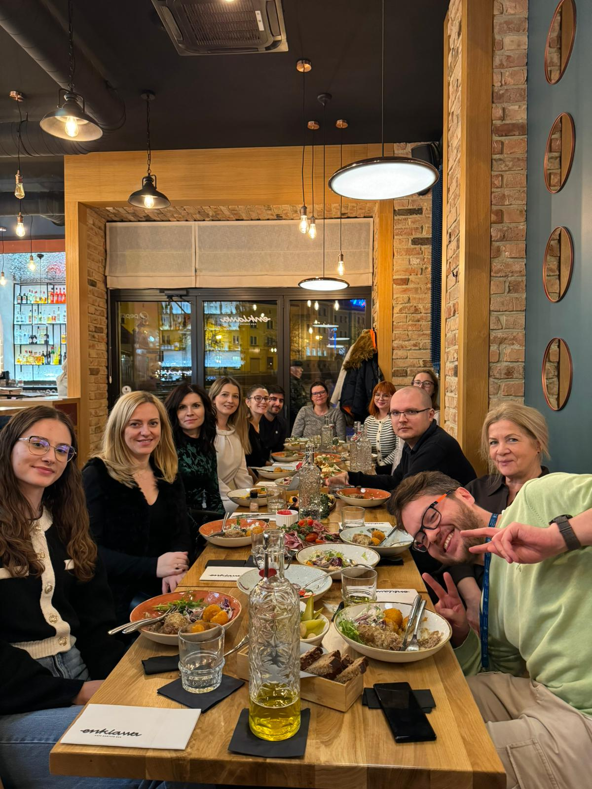

# Celebrating our successes 🎉

team

party

celebration

On November 14 Michał organised a small party to celebrate our achievements and thank amazing people supporting our journey!

Published

November 19, 2024

# 🎊 Celebrating small wins and big gratitude 🎊

On **November 14**, BioGenies gathered for a special **celebration of small successes** and to express our heartfelt gratitude to the wonderful people who support us behind the scenes 💪💪💪

The evening was dedicated to thanking:

- **Magda** and **Agnieszka** from the grant acquisition team, whose dedication ensures our projects keep moving forward 🚀

- **Sylwia** from the NAWA office, whose expertise has been vital in guiding us through paperwork, just to go for a scientific stay and conferences 🌍

## 🌟 Guests

The party was a warm and joyful occasion, attended by:

- From **BioGenies** and their relatives: Michał, Jarek, Valen, Eva, Ronja, Mariia, Asia, Jarek’s mom, and Alicja 🥳

- Our supportive collaborators: Magda, Agnieszka, and Sylwia 🤝🏻

## 🍰 A toast to teamwork

With delicious food, lively conversations, and shared laughter, we celebrated our milestones and reflected on the teamwork that made them possible. It was a beautiful evening to strengthen our connections and share gratitude.

A big thank you to everyone who joined us and helped make the event so memorable. Here’s to more successes and celebrations in the future! 🥂✨

