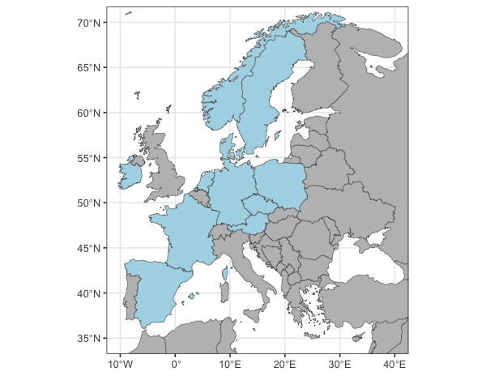

# Writing OneTick Grant for Marie Skłodowska-Curie Actions (MSCA) Staff Exchanges 🎯

grants

MSCA

collaboration

ticks

Michał, Jarek, and Valen are hard at work preparing a OneTick grant for the MSCA Staff Exchanges application with a potential consortium of 11 participants!

Published

January 9, 2025

# 🖋️ Writing the OneTick Grant for MSCA Staff Exchanges!

Exciting times for **BioGenies** as **Michał**, **Jarek**, and **Valen** dive into the process of preparing a **OneTick proposal** for the **MSCA Staff Exchanges** program! 🏗️ This endeavor involves **a lot of administrative work**, but the potential rewards for international collaboration make it all worthwhile 💪.

## 🌍 European consortium

Our proposed consortium could bring together **11 participants** from Europe, representing:  
🇵🇱 Poland \| 🇩🇪 Germany \| 🇸🇪 Sweden \| 🇩🇰 Denmark \| 🇨🇿 Czech Republic \| 🇪🇸 Spain \| 🇫🇷 France \| 🇮🇪 Ireland \| 🇳🇱 Netherlands \| 🇦🇺 Australia \| 🇳🇴 Norway.

Such a diverse and interdisciplinary team would be a fantastic opportunity to advance our research and strengthen international networks 🤝.

## 🔧 Behind the scenes

The process involves:

- Finalizing partnerships and collaborations 🤝
- Drafting the project proposal ✍️
- Coordinating with institutions across 11 countries 🌍
- Managing all the nitty-gritty admin
