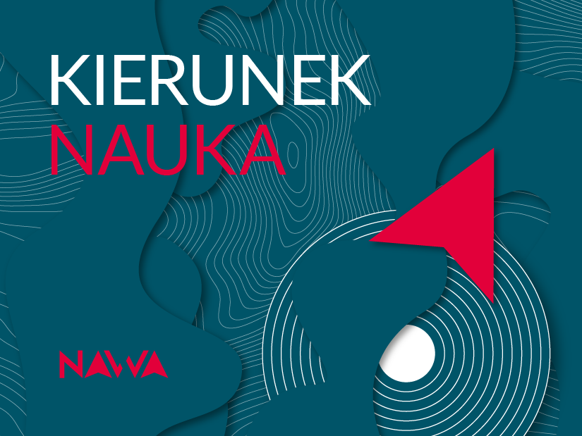

# Valen Featured on NAWA Podcast! 🎙️

podcast

outreach

NAWA

Valen discusses our lab’s exciting science and research projects on the NAWA podcast.

Published

January 10, 2025

# 🎧 Valen on NAWA podcast: sharing our science!

We’re thrilled to share that **Valen** was featured on the **NAWA podcast**! 🎙️ In this episode, Valen talked about the fascinating science we’re working on in the lab and highlighted our innovative projects and international collaborations 🌍🔬.

You can listen to the podcast here:  
👉 [NAWA Podcast - Episode S01E19](https://www.youtube.com/watch?v=h5xSlOCtGPE)

## 🧪 Topics Covered

Valen shared insights into:  
- Our lab’s research in **amyloids** 🔍.  
- The international collaborations and exchange programs that drive our projects 🤝.  
- The challenges and rewards of advancing science in an interdisciplinary environment 🚀.

## 🌟 Thank You, NAWA!

A big thank you to **NAWA** for providing this platform to showcase our work and connect with the broader scientific community 💡.

Tune in to learn more about the exciting work happening at **BioGenies**!

Photo by NAWA
