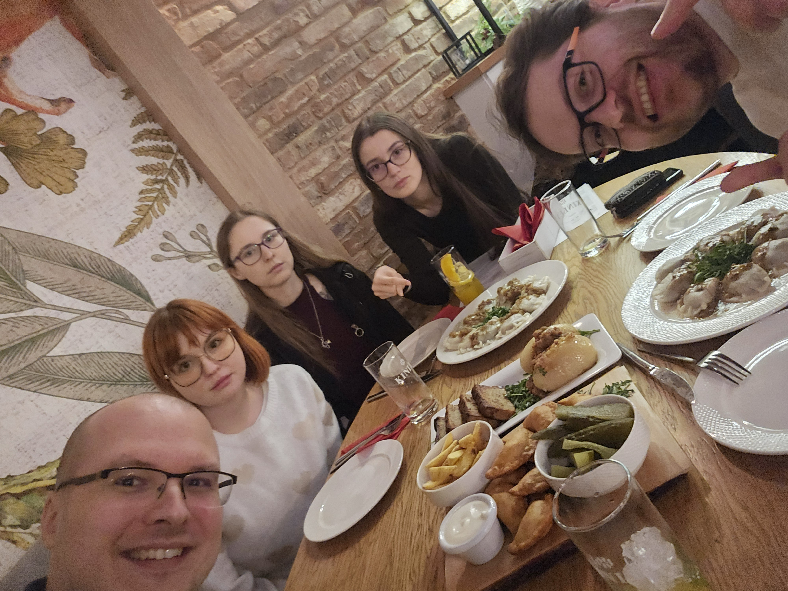
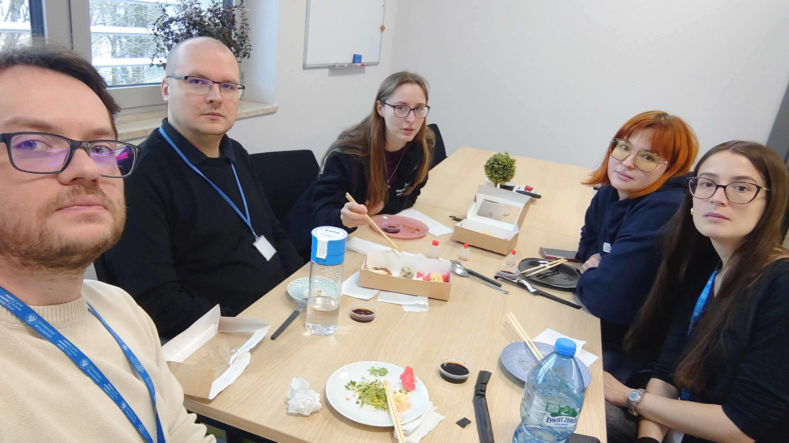
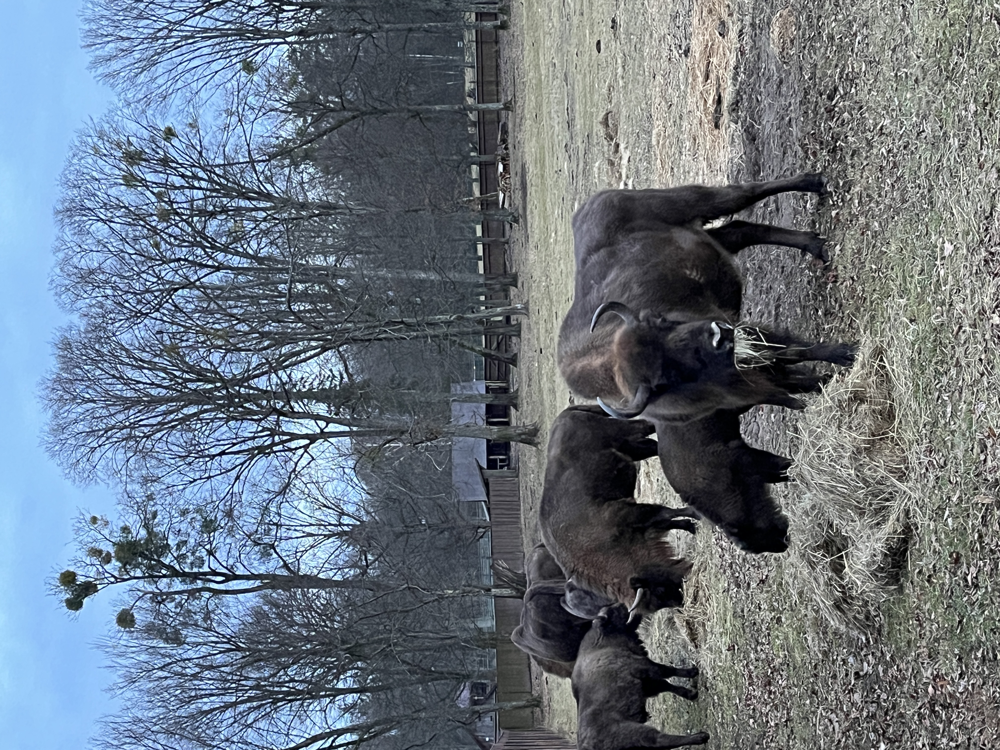
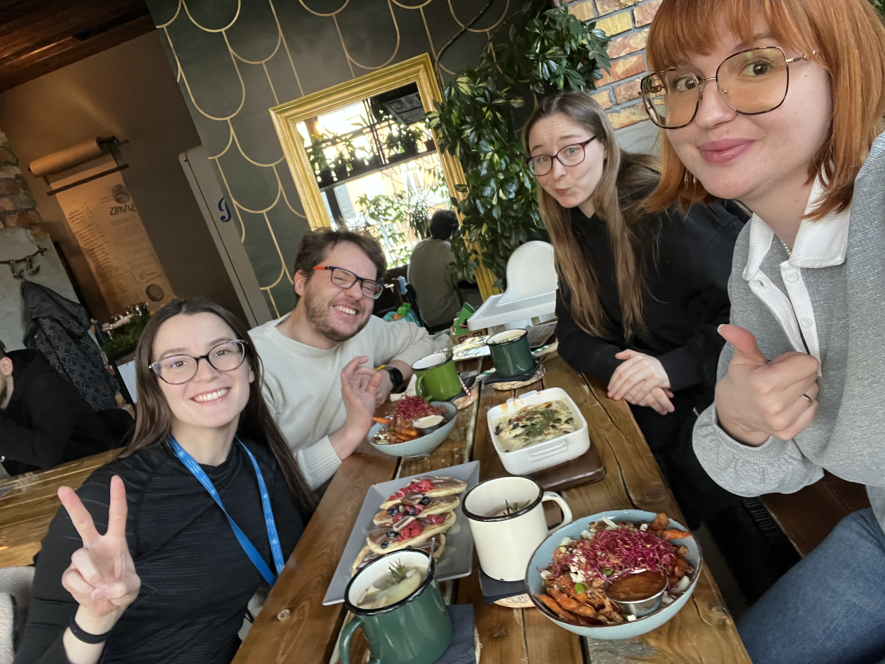
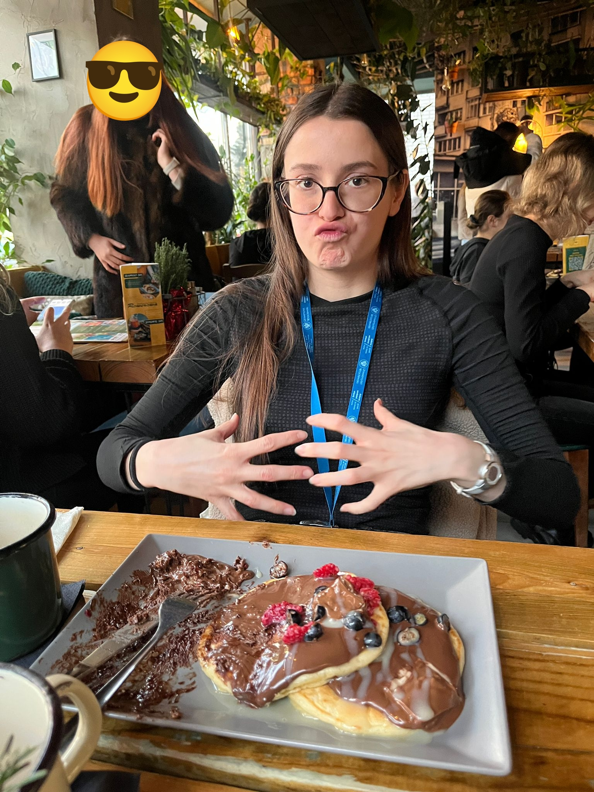
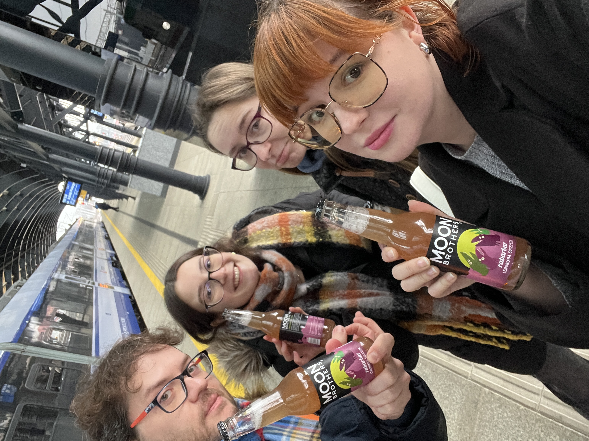
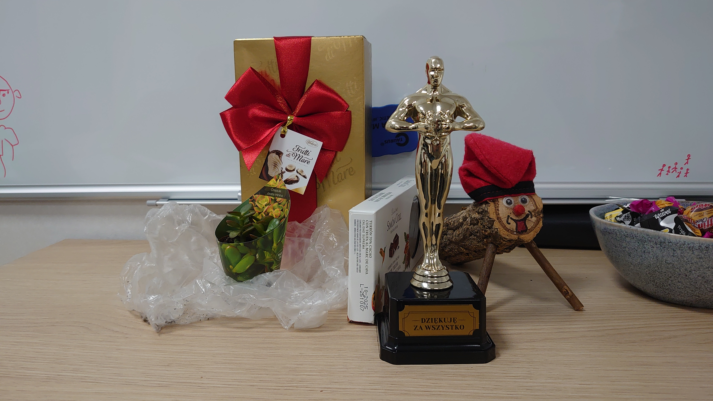

# Farewell to Eva – our first departing Erasmus+ student! 🎓💙

Erasmus+

farewell

party

After an amazing Erasmus experience, Eva says goodbye to our lab. A week full of memories, pierogi, karaoke, and adventures!

Published

January 30, 2025

# 👋 Farewell to Eva – our first departing Erasmus+ student! 💙

This past week was bittersweet as we said goodbye to **Eva**, our **second Erasmus student** but the **first to leave**. Her time with us was filled with science, fun, and unforgettable moments, and we made sure to give her a proper **BioGenies send-off**! 🚀

## 📅 A week of goodbyes & great memories

🟢 **Thursday** – Pierogi, kartacze and potato grandma 🤭 feast! 🥟 A classic Polish experience for a proper farewell.  

🟢 **Friday** – **Sushi lunch** 🍣 followed by the **4th International Karaoke Night at UMB**! 🎤🌍  

🟢 **Sunday** – An adventure in **Białowieża**, walking the route to Jagiełło oak, followed by a delicious meal at **Fanaberia restaurant** 🍽️.  

🟢 **Tuesday** – Our **last pancake night** 🥞 with **Jarek, Ronja, Eva, and Maria**.

 Eva ordered **sweet pancakes** and managed to eat **half**, which we count as a victory! 🎉  

🟢 **Final goodbye** – On **Wednesday**, we went together to the **train station** to say our **last goodbye** in Białystok. 💔🚆

## 🎁 Gifts and gratitude

Eva didn’t leave BioGenies empty-handed — she **left us some nice gifts**! 🎁 We’re grateful for everything she brought to our lab and will truly miss her.

## 🧪 Another great scientist leaving academia

It is always sad to see **another great researcher leaving academia**. Eva has an incredible mind, and the academic world is losing a talented scientist. But wherever she goes next, we know she will **make a difference** and **continue to excel**! 💙

Eva, we wish you all the best in your future adventures! 🚀💙
