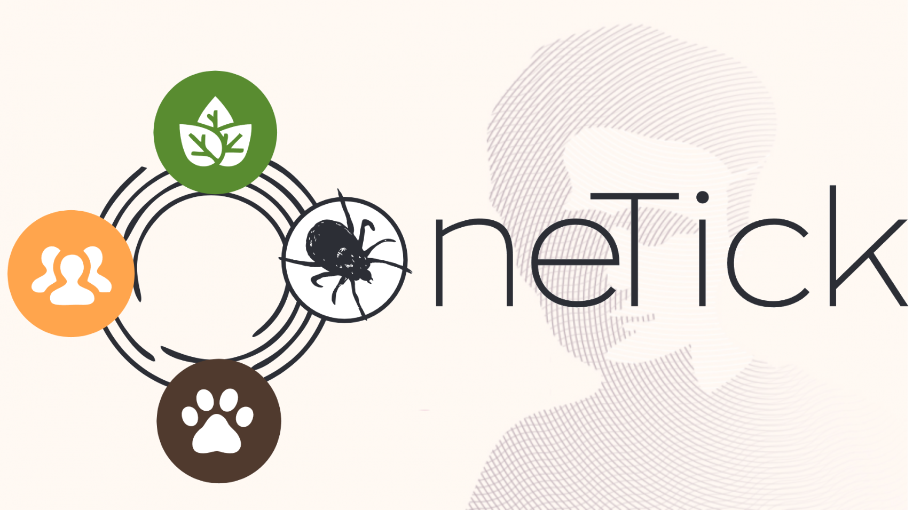

# OneTick proposal submitted & Michał’s well-deserved break! 🚀🌴

MSCA

ticks

grants

holidays

We’ve officially submitted our OneTick proposal for MSCA Staff Exchanges, and Michał is finally taking a holiday after seven years!

Published

February 10, 2025

# ✅ OneTick Proposal Submitted & Michał’s First Holiday in 7 Years! 🌍🎉

Big news from BioGenies! After weeks of **hard work, paperwork, and coordination**, we have **officially submitted the OneTick proposal** for **MSCA Staff Exchanges**! 📝🚀 Our consortium consists of **11 amazing participants** spanning **PL, DE, SE, DK, CZ, ES, FR, IR, NL, AU, and NO**. Now, fingers crossed for good results! 🤞

On top of that, another milestone—**Michał is finally on holiday!** 🌴 After **seven years of non-stop work**, he’s taking a well-deserved break. No grants, no deadlines, just **pure relaxation** (or at least we hope so! 😆).

Wishing Michał a fantastic holiday and hoping for positive news on OneTick! 🎊

