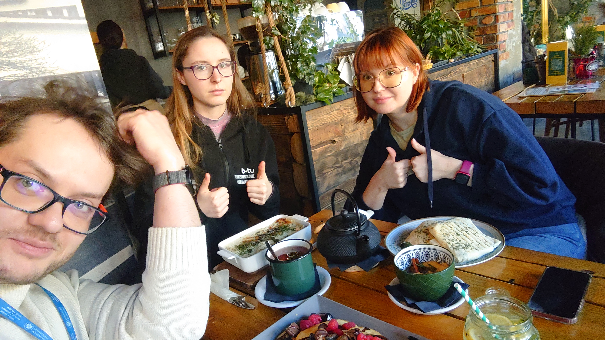
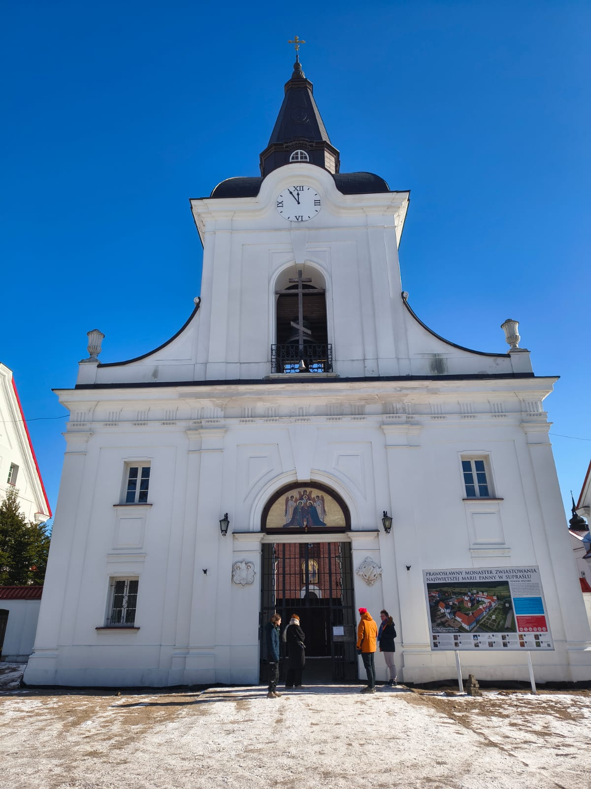
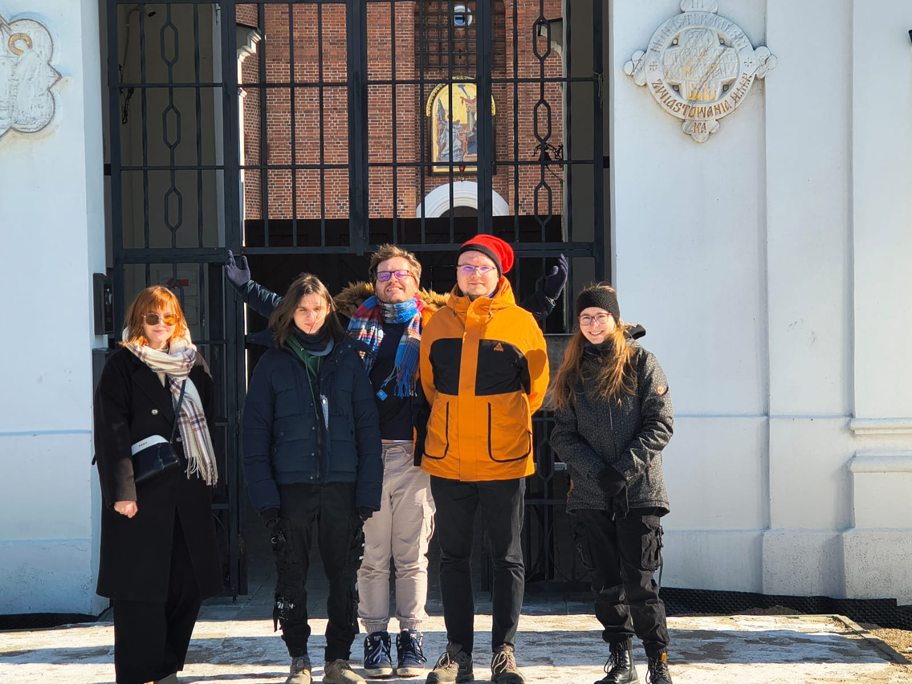
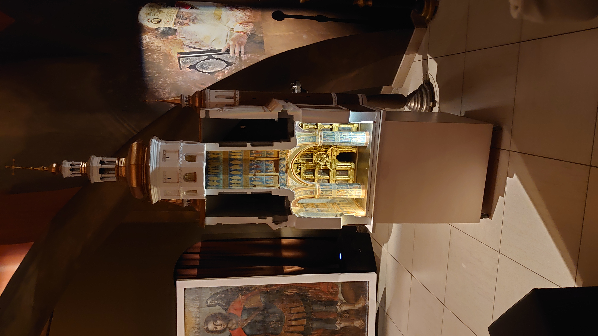
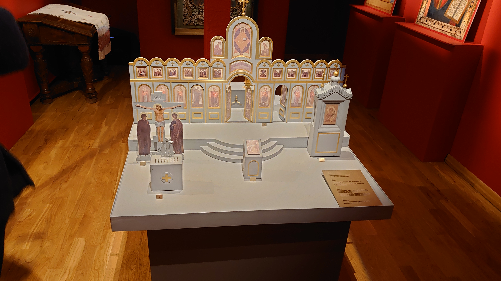
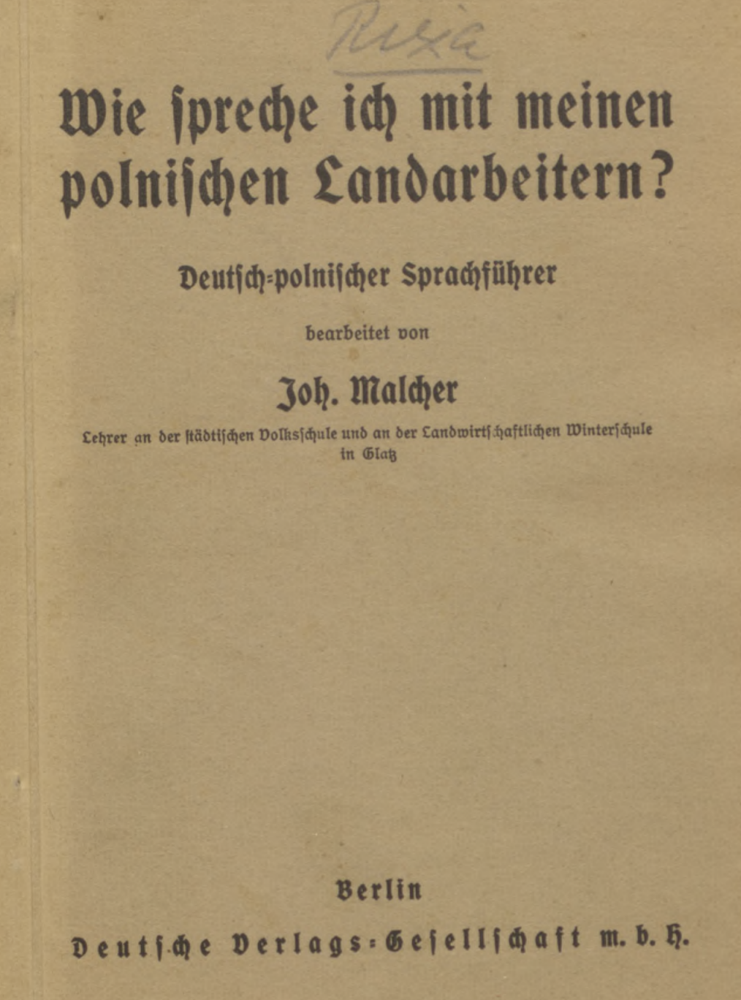
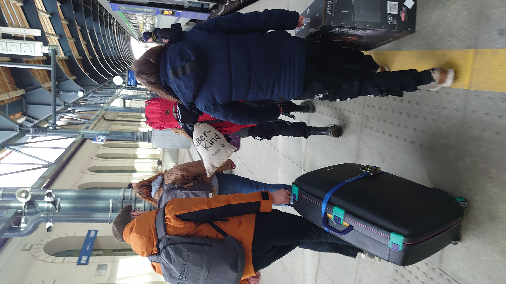
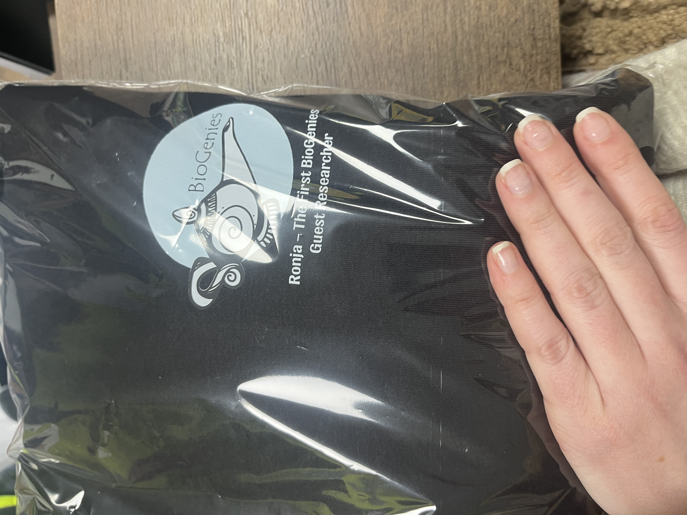

# Farewell to Ronja – our first Erasmus+ student! 🇩🇪💙

Erasmus+

farewell

Praxissemester

Ronja’s Praxissemester with us has come to an end. From food feasts to cultural trips and a dramatic train station farewell – here’s how we spent the last days together!

Published

February 24, 2025

# 👋 Goodbye Ronja – our first Erasmus+ student! 💙

Ronja’s **Praxissemester** with us has officially come to an end 😢. It feels like just yesterday she arrived, and now we’re saying goodbye to an amazing colleague and friend. We made sure her last days were **filled with great memories!**

## 🍽️ Eating our way through farewell week

As per BioGenies tradition, we **ate a lot** during these last days! 🥟🍰

## 🏛️ A trip to Supraśl – history, culture & icons

We took a trip to **Suprasł**, where we **learned how to read icons** and soaked in the local history! 🎨  
Ronja’s friend, **Robin**, also joined us to **help her on her return trip**, and he got to experience Supraśl with us as well! 🚗🌲

 

 

## 🗣️ A mix of languages

Between science and sightseeing, we even managed to **learn some German and Polish** together! 🇩🇪🇵🇱

## 🚆 A chaotic but memorable farewell

And of course, what would a BioGenies goodbye be without **rushing to the train station at the last minute**? As always, we were **very late** 😆 🏃‍♂️💨

 

The train station was **bustling with people**, and in a surprise twist, the **Jagiellonia Białystok football team** was also there, taking the train! ⚽😲

Ronja, **thank you for everything** – your dedication, hard work, and all the fun moments we shared. We’ll miss you, but we know you’ll do amazing things in the future! 💙

