# Ticks, trails & travel – Science and short city break adventures 🧬🧗‍♀️🌍

conference

France

via ferrata

Germany

holidays

Michał shared urban tick research in Weimar, while Jarek, Weronika, and Krysia took a well-earned adventure break in Montpellier!

Published

April 1, 2025

# 🧬 Michał at the International Symposium on Ticks and Tick-borne Diseases 🇩🇪

From **March 26–28, 2025**, **Michał** attended the **International Symposium on Ticks and Tick-borne Diseases** in **Weimar**, where he presented his poster titled:

> 🪳 *“Ticks and the city: investigating ticks and tick-borne diseases in urban and peri-urban environments”*

Michał was there together with **Prof. Anna Moniuszko-Malinowska**, Head of the **Department of Infectious Diseases and Neuroinfection**, and a key figure in the field. Great to have strong representation from our MUB team! 👏

He also had the opportunity to do a bit of **networking with OneTick consortium members** (our **MSCA Staff Exchanges proposal** is still under evaluation – fingers crossed!) 🧬💬.

------------------------------------------------------------------------

# 🧗‍♀️ BioGenies’ city break – Montpellier edition 🇫🇷

While Michał was in full science mode, **Jarek**, **Weronika**, and **Krysia** decided to hit pause on lab life and dive into a spontaneous **short city break adventure in Montpellier**!

### 🛤️✈️ Train to Wrocław → Flight to Montpellier

The adventure begins!

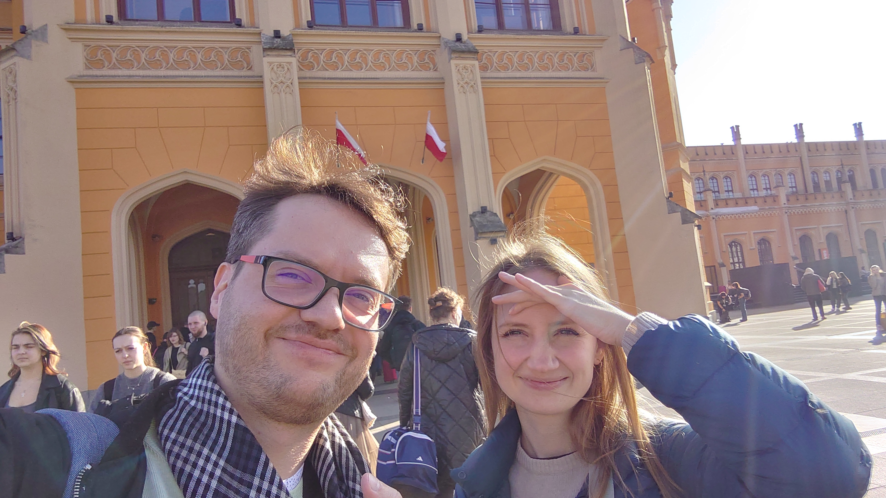

### 🧗 Day 1 – First via ferrata

Sunny skies but **cold wind in the shadows** made the climb extra challenging.

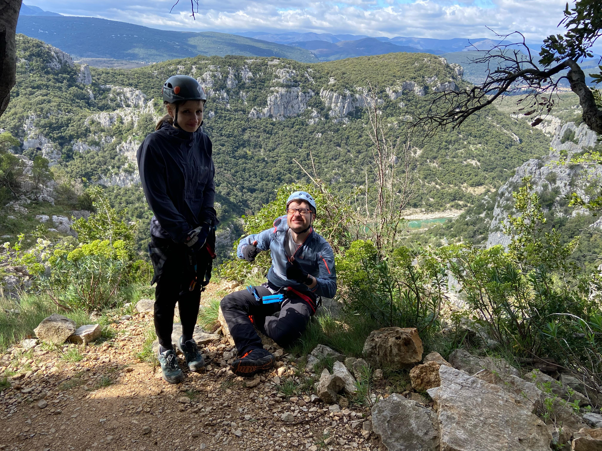 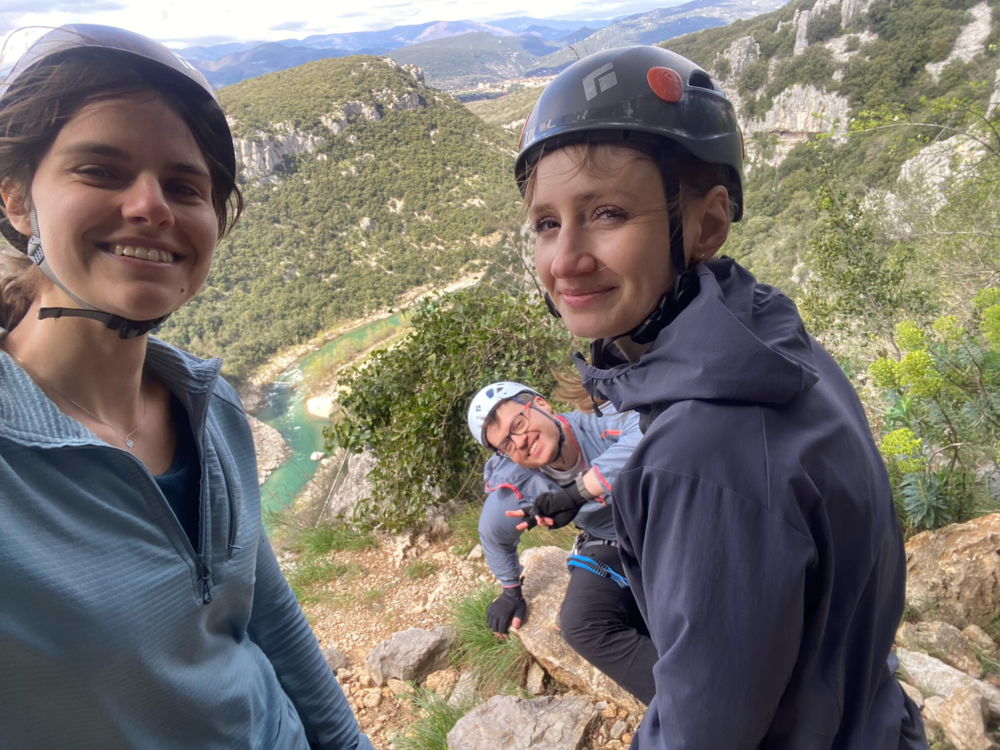 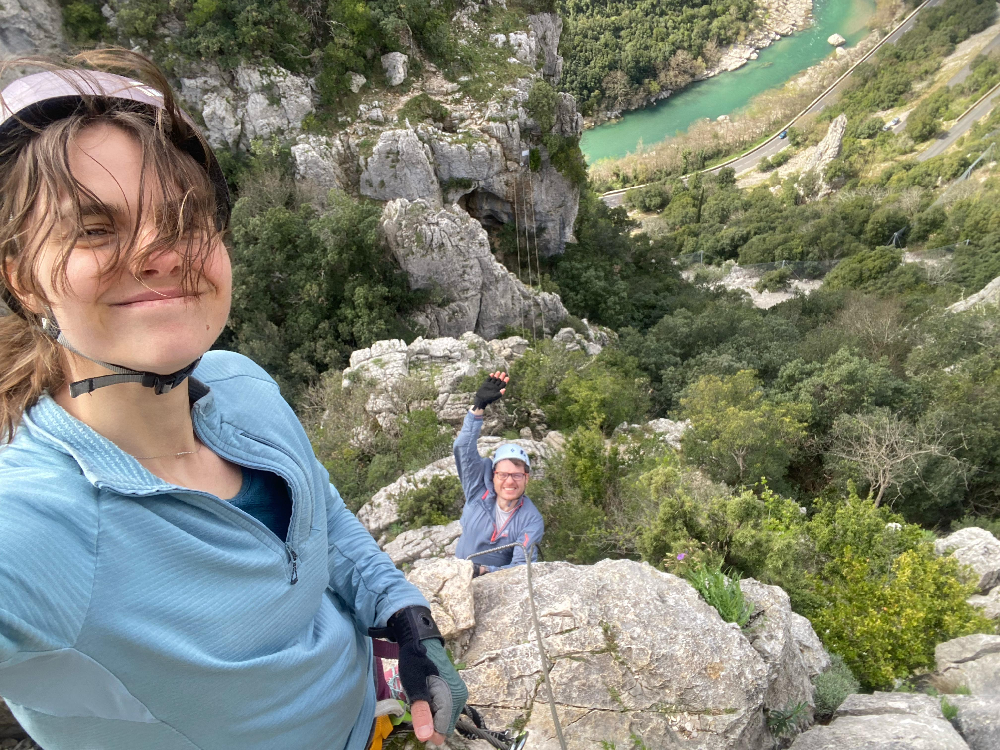 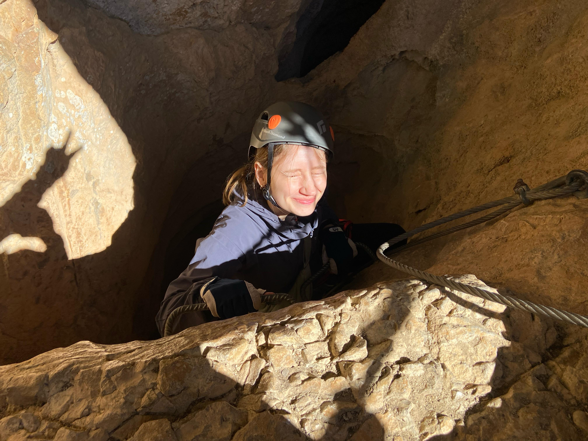

### 🏛️ Quick sightseeing in Montpellier

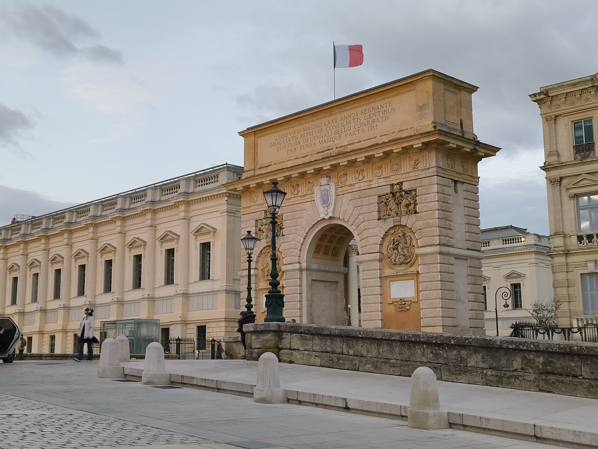

The **aqueducts were closed**, but **Jarek tried going around the fence** anyway 🙈

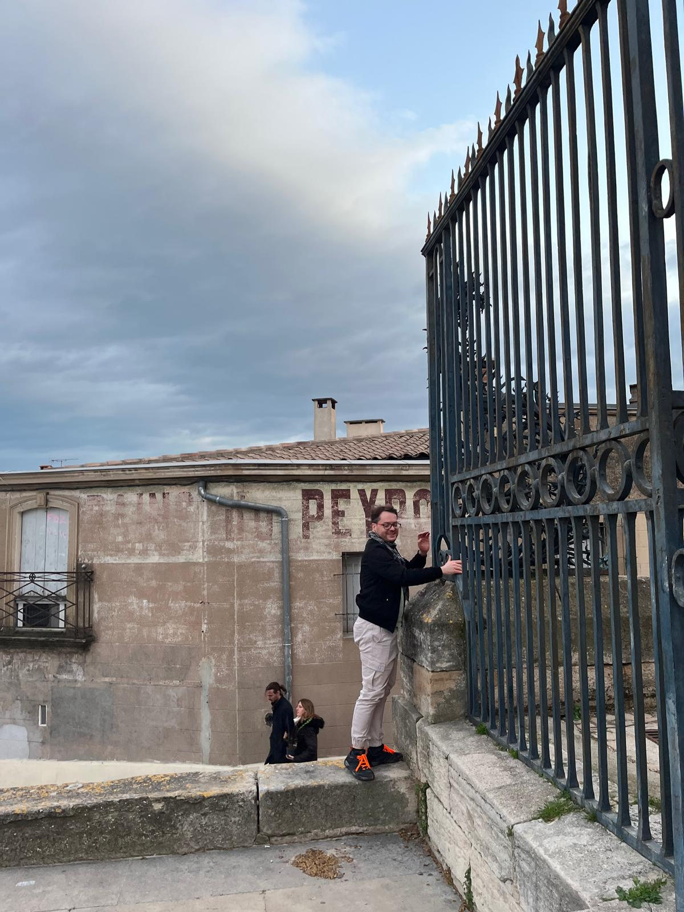

### 🧗‍♂️ Day 2 – River via ferrata & zipline

Second via ferrata directly **above the river**, with a super **fun zipline ride**!

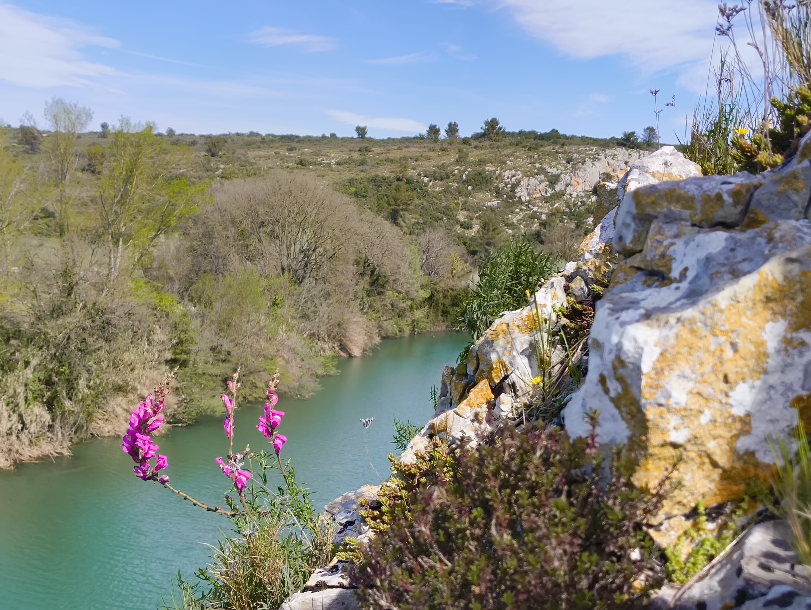 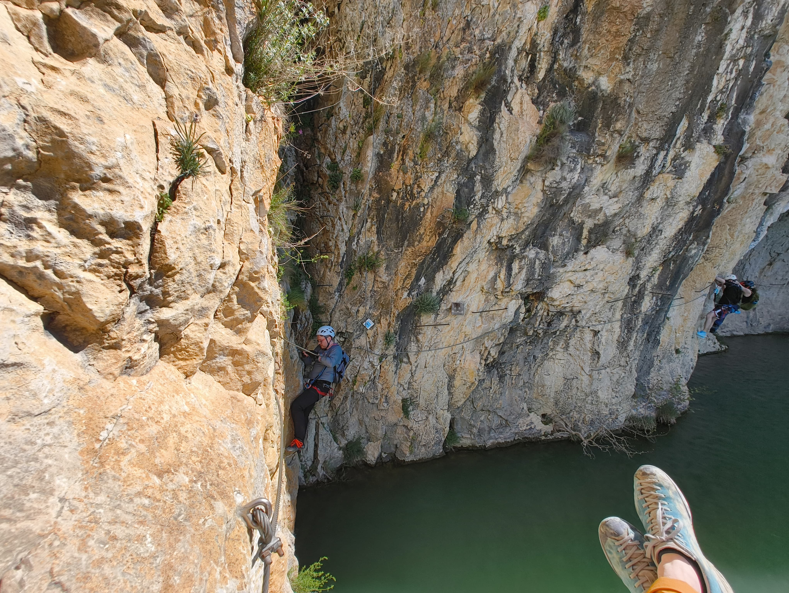 [Video](../fig/posts/2025_04_01/1000031184.mp4)

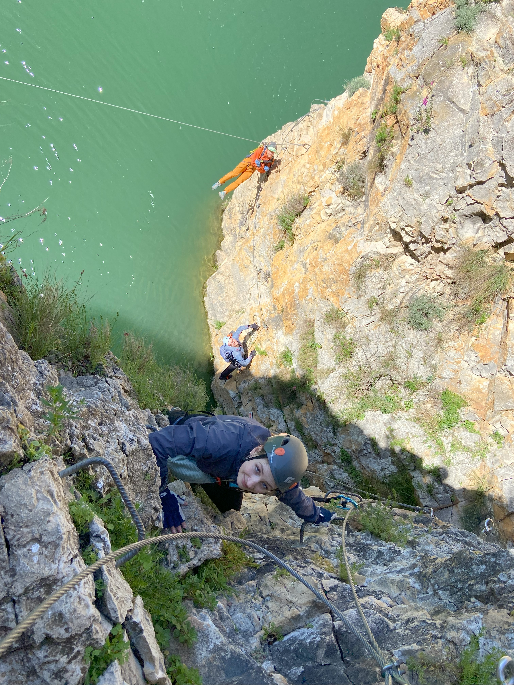

### 🕳️ Cave exploration near Pic Saint-Loup

Before heading to the beach, we visited a **cool cave near Pic Saint-Loup**, mysterious and refreshing!  
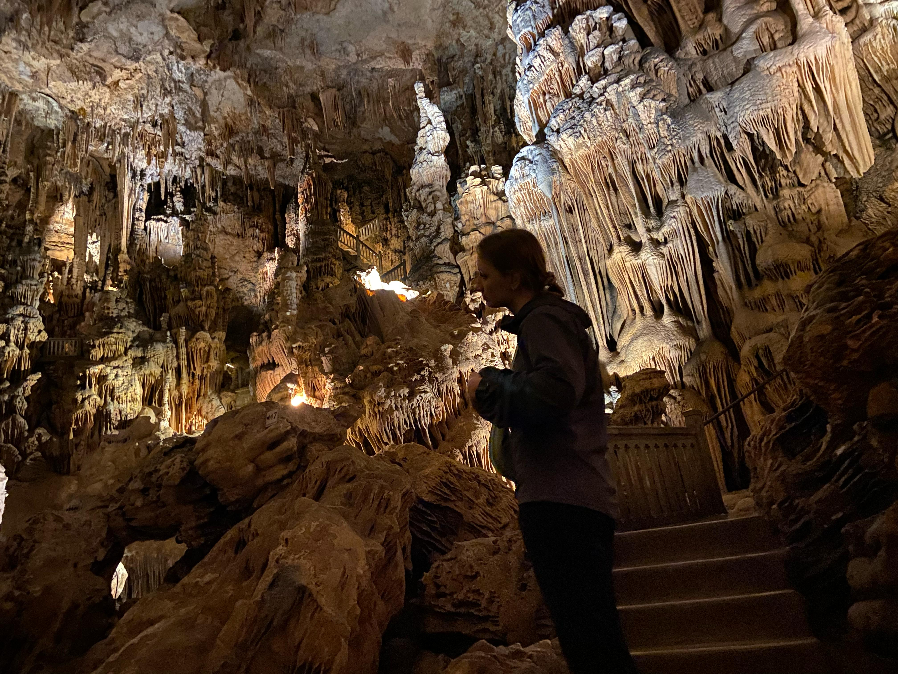

### 🌊 Afternoon at the beach

Collected **seashells** and saw beautiful **flamingos** 🦩

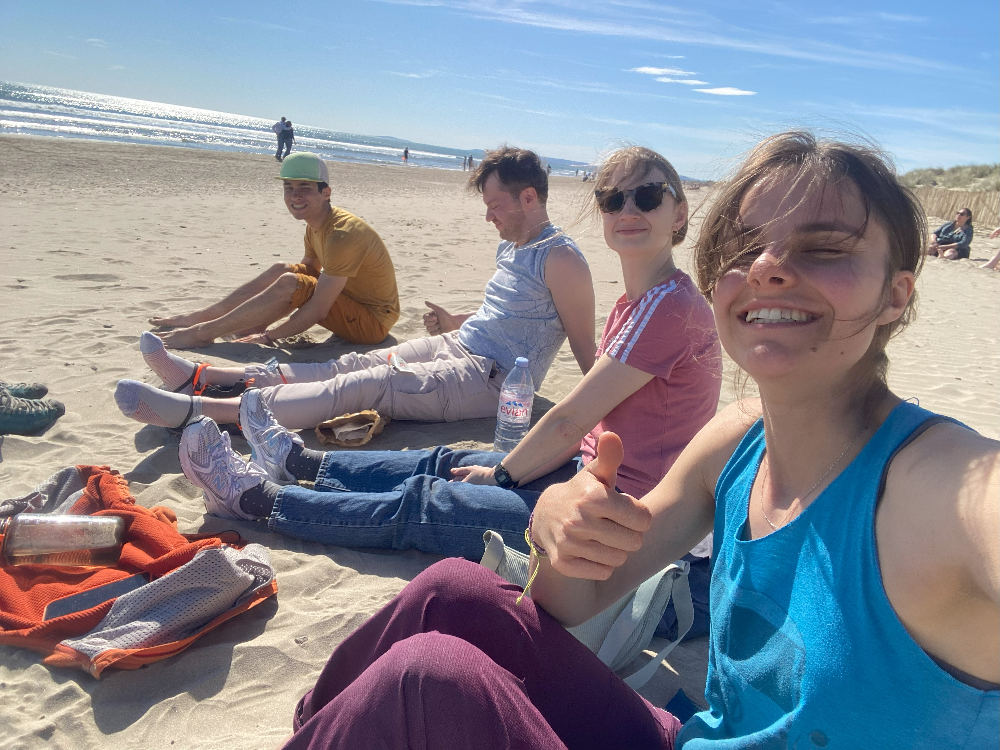

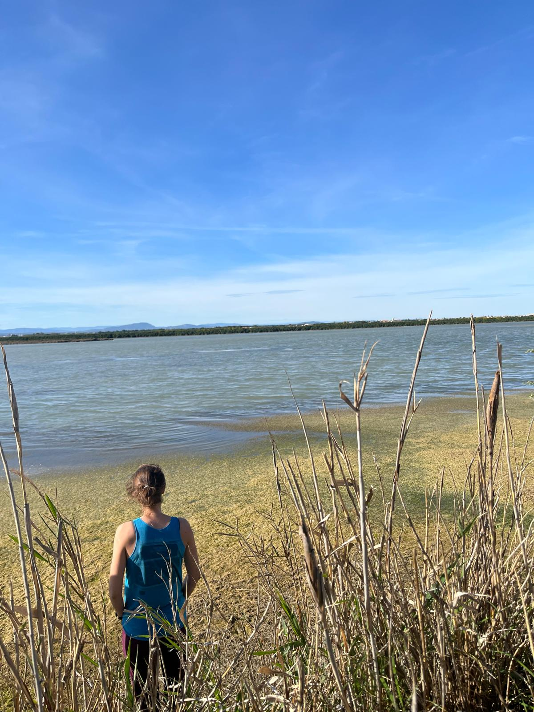

### 🇵🇱 Return to Poland

Landed in **Cracow**, where we were greeted by **Pope John Paul II** 🧳🇵🇱  
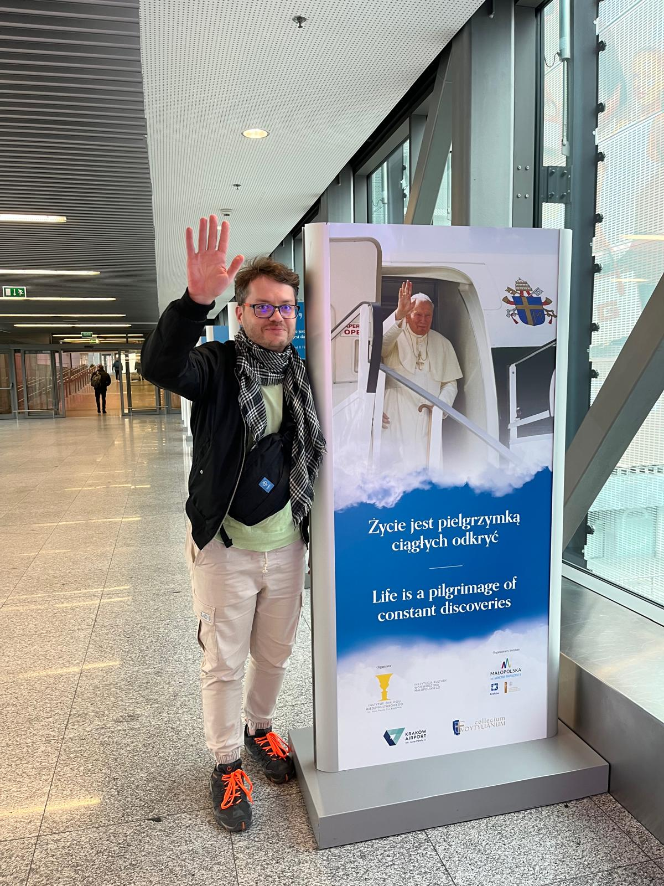 Sometimes you need a dose of nature and adventure to recharge, and that’s exactly what they did! 💙

------------------------------------------------------------------------

This spontaneous journey was the perfect mix of **adventure, fun, and relaxation**, and a great reminder that BioGenies know how to balance science and life 💙.
