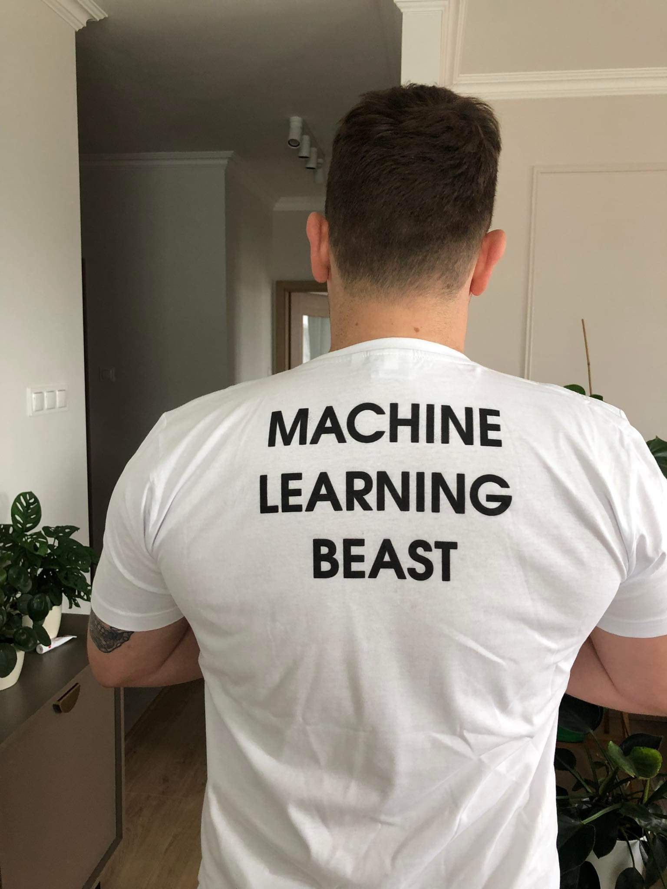

# Jakub joins Google! 🚀 Our ML beast in the big leagues

celebration

achievements

From BioGenies to Google, Jakub is now working on C++ projects for OpenAI but he’s still part of the family!

Published

May 18, 2025

# 🚀 Jakub joins Google, our machine learning beast in the Big Leagues!

We’re thrilled to share that **Jakub** has officially **joined Google**! 🧠💻 Even more exciting? He’s **working on projects for OpenAI**! 🔥

## 🔁 Shifting gears – Python to C++

“Our favorite ML master is **shifting focus to C++**, diving deep into performance-heavy projects. It’s a big leap, but if anyone can handle that kind of compute muscle-flexing, it’s **Jakub**.

> “Less time for BioGenies… but still a BioGenie.” 💙  
> We’ll take it!

## 🥐🥗🍣 The perks? Insider scoop!

The rumors are true – **Google takes care of its people**. Jakub reports:

- ✅ Free **breakfast**, **lunch**, **dinner**, and even **supper** 🍳🍱🍜
- ✅ Access to a **gym** to burn all those free calories 💪
- ❌ But don’t try to crash overnight ,you’ll **get kicked out** 😅

Almost sounds like a place you could live in… if only they’d let you stay past bedtime!

------------------------------------------------------------------------

We’re super proud of Jakub and his journey from lab notebooks to massive production servers. We miss you in the daily grind, but once a BioGenie – **always** a BioGenie. 💙🚀
