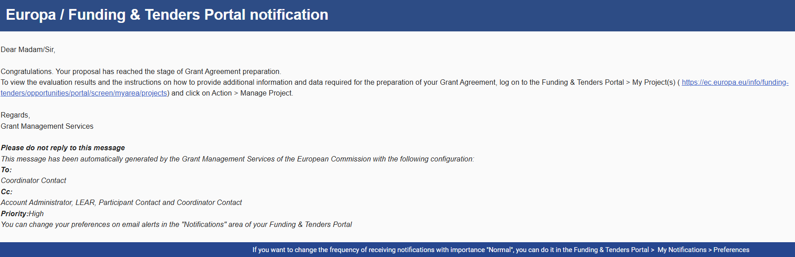
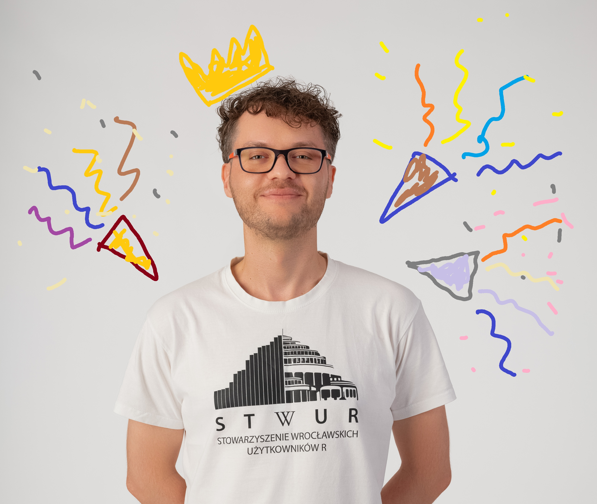

# 🎉 Jarek awarded Horizon Europe ERA Talents grant!

AmyloGraph

amyloids

Lithuania

MSCA

Horizon Europe

WIDERA

ERA Talents

From MSCA near-miss to ERA Talents success, BioGenies score again! 🇪🇺💪 . Next stop: Life Sciences Center at Vilnius University

Published

May 19, 2025

# 🚀 Jarek awarded his first Horizon Europe ERA Fellowship! 🇪🇺🎓

We’re thrilled to announce that **Jarek** has received a **Horizon Europe ERA Talents Postdoctoral Fellowship**! 🌟 This came as a surprise twist after he submitted a **MSCA Postdoctoral Fellowship** proposal, which, while not funded, still **passed all threshold points**. For a **first European-level application**, that’s already a huge win! 💪

But here’s the plot twist: 💡 his application was **automatically moved** to the **ERA Talents** scheme. We had already lost hope…

…Until **last week**, out of the blue, we received a notification from the **European Commission**:

> “Congratulations. Your proposal has reached the stage of Grant Agreement preparation.”

Cue the celebration! 🎊🥳🎊🥳🎊🥳

## ✈️ Two-year adventure in Vilnius

Starting **early next year**, Jarek will begin a **two-year research stay at Vilnius University** 🇱🇹. There, he’ll:

- 🔬 Study the **impact of small molecules on amyloid polymorphism**  
- 🧩 Apply the findings to **expand the AmyloGraph database**  
- 🤝 Collaborate closely with top researchers in the field

This project promises to push forward our understanding of amyloid structures and interactions and feed valuable insights into our growing infrastructure!

------------------------------------------------------------------------

We’re incredibly proud of Jarek for this achievement and perseverance. From nearly missing out to scoring **an amazing opportunity**, this grant will open new doors for international collaboration and career development!
