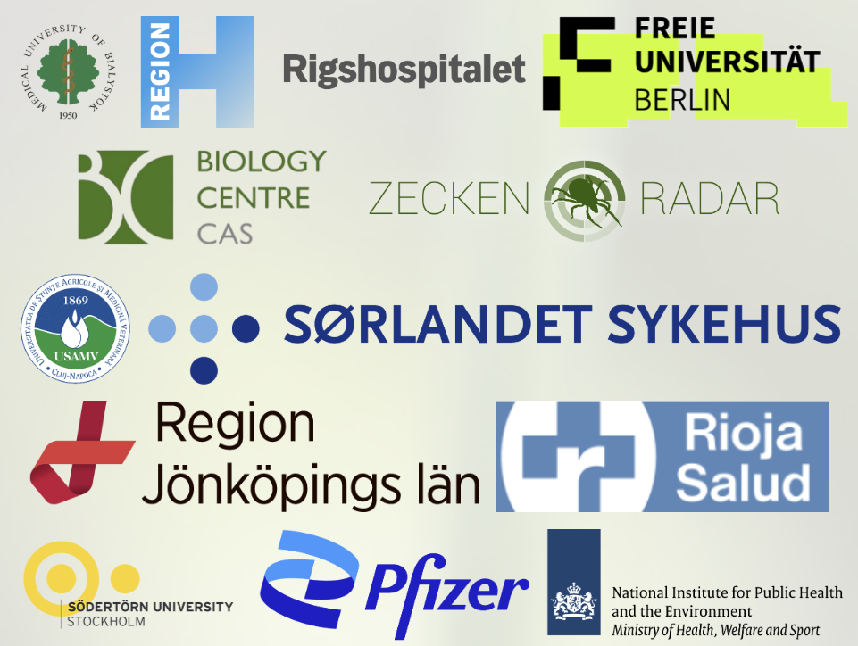

# 🎉 OneTick project awarded MSCA Staff Exchanges grant!

MSCA

Horizon Europe

ticks

grants

Another huge win for BioGenies! Our first MSCA Staff Exchanges project, OneTick, officially funded by the European Commission!

Published

May 20, 2025

# 🏆 Another win from the European Commission, **OneTick** is funded! 🎉

Just **a few days after celebrating Jarek’s ERA Fellowship**, we received another incredible notification from the **European Commission**.

## ✅ **Our OneTick project has been awarded MSCA Staff Exchanges!** 🎓

Not only is this our **first project of this kind**, we’re the **only project coordinated from Poland** among a total 19 proposals submitted by Polish-led consortia! 😲

👏 **Huge congratulations to Michał**, who led the application and tirelessly coordinated with all the partners. **Jarek and Valen** were deeply involved in writing and structuring the proposal, but the heavy lifting, all those calls and negotiations, was on Michał’s shoulders. And he nailed it 💪

## 🦠🧬 About OneTick

**OneTick** investigates **tick-borne diseases** using a **One Health approach**, linking human, animal, and environmental health.

### 🌱🌍 Focus areas:

- Impact of **climate change** on **tick behavior and presence** in **urban and peri-urban areas** (parks, gardens, playgrounds)
- Use of **AI-based modeling**, **epidemiology** and **field ecology** to:
  - Improve **risk assessment**
  - Understand **tick distribution**
  - Inform **control strategies**

## 🤝 Our European dream team 🌐

The project brings together **13 partners from 10 countries**, including:

- 🧭 Medical University of Białystok 🇵🇱
- 🧪 Tick-radar GmbH 🇩🇪  
- 🧬 FUNDACION RIOJA SALUD 🇪🇸  
- 🎓 Södertörn University 🇸🇪  
- 🏥 Rigshospitalet 🇩🇰  
- 💊 Pfizer 🇦🇹  
- 🧠 Freie Universität Berlin 🇩🇪  
- 🐾 University of Agricultural Sciences and Veterinary Medicine Cluj-Napoca 🇷🇴  
- 🏥 Region Jönköpings län 🇸🇪  
- 🏥 Sørlandet sykehus HF 🇳🇴  
- 🧫 RIVM National Institute for Public Health and the Environment 🇳🇱  
- 🔬 Biologické centrum AV ČR, v.v.i. 🇨🇿

------------------------------------------------------------------------

We’re beyond excited to kick off this **cross-disciplinary, cross-sector collaboration** to tackle a **growing public health challenge**! 💚

Stay tuned for updates, ticks don’t rest, and neither do we 🕷️🌍
