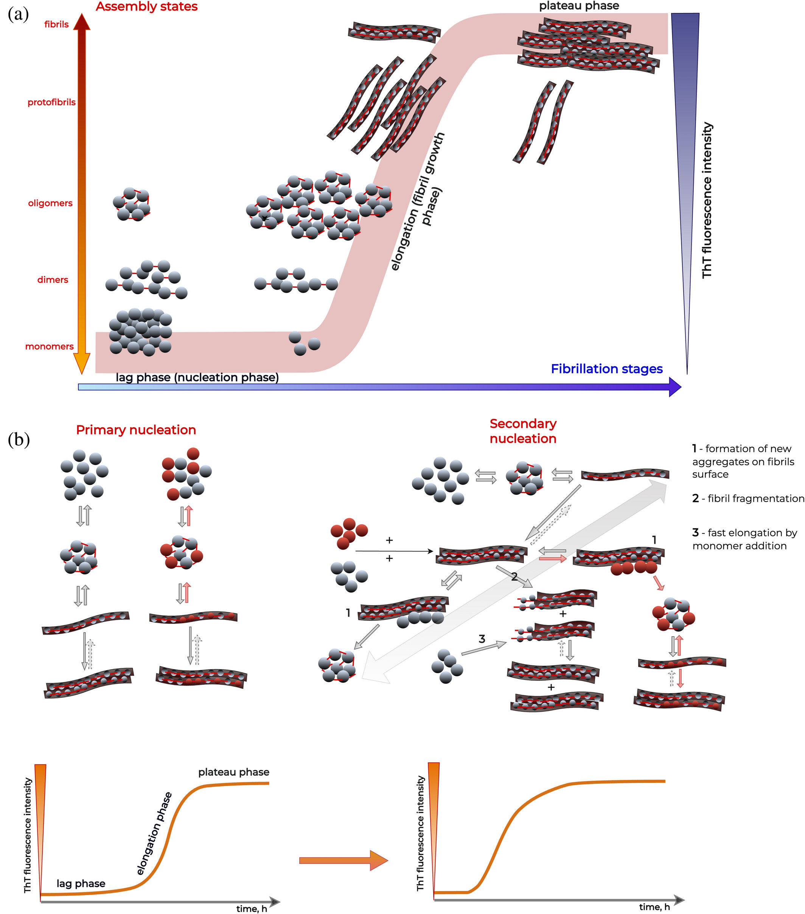

# 📢 New review article published in *Protein Science*!

amyloids

publications

review

We explore how experimental methods help unravel amyloid cross-interactions, a key aspect in understanding amyloid behavior in health and disease.

Published

May 21, 2025

# 🧪 Our latest review is finally online in **Protein Science**!

🎉 We’re excited to share that our review article, **“Experimental methods for studying amyloid cross-interactions”**, is now published and open access in *Protein Science*!

🔗 [You can read it here](https://doi.org/10.1002/pro.70151)

------------------------------------------------------------------------

## 👥 Authors:

Aleksandra Kalitnik, Anna Lassota, Oliwia Polańska, Marlena Gąsior-Głogowska, Monika Szefczyk, Agnieszka Barbach, **Jarosław Chilimoniuk**, Izabela Jęśkowiak-Kossakowska, Alicja W. Wojciechowska, Jakub W. Wojciechowski, Natalia Szulc, Małgorzata Kotulska and **Michał Burdukiewicz**.

------------------------------------------------------------------------

## 🧬 What’s inside?

Cross-interactions between amyloid proteins are a **key factor** in many diseases, from Alzheimer’s to prion diseases. Yet, capturing the full picture of these interactions remains a major experimental challenge.

In this comprehensive review, we:

- 🔬 Survey the most widely used **(*in vitro*) and in vivo methods** to study amyloid cross-interactions  
- 💡 Discuss how each method contributes unique (but partial) insights, from **aggregation kinetics** to **fibril morphology** and **hetero-aggregate composition**  
- 📷 Highlight the **complementarity** of techniques such as:
  - Thioflavin T fluorescence
  - AFM, Cryo-EM, immuno-TEM
  - Mass spectrometry & solid-state NMR
  - Co-immunoprecipitation and super-resolution imaging

📊 And we emphasize: **no single method is enough**, it’s only through **hybrid strategies** that we can start to decode the complexity of amyloid cross-interactions.

------------------------------------------------------------------------

## 📌 Key takeaway:

> “The only recommended approach is to combine indirect and direct evidence to create a more complete outlook of this process.”

Whether you’re developing new tools, studying amyloid polymorphism or exploring proteinopathies, we hope this work helps chart the path toward better experimental designs and interpretations.

------------------------------------------------------------------------

🧠💪 Congrats to the whole team and special thanks to everyone who contributed ideas, figures and hard-won insights!
