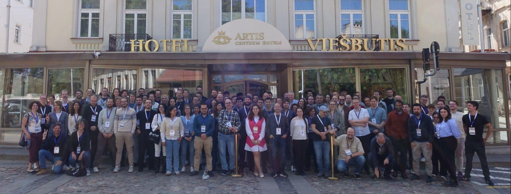
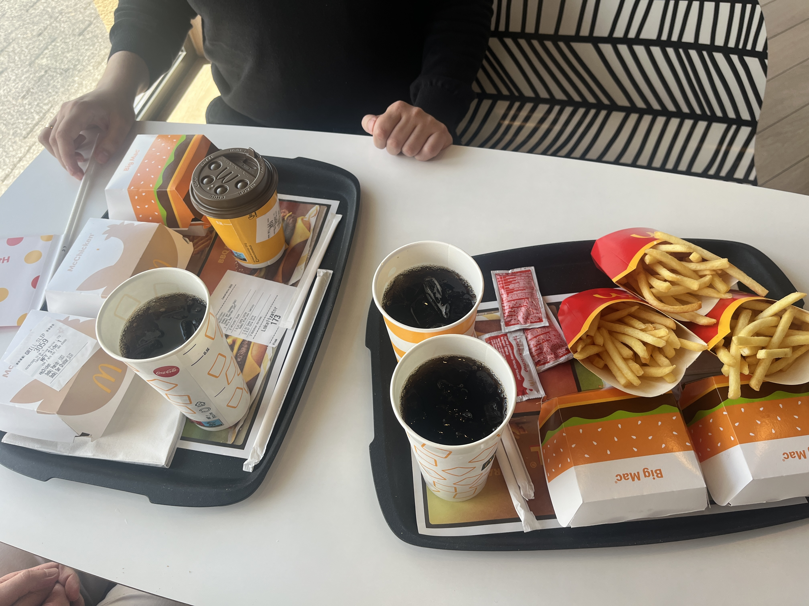
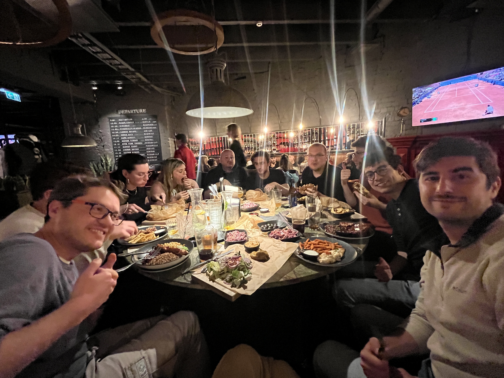
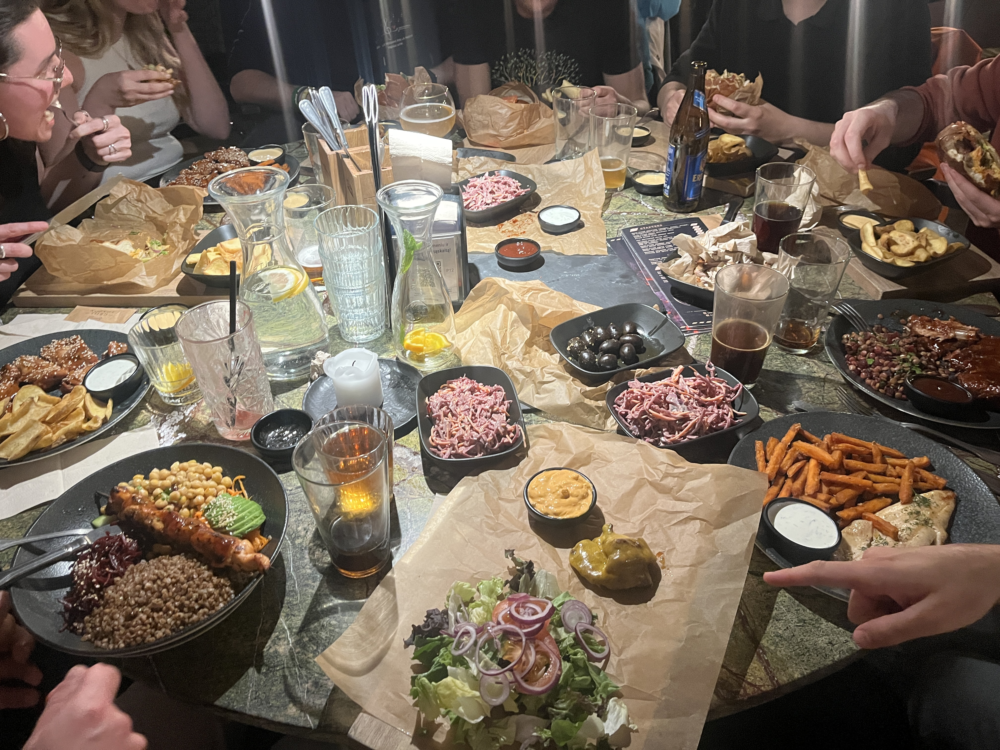
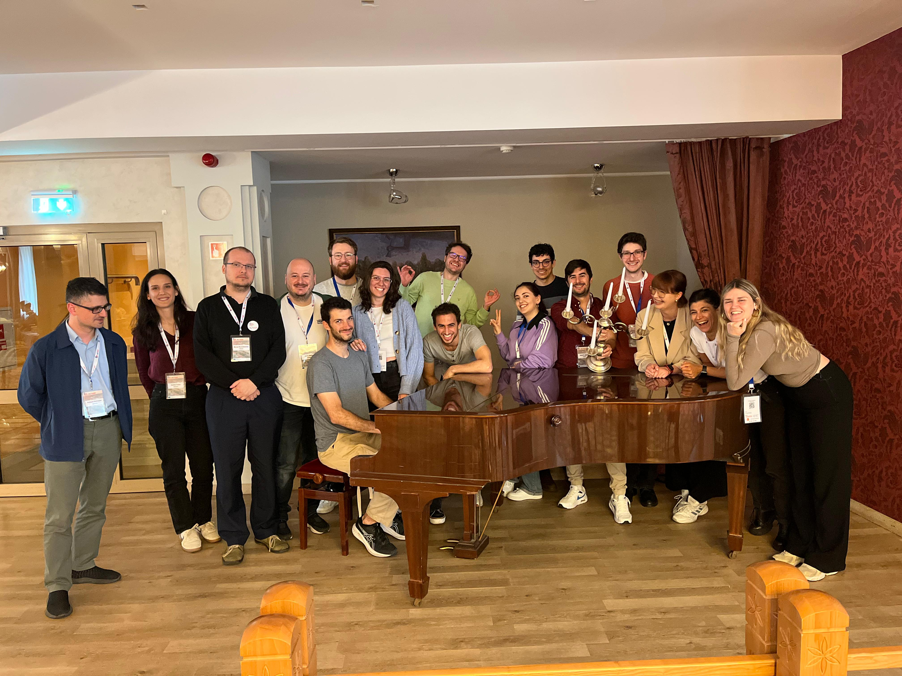

# 🌟 Highlights from the 3rd ML4NGP Conference in Vilnius!🌟

conference

COST Actions

Lithuania

ML4NGP

Michał, Jarek, Valen and Mariia presented posters at the ML4NGP Meeting, a fantastic mix of science, food and networking!

Published

June 17, 2025

# 🚀 3rd Machine Learning 4 Non‑Globular Proteins Meeting (May 20–23 2025) in Vilnius, Lithuania 🚀

We have returned from the **3rd ML4NGP Meeting**, top-tier conference on machine learning for non-globular proteins, held **May 20–23** in vibrant city of **Vilnius** 🇱🇹.

From our team **Michał, Jarek, Valen and Mariia** actively proudly presented their posters and actively participated in engaging scientific discussions with global peers 🌍✨

## 🍔 Arrival and foodie adventures 🍟

What better way to start a scientific adventure than with a classic fuel-up at the iconic **Golden Arches** in Augustów, our always stop when visiting Vilnius? Our first stop was a hearty break for some quick, comfort food, because brilliant minds run on good food! 😋🍔

## 🤝 Reunion under the London Grill

The very first evening brought a heartwarming reunion with colleagues from the **Autonomous University of Barcelona** 🇪🇸 and the **Technical University of Denmark** 🇩🇰 during a cozy dinner at **London Grill** restaurant. Great food, great company and lots of laughs! 🥂🍽️

 

## 💡 Busy days and brilliant science

The first day was packed with fascinating lectures, groundbreaking research and vibrant discussions. Every session challenged and inspired us to think deeper and push further, exactly what ML4NGP is all about 💡💻

## 🍕 Welcome reception and food truck fiesta

The day ended at the historic Vilnius University main building with the **Welcome Reception**, followed by a fun evening at local food trucks. Party was *top-notch*! 🌇🎉🌮

## 🧑 🤝 🧑 New connections and lasting memories 🌟

One of the best parts of any conference is meeting incredible people and ML4NGP 2025 was no exception. We connected with inspiring researchers from Spain 🇪🇸, Germany 🇩🇪, Canada 🇨🇦, Armenia 🇦🇲, Italy 🇮🇹, Argentina 🇦🇷 and beyond! 🌐✨

Here’s a joyful group photo after our final lunch, a perfect snapshot capturing the spirit of collaboration and friendship forged over these unforgettable days 📸❤️

## 🙌 Looking ahead

We’re incredibly grateful to have been part of such a dynamic and forward-thinking community. ML4NGP 2025 has fueled our passion and sparked new ideas that will shape our amyloid and LLPS work ahead.

Can’t wait to see what the next year holds! 🚀🔬💙
