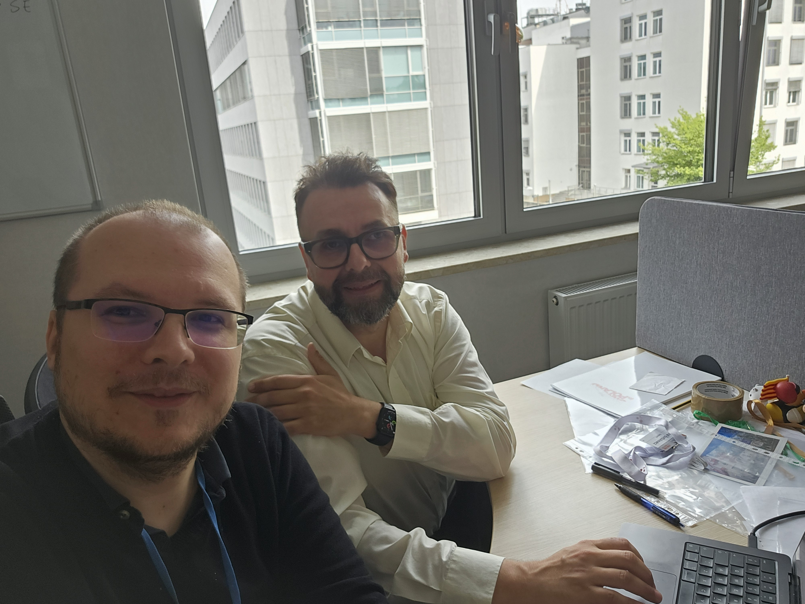

# 🌍 Welcoming Krzysztof Poterlowicz from ELIXIR‑UK! 🚀

ELIXIR

news

bioinformatics

Excited to host Prof. Krzysztof Poterlowicz (University of Bradford & ELIXIR‑UK) to support our lab’s journey toward full ELIXIR integration.

Published

June 18, 2025

# 🤝 Welcoming Prof. Krzysztof Poterłowicz (ELIXIR‑UK) to our lab! 🎉

We’re thrilled to host **Prof. Krzysztof Poterlowicz** from the **University of Bradford**, a key connector for **ELIXIR‑UK** as their Training Coordinator and UK Node’s DaSH fellowship PI. Krzysztof brings rich expertise in **FAIR data stewardship**, **Galaxy Training**, and practical implementation of ELIXIR standards.

## 🎯 Why his visit matters

Poland is not yet a formal **ELIXIR** member, and Krzysztof’s visit is a major step in our lab’s push toward joining the infrastructure. During his stay, we were discussing another MSCA Staff Exchanges project, the TAPESTRY! 🛠🌍️

------------------------------------------------------------------------

We’re honored to welcome Krzysztof and grateful for the strategic support he brings 🙌
