# 🌳 BioGenies retreat in Wrocław from June 4 till 7, 2025

retreat

reunion

team

news

Poland

Team fun and productivity at our Wrocław retreat: pizzas, sta,p hunt at Arboretum, seminars, hiking, cocktails (healthy, non-alchocholic) and more 😄

Published

June 23, 2025

# 🌟 BioGenies team retreat in Wrocław (June 4–7, 2025)

Our lab had an amazing team retreat in **Wrocław**, packed with 🍕 pizza, 🎂 cake pops, forest adventures, board games and seminars, a mix of fun and productivity!

------------------------------------------------------------------------

## 🎉 Day 1 (June 4): pizza party and yearly review

- We kicked off our retreat with doing big groceries 🧺🍓🍉🥑🥦🍆

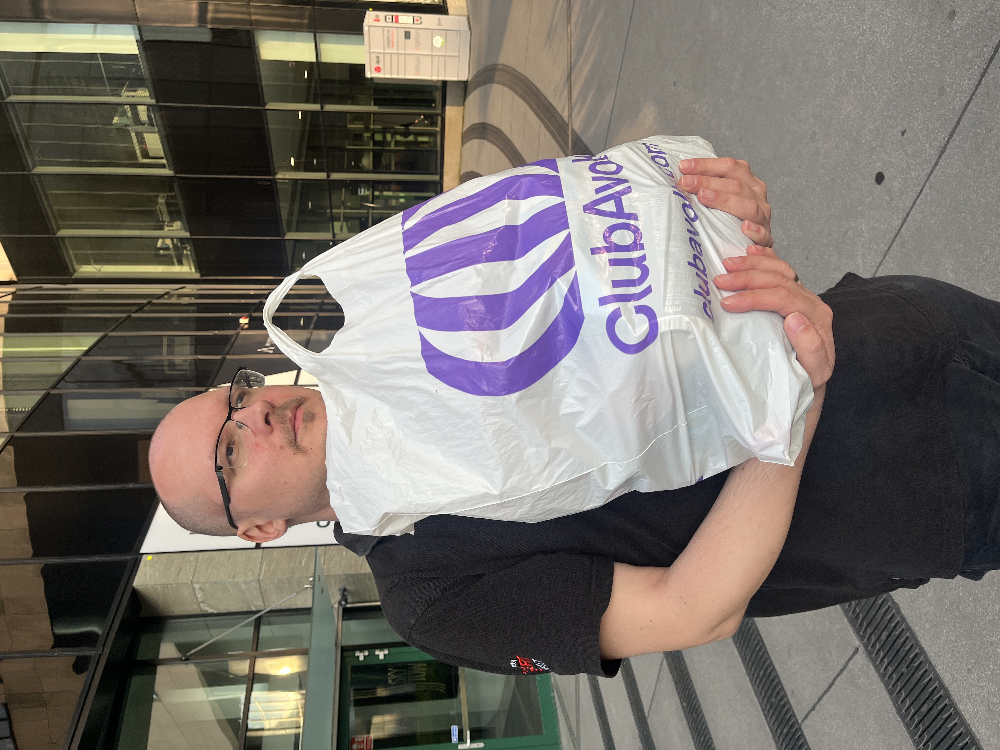

- Kicked off with a **pizza fest** and **Asia’s cake pops** (they where so filling 😋)

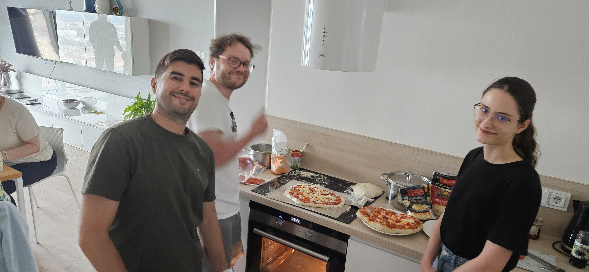

- **Michał** presented last year’s achievements and future goals—cheers to all the team’s hard work! 🥂

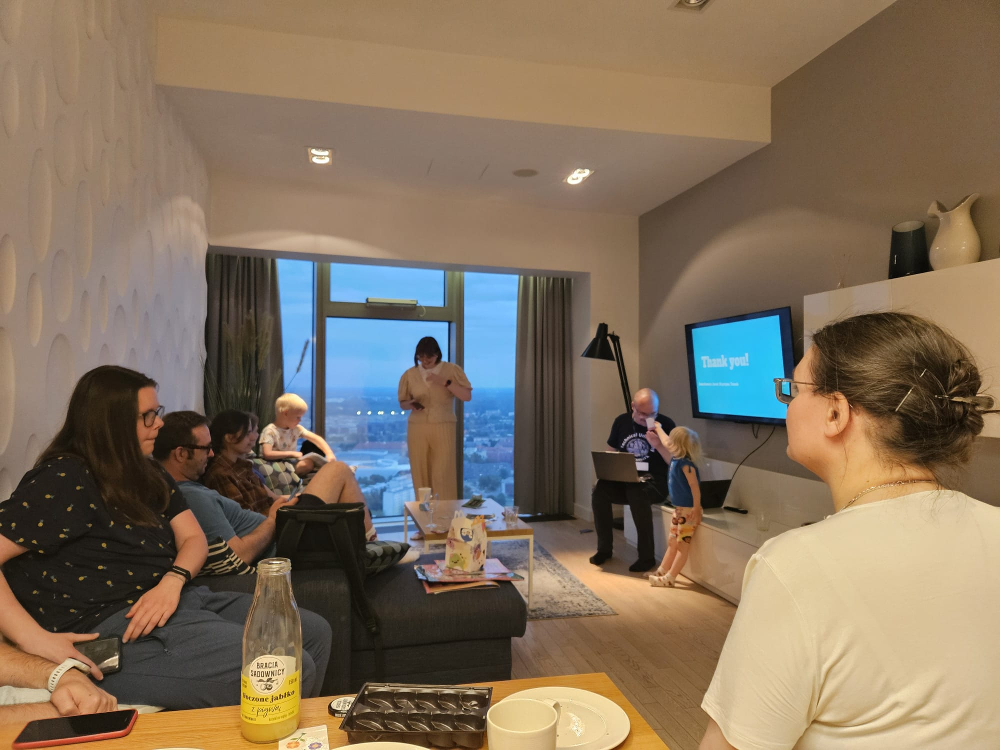

- 🤞🏻 Fingers cross for Weronika and her PhD defence this year. Thesis was finally submitted and she is ready to defend it in September 🎉
- Caught up with friends from **STWUR**, and **Medical University of Wrocław** sparking energizing conversations.

------------------------------------------------------------------------

## 🌿 Day 2 (June 5): Arboretum Wojsławice and nature fun

We ventured to the lush **Arboretum Wojsławice** (a stunning botanical garden near Niemcza) 🌳🌸🦋🪑

Highlights included:

- A guided walk with the **Arboretum director** and **UWr rector**.

- Hunting down **collectible stamps** around the trails—and earning prizes 🏅

- Spotting a friendly cat that **Krysia & Jarek** couldn’t resist petting 😻

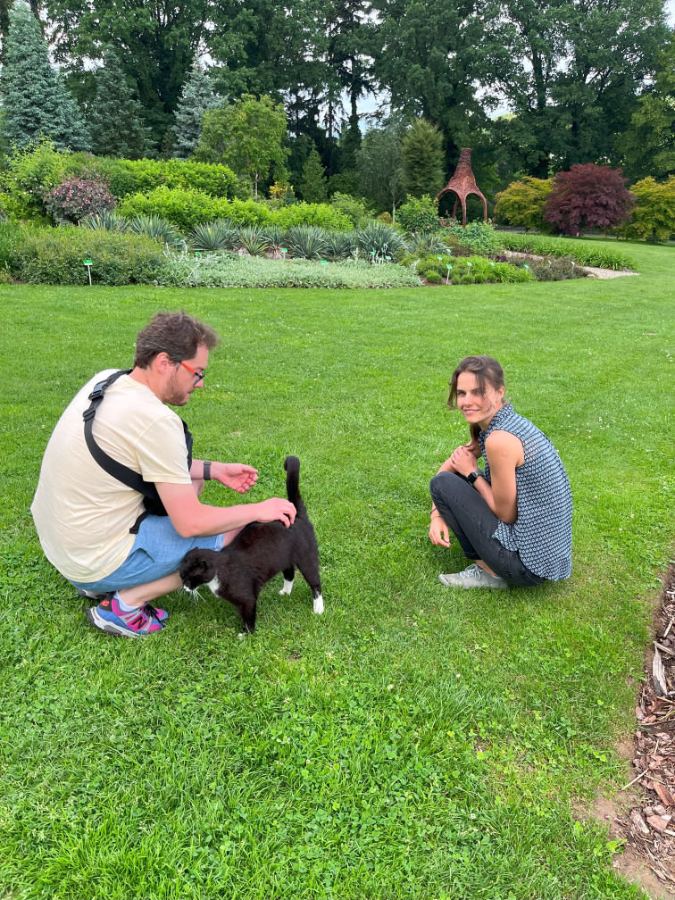

- **Weronika, Krysia and Valen** hugged a tree to absorb its *positive energy* 🌳💚

- Topped it off with *delicious apple cake and ice cream*! 🍰

- When the Rector had to leave, we continued hunting stamps and snacking on fresh cherries 🍒

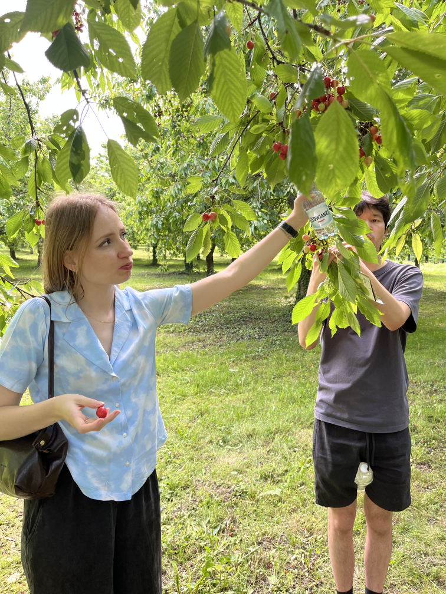 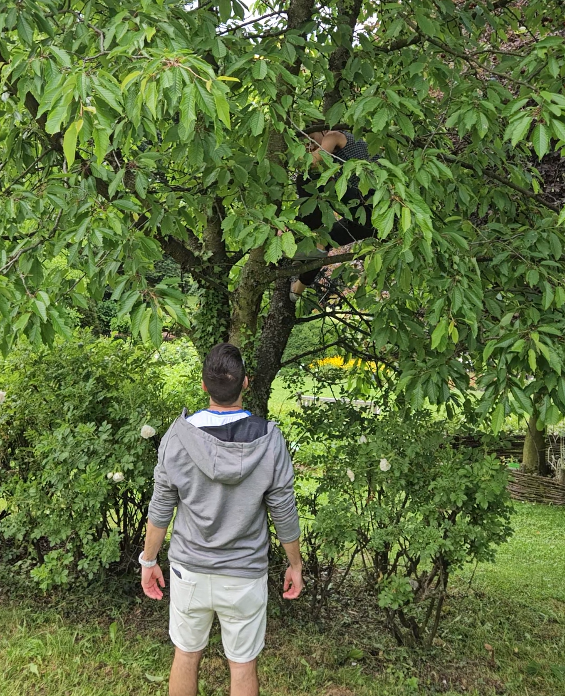

- Wrapped the evening with **board games** and team bonding

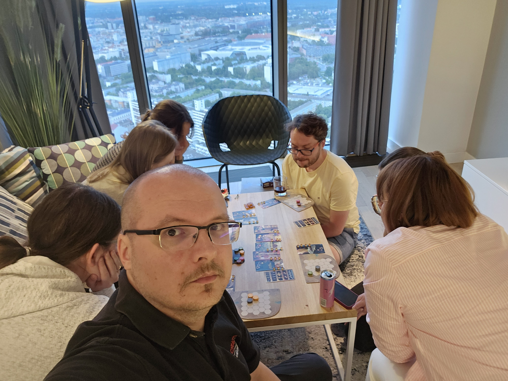

------------------------------------------------------------------------

## 🎂 Birthday twist on day

We also celebrated **Valen’s and Eva’s birthdays** 🎉 with cake and warm wishes—lots of smiles and shared joy! 🎂

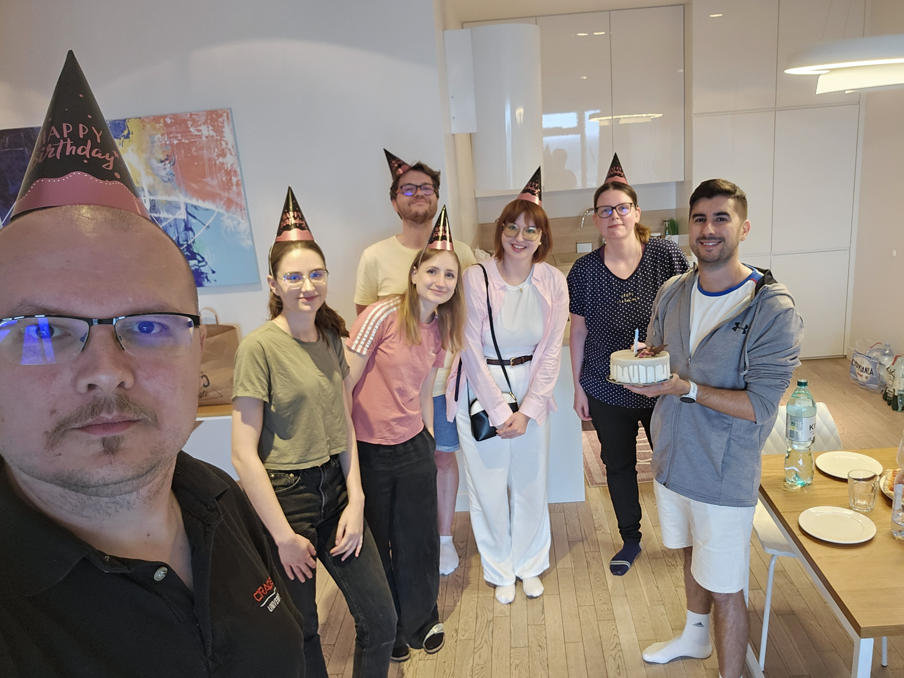

------------------------------------------------------------------------

## 🧠 Day 3 (June 6): seminar & Ślęża hike

- **Michał** delivered a fantastic seminar at the **Faculty of Mathematics, University of Wrocław** 🎓

- Then we set off on a hike to **Ślęża**, through forests and past an old castle. 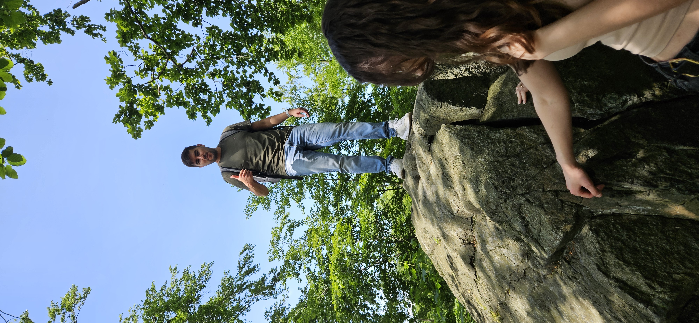 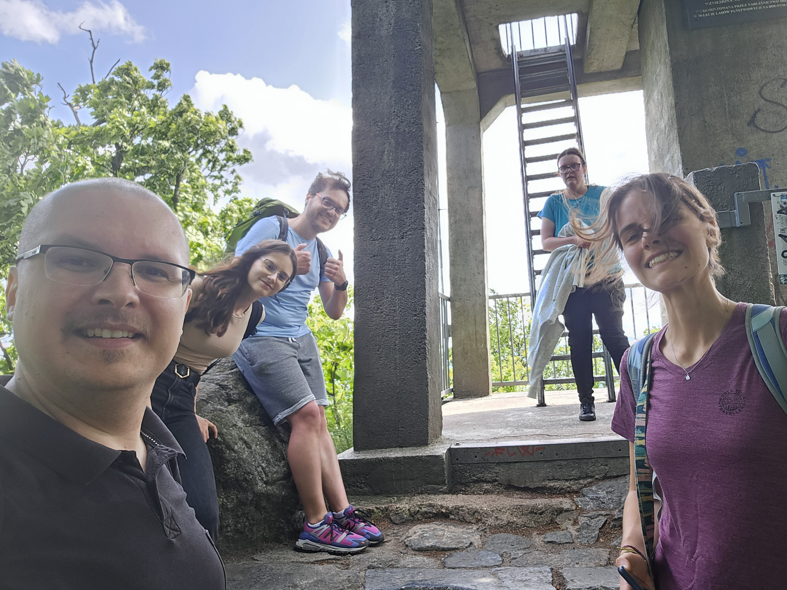

- Despite the castle’s dwindling water supply, the views were breathtaking, although **Jarek** died on the trail 🤭🫣

------------------------------------------------------------------------

## 🍸 Day 4 (June 7): farewells and cocktails

- On the last day we had a brakefast together, with full bellies we went our ways.

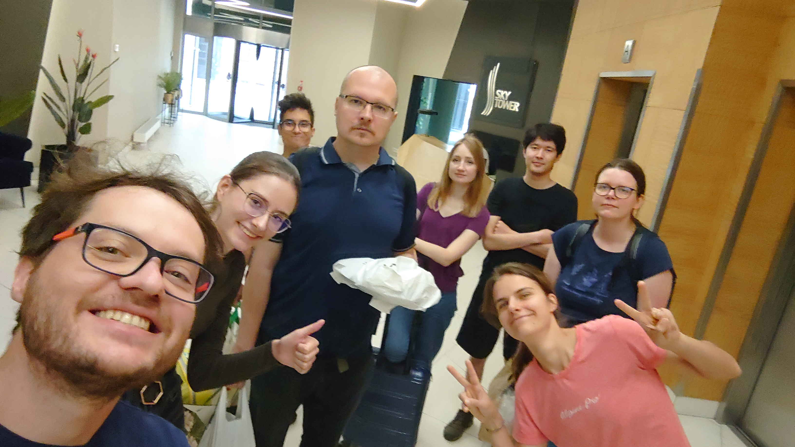

- **Michał** traveled to **Łódź** for doctoral school evaluations and later to **Vilnius University**

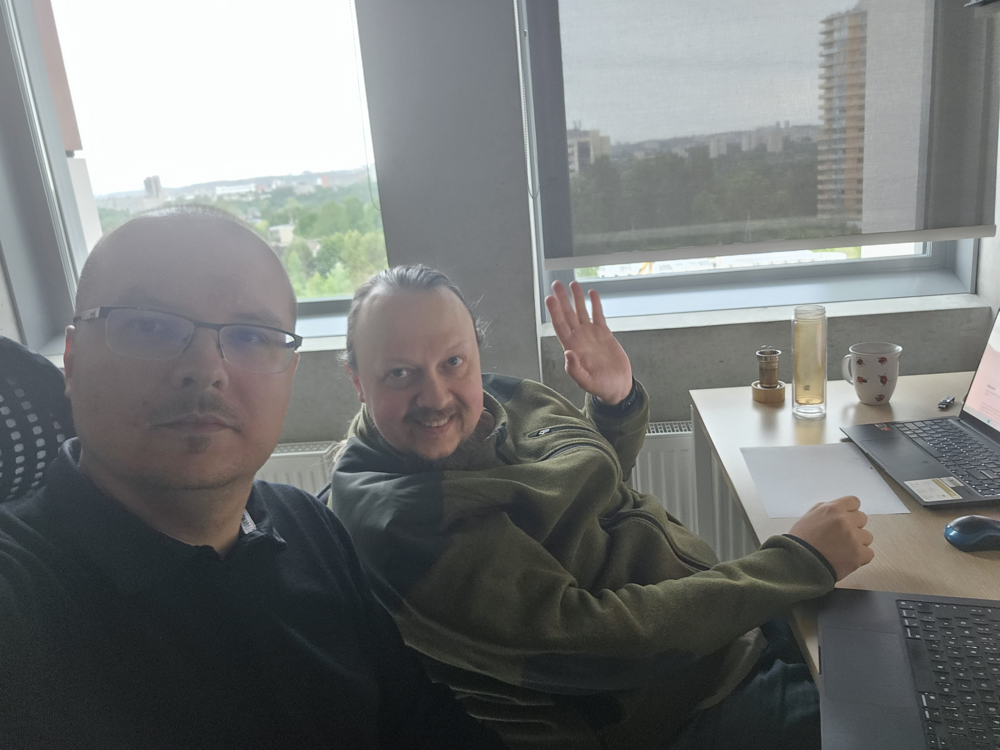

- **Jarek and Weronika** stopped by **Krysia and Józek’s place** before hopping on the train, where **Krysia treated them to amazing homemade cocktails**🍹

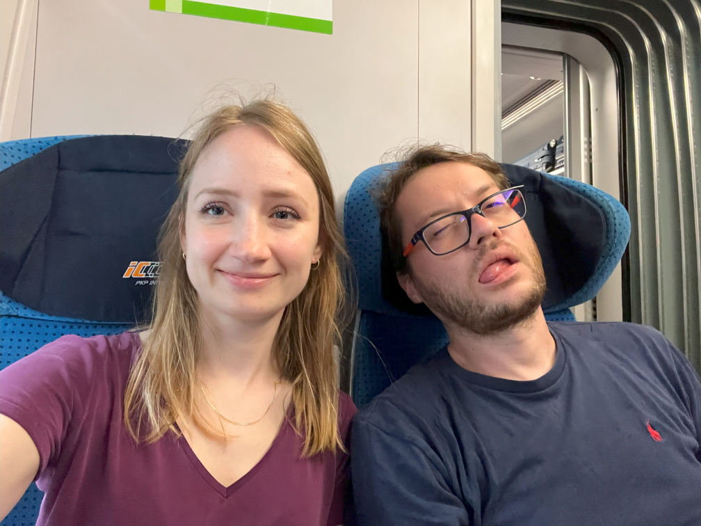
