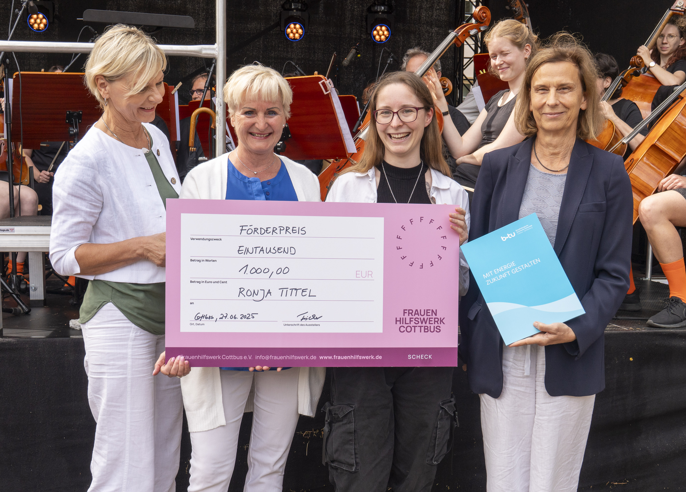

# 🏅 Ronja wins BTU Women’s Advancement Award! 🌟!

awards

Erasmus+

celebration

Celebrating Ronja Tittel’s outstanding contribution in her praxissemester with us and her award at BTU Cottbus-Senftenberg!

Published

July 2, 2025

# 🎉 Huge congrats to Ronja Tittel! 🎉

We’re beyond proud to share that **Ronja Tittel**, who spent her Praxissemester with us, has been honored with the prestigious **Women’s Advancement (Frauenförderpreis)** by **Frauen‑Hilfswerk Cottbus e.V.** at **BTU Cottbus‑Senftenberg**! 🏅🇩🇪

------------------------------------------------------------------------

## 👏 What makes this award special?

Ronja, now in her 6th semester of **Biotechnology**, was recognized not only for excellent academic performance but also for her **amazing leadership and dedication**:

- Deputy chair of the **Biotechnology & Materials Chemistry Student Council** since 2023  
- Organizer of the BTU **Christmas Market** and the first Senftenberg **Snowflake Ball**  
- Event MC at **poetry slams** and youth ceremonies via Märkische Jugendweihe e.V. since 2019

The award was presented on **June 27, 2025**, during BTU’s “Kulturcampus Sachsendorf” campus festival.

------------------------------------------------------------------------

Ronja’s drive and organization have been valuable both during her time with us and beyond. We’re proud to have had her as part of the team. Congratulations, Ronja! 🎉
