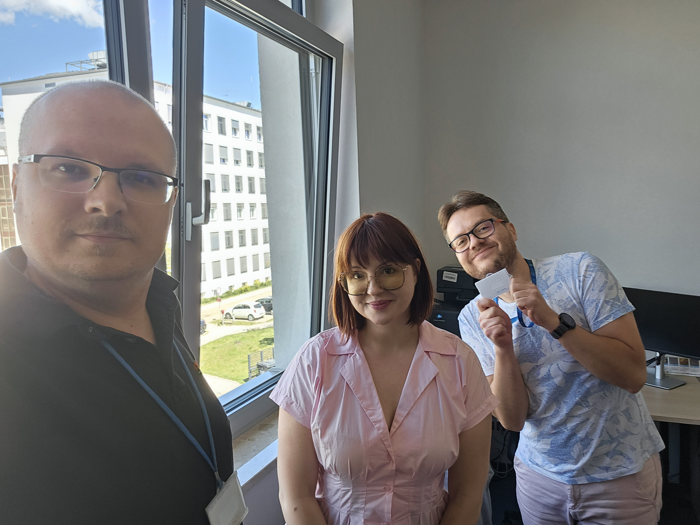

# 🎓 Career highlights: Mariia at UMB and Jarek’s NCN Poland Miniatura grant!

grants

achievements

celebration

NCN

Big news, Mariia starts at UMB and applies for a PhD, while Jarek gets NCN Miniatura to grow his imputomics project! 🎉

Published

July 4, 2025

# 🌿 Mariia joins UMB and gets ready for a PhD programme! 🎓✨

We’re happy to share that **Mariia** got a position at **Medical University of Białystok (UMB)**. She’s also taking the first step toward a **PhD journey**, aiming to deepen her bioinformatics and biotech skills. 🧬📖

------------------------------------------------------------------------

# 🧠 Jarek scores NCN Miniatura grant for imputomics! 🧩💡

Huge congrats to **Jarek**, who just received an **NCN Miniatura grant** to **expand imputomics pipeline**! This support (50 000 PLN) will enable gather more algorithms for missing data imputation in different omics data. Laying the groundwork for future publications and bigger grants 🚀

------------------------------------------------------------------------

👏 Join us in celebrating both Mariia’s and Jarek’s achievements. Onward to new discoveries and impactful science! 🌟

