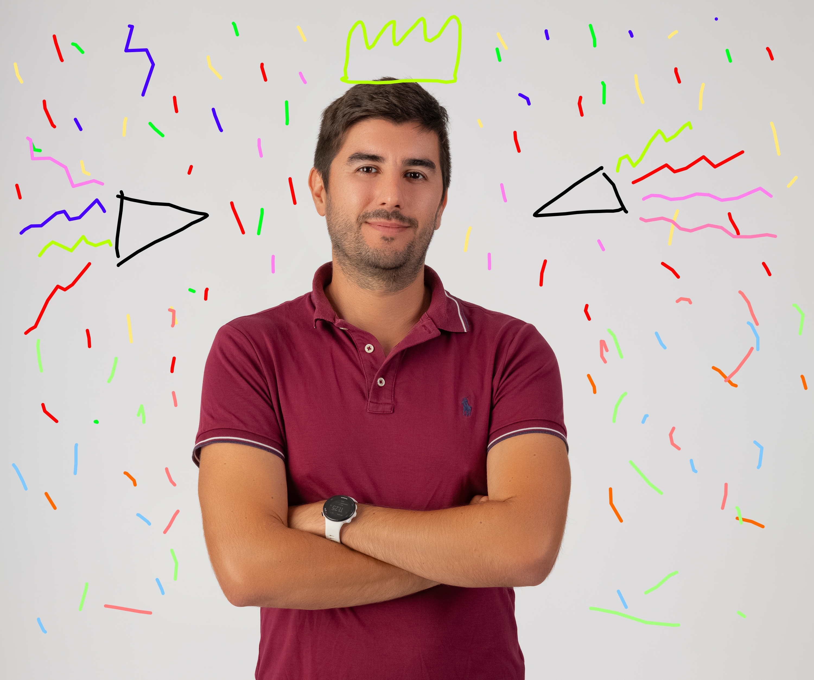

# From microbes to medicine 💊🦠, Valen’s NCN Miniatura grant success!

grants

achievements

NCN

amyloids

Congrats to Valen 🎉 for receiving an NCN Miniatura grant! The LIMAD project will explore how microbes 🦠 influence harmful protein build-up in Alzheimer’s and Parkinson’s disease 🧠, opening new doors for future therapies 💊✨.

Published

September 15, 2025

🎉🥳 **Big news alert!** our very own **Valen** has just secured an **NCN Miniatura grant** for the project *LIMAD: Large-scale identification of microorganism products impacting amyloid diseases*! 🧬🦠💡

------------------------------------------------------------------------

# 🧠 Why this matters

Diseases like **Alzheimer’s 🧩, Parkinson’s 🎭 and ALS 🌀** are linked to clumps of harmful proteins called **amyloids**. These aggregates damage cells and are central to the progression of these conditions.

But here’s the twist: 🦠👀 **microbes may be part of the story!**. From gut bacteria to fungi in the brain, there’s growing evidence that microorganisms might help trigger or accelerate protein misfolding. That means the microbes around us (and inside us) could be influencing how these diseases develop.

------------------------------------------------------------------------

# 🔬 What LIMAD will do

Valen’s project will take on this challenge by:

✨ **Spotting microbes** most linked to Alzheimer’s and Parkinson’s through careful review of scientific studies ✨ **Checking their proteins** with powerful computational tools to see if they have “myloid potential 💻⚡  
✨ **Testing interactions** with human proteins like Aβ42 and α-synuclein using cutting-edge ML and structural biology 🤖🔍

Together, this will give us clues about *which microbes might secretly push amyloid diseases forward*.

------------------------------------------------------------------------

# 🚀 What it means for the future

If LIMAD uncovers microbial proteins that drive amyloid formation, they could become **new drug targets 💊✨**. Imagine tackling neurodegenerative diseases not just through the brain, but by also looking at the **microbiome 🌱🧫**. That’s the big-picture vision!

------------------------------------------------------------------------

# 🎉 Huge congratulations, Valen! 🙌

We’re beyond proud to see you take on this ambitious project with NCN’s support 🇵🇱👏. It’s an amazing step forward for BioGenies 💚🧬 and for the fight against neurodegenerative diseases worldwide 🌍✨.

Stay tuned, we’ll be sharing updates from the LIMAD journey here! 📢🔥

