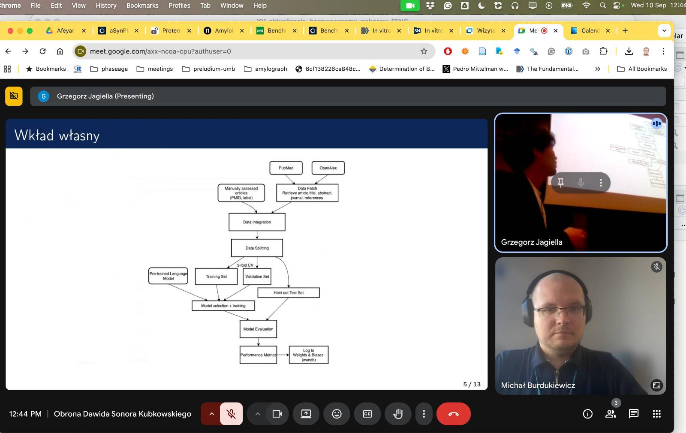

# Sonor defends his MSc with flying colors! 🎓🥳

MSc

defence

Huge congratulations to Sonor, who just defended his MSc thesis *Biomedical Text Classification with Pre-trained Language Models* with the best possible grade 💯🌟! His work shows how AI 🤖 can speed up biomedical literature searches 📚🔍, making science faster and smarter 🚀🧬

Published

September 16, 2025

🎉🥳 **Big congratulations to Sonor!** He has just successfully defended his MSc thesis, *Biomedical Text Classification with Pre-trained Language Models*, and scored the **highest possible grade**! 🌟💯👏

------------------------------------------------------------------------

# 📚 What was the thesis about? 🧾

Biomedical science produces *mountains of publications* every year 📈📖. But finding the truly relevant papers, especially those about amyloids 🧩 and antibodies 🧪, can be *slow and exhausting* 😵.

Sonor set out to change that! 🚀✨ His thesis explored **AI-powered text classification** to help researchers filter the noise and find the gems 💎.

------------------------------------------------------------------------

# 🤖 How did he do it? ⚙️

📝 Compared **classical ML** models (logistic regression, random forest 🌲) with **transformer-based language models** (BioMedBERT, SapBERT, BioMed RoBERTa 🧬🤖).  
🔎 Built a system that uses **titles, abstracts, and journal names** to decide if a paper is relevant.  
🌐 Automated the process by pulling data straight from **PubMed 🩺📚**.

------------------------------------------------------------------------

# 🚀 What did he achieve? 🏆

✨ Reduced manual curation time drastically ⏱️⬇️.  
✨ Improved the ratio of relevant papers found by over **350%** 📈🔥.  
✨ Created a tool that works like a **supercharged search engine** for biomedical literature 💡🔍.

In simple words: Sonor built a system that helps scientists **find the right papers faster** ⚡📚💪.

------------------------------------------------------------------------

# 🎓 Way to go, Sonor! 🌟👏

We’re so proud to celebrate Sonor’s incredible MSc journey 🎉🥂. He not only earned the **top grade** 🥇 but also showed how AI and ML can revolutionize biomedical research 🧬🤖💡.

