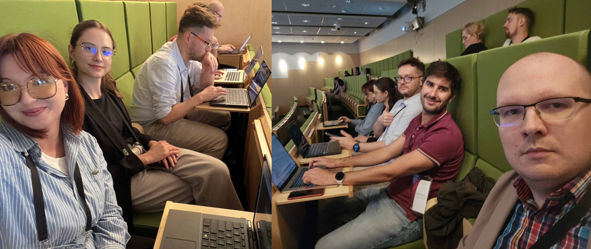
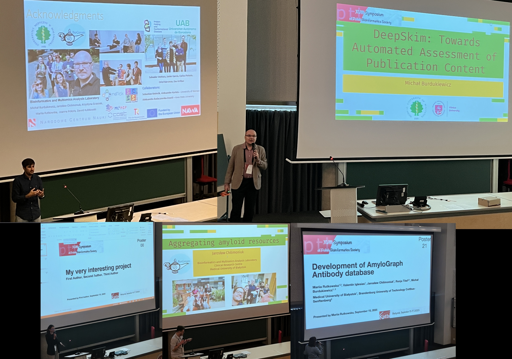
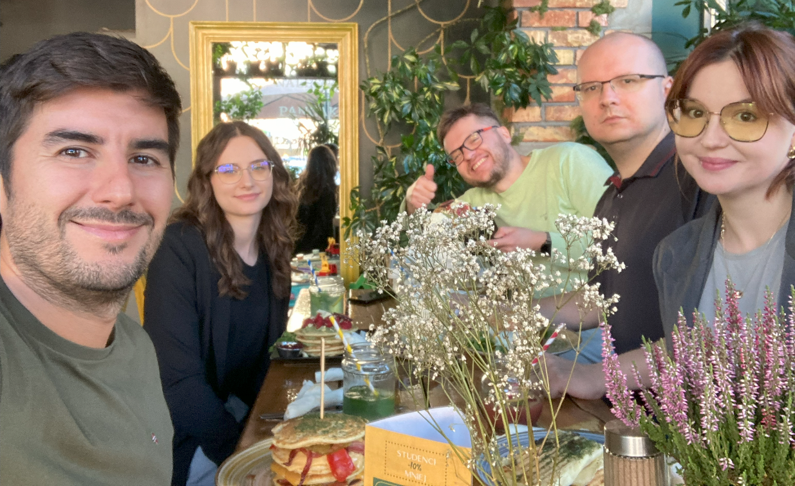

# BioGenies at PTBI 2025 in Białystok! 🧬🎤🥞

conference

PTBI

Poland

BioGenies rocked PTBI 2025 in Białystok! 🎉 Michał and Valen gave talks, Mariia, Asia and Jarek flash talks + posters, we joined PTBI 🇵🇱, voted for a new CEO 🗳, and wrapped up (as always in Białystok) with pancakes 🥞.

Published

September 18, 2025

🥳 **What a conference!** The **Polish Bioinformatics Society (PTBI) 2025 meeting** in Białystok was an absolute blast 🚀. The days were intense, filled with science 🧬, food 🍲, elections 🗳 and plenty of BioGenies energy 💚.

------------------------------------------------------------------------

# 🎤 Talks, posters & flash talks

- **Michał** and **Valen** delivered fantastic talks 💪👏.  
- **Mariia**, **Asia** and **Jarek** joined the poster + flash talk sessions, presenting their projects and sharing insights like pros! 🖼️🔬

Special shout-out to **Asia** 🙌: her presentation file got corrupted right before her talk 😱💻💥… but she still gave a **super talk without slides**! 💯🔥 That’s what we call true conference skills 🥷✨.

------------------------------------------------------------------------

# 🌍 Joining the Polish Bioinformatics Society 🇵🇱

Beyond the science, PTBI 2025 was also a milestone for BioGenies:

- We officially **joined the Polish Bioinformatics Society**, becoming part of the national network of bioinformatics researchers.  
- We also cast our votes 🗳️ in the **election for the society’s new CEO**, contributing to shaping the future of Polish bioinformatics leadership.

------------------------------------------------------------------------

# 🍲 Food, food… and more food

As always, PTBI wasn’t just about science, it was also about **eating A LOT** 😋🍝🍰. Coffee breaks, conference dinner, late-night snacks… we powered through it all.

And since it was Białystok, of course we **ended with pancakes 🥞💚**. A proper BioGenies tradition!

