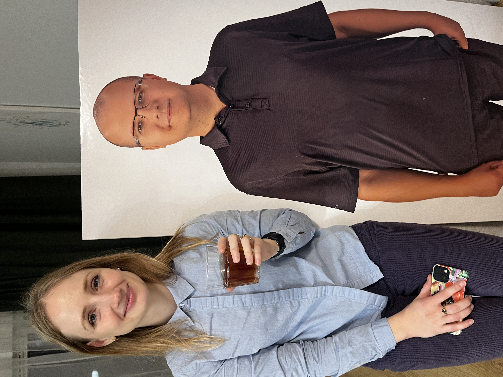
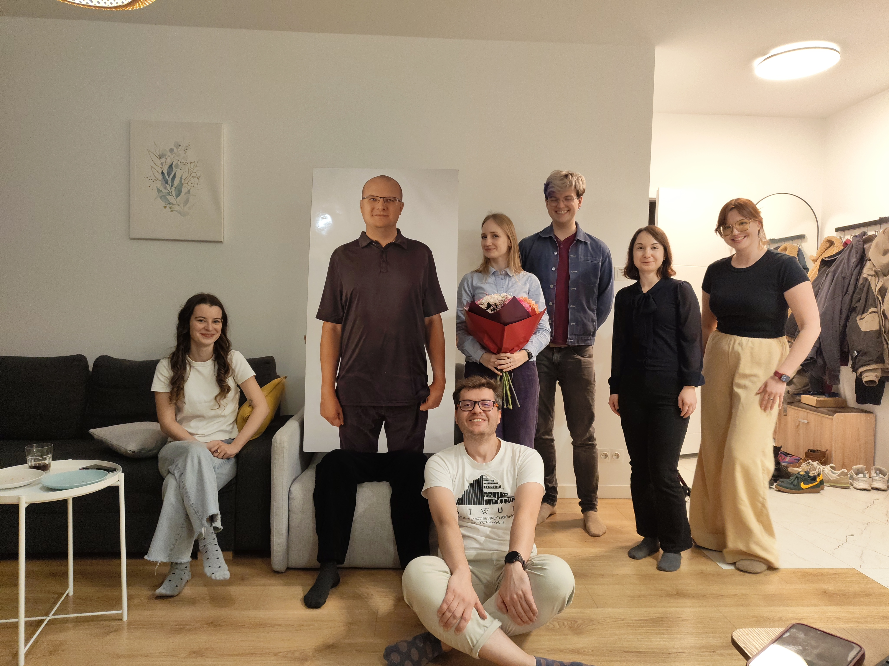
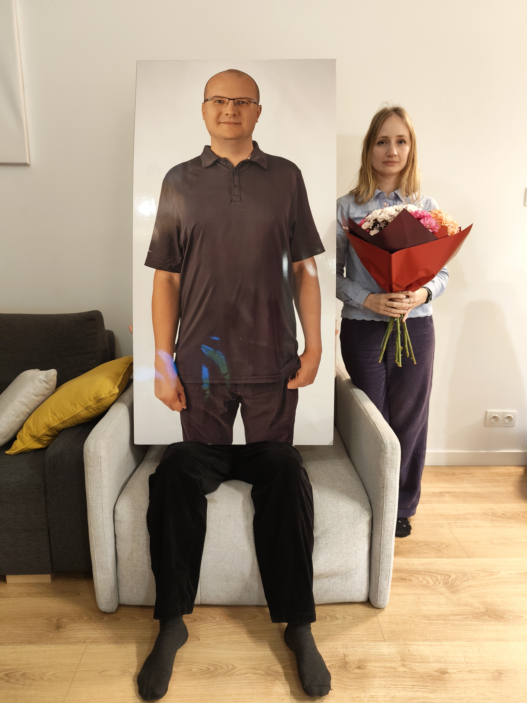
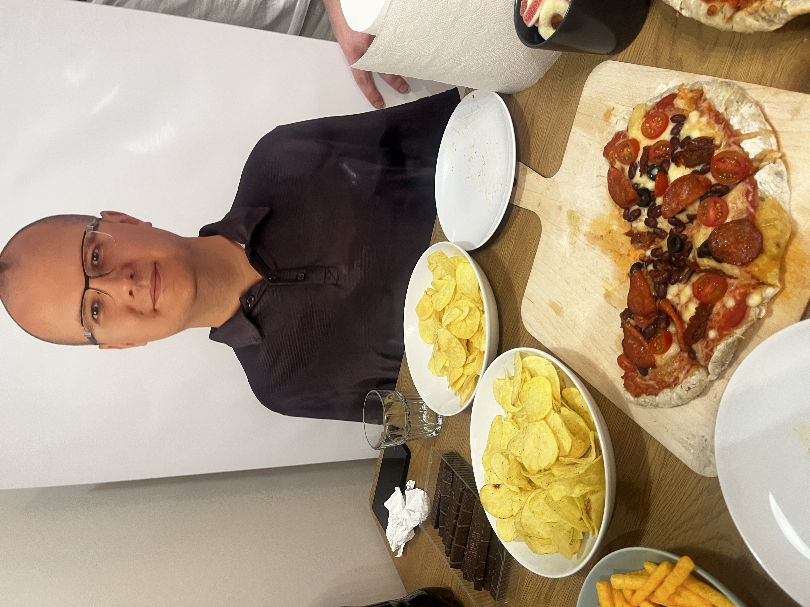
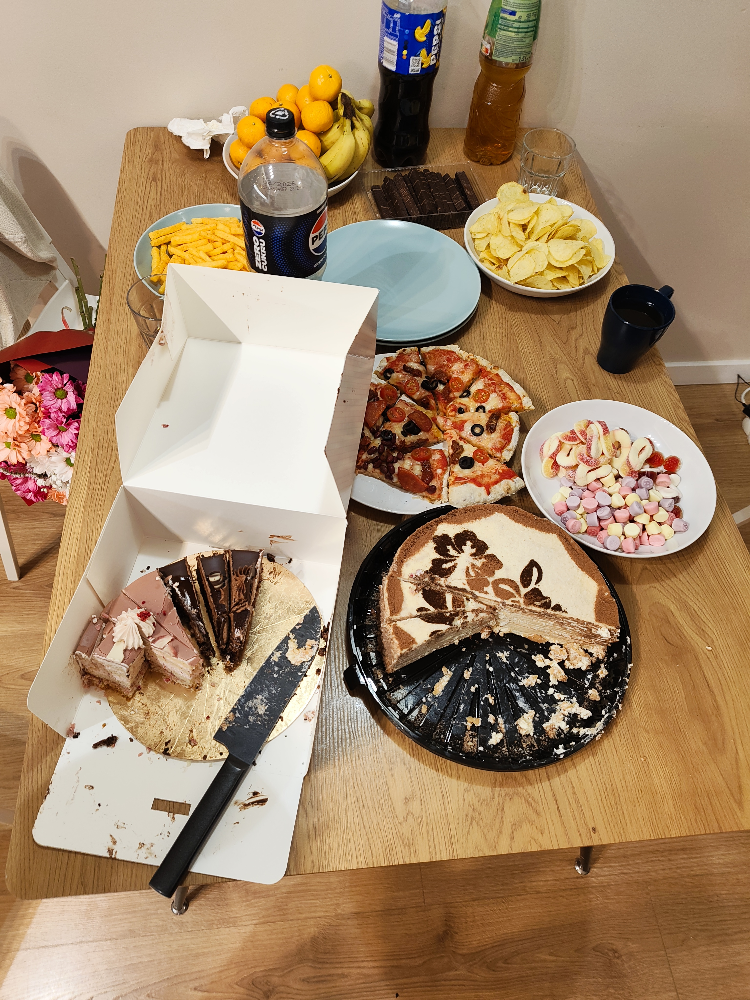
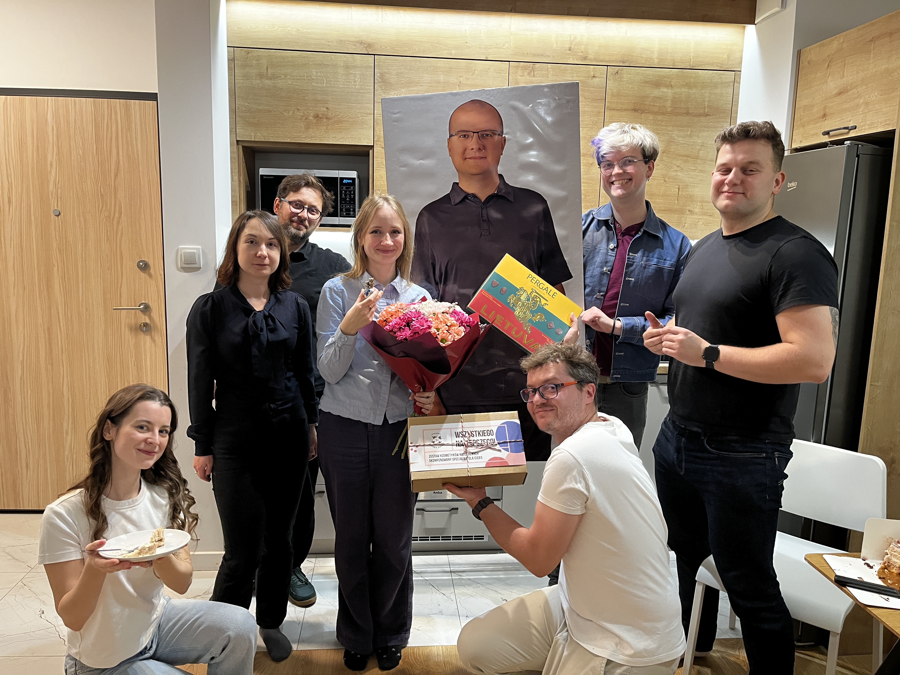
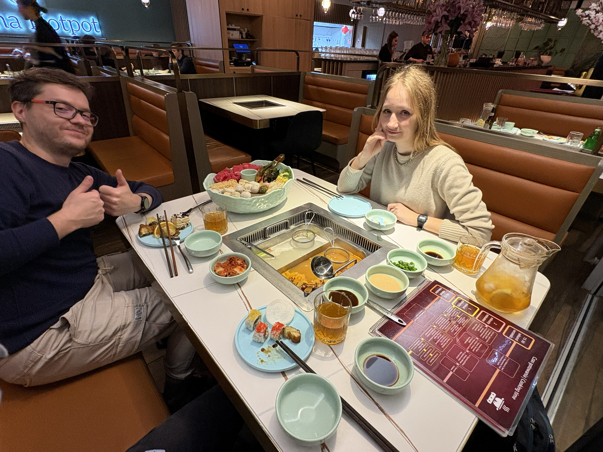
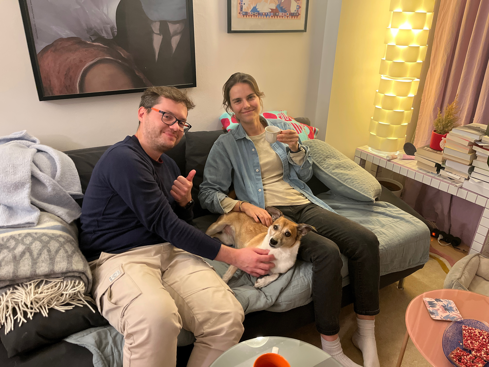

# Weronika defends her PhD with distinction! 🎓🌟

achievements

celebration

defence

team

Huge congratulations to Weronika, who defended her PhD thesis on high-resolution H/D exchange MS data 🎓🔬 with distinction! Weronika celebrated first at IBB PAS and then together all night long with homemade pizza, friends and even a cardboard Michał 😄🍕

Published

November 12, 2025

🎉 **Massive congratulations to Weronika!** on **4 November 2025** she successfully defended her PhD thesis:

> **“High-resolution analysis of hydrogen/deuterium exchange monitored by mass spectrometry experiment data”** 🔬💧

and received a **distinction** for her work! 🎓💯✨  
We’re unbelievably proud of her and the years of effort behind this achievement.

------------------------------------------------------------------------

# 🎓 The big day

The defence took place at the **Institute of Biochemistry and Biophysics of the Polish Academy of Sciences (IBB PAS)** 🏛️🧬

Weronika walked the committee through the world of **high-resolution hydrogen/deuterium exchange (H/DX) mass spectrometry**, a powerful way to study protein dynamics and structure at an incredibly detailed level 📈🧪

After a successful defence and the news of the **distinction** 🥇, there was a small celebration at IBB PAS 🎂☕ , the perfect way to close this long PhD journey.

------------------------------------------------------------------------

# 🍕 Night party with (cardboard) Michał 😄

Of course, one party was definitely **not enough** for Weronika 😎. So we organised another celebration with:

**Weronika** and **Tomek**, **Jarek**, **Jakub**, **Dominik**, **Kasia**, **Mariia**, **Julia** and…  
**cardboard Michał** 😅, because real Michał was at **BioHackathon 2025 in Berlin**, but we still wanted him “there” for the photos 📸🧍♂️🧻

👨🍳 **Jarek made pizza**, lots of it 🍕🔥  
We ate, talked, laughed and shared stories **the whole night** 🌙💬. It was the perfect mix of science gossip, future plans and pure chill.

------------------------------------------------------------------------

# 🍲 Hot pot, Marcinek & Thursday follow-up

And because **good news deserves several rounds of celebration**…

On **Thursday**, when **Krysia** could finally make it to Warsaw, we had yet another mini-party with **Weronika**, **Krysia** and **Jarek**:

- We went out for **hot pot** 🍲🔥 — perfect comfort food + gossip combo  
- Then headed to **Weronika’s place** for dessert: the legendary **Marcinek cake** 🎂 (leftover from Tuesday, but still absolutely top tier 😋)  
- And, of course, more long conversations, laughs and decompression after the rollercoaster of the defence week 💬💛

------------------------------------------------------------------------

# 💚 Congrats, Weronika!

Weronika, your dedication, persistence and brilliant science have paid off in the best possible way, PhD *with distinction* 🎓🌟

We’re incredibly happy to celebrate this milestone with you and can’t wait to see what you do next 🚀

**Huge, huge congratulations!** 🥳🍾💚
