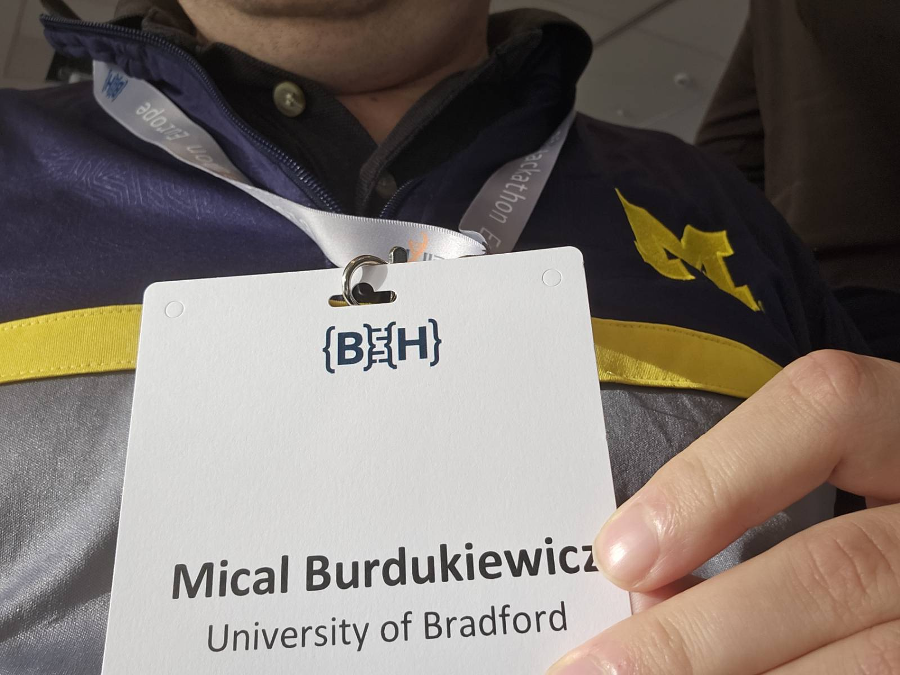

# Michał hacks away at BioHackathon Europe 2025 in Berlin! 💻🧬🚀

achievements

conference

Germany

ELIXIR

Michał joined BioHackathon Europe 2025 in Berlin, organised by ELIXIR Europe 💻🧬, an intense week of coding, data wrangling and open science, and a huge opportunity for BioGenies to plug into the European bioinformatics community 🌍🚀.

Published

November 13, 2025

This year, **Michał** traded our usual pizza-fueled evenings for something even more hardcore:  
he headed to **BioHackathon Europe 2025** in **Berlin**, organised by **ELIXIR Europe** 💻🧬🇪🇺.

For Michał, and for us as **BioGenies**, this is a **huge opportunity** to plug directly into the European bioinformatics & infrastructure ecosystem, contribute code and show what we can do on the international stage 🌍🚀.

------------------------------------------------------------------------

# 🧬 What is BioHackathon Europe?

BioHackathon Europe is a community-driven event where participants:

- 👨💻 team up on **collaborative coding projects**  
- 🧠 work on topics like **FAIR data**, metadata standards, ontologies and AI-ready workflows  
- 🧰 improve tools and infrastructure that support ELIXIR Platforms and Communities

The goal is simple and powerful:  
\> **Write code that solves real problems in bioinformatics and accelerates open science.**

------------------------------------------------------------------------

# 💻 What was Michał up to?

For a full week, Michał was immersed in:

- 🧩 integrating and cleaning tricky biological data  
- 🛠️ hacking on tools that make bioinformatics workflows more robust and reproducible  
- 🤝 collaborating with researchers from all over Europe on ELIXIR-aligned projects

Days were packed with **coding sprints, project stand-ups and ad-hoc whiteboard sessions**.  
Nights… probably also coding (plus a bit of Berlin 🍻).

------------------------------------------------------------------------

# 🌍 Why it matters for BioGenies

For BioGenies, joining BioHackathon Europe is a **big deal**:

- It connects us directly to the **ELIXIR Europe community** 🤝  
- It gives us a chance to **shape standards, tools and best practices** that everyone will use  
- It opens doors for **future collaborations, grants and shared projects** 💶🧬  
- And it helps us make our own tools **more visible, reusable and impactful** across Europe 🌐

Michał is coming back with fresh ideas for **FAIRer, more interoperable data** in our projects, new contacts across the ELIXIR ecosystem and plenty of inspiration to make our workflows even better 😎💡.
