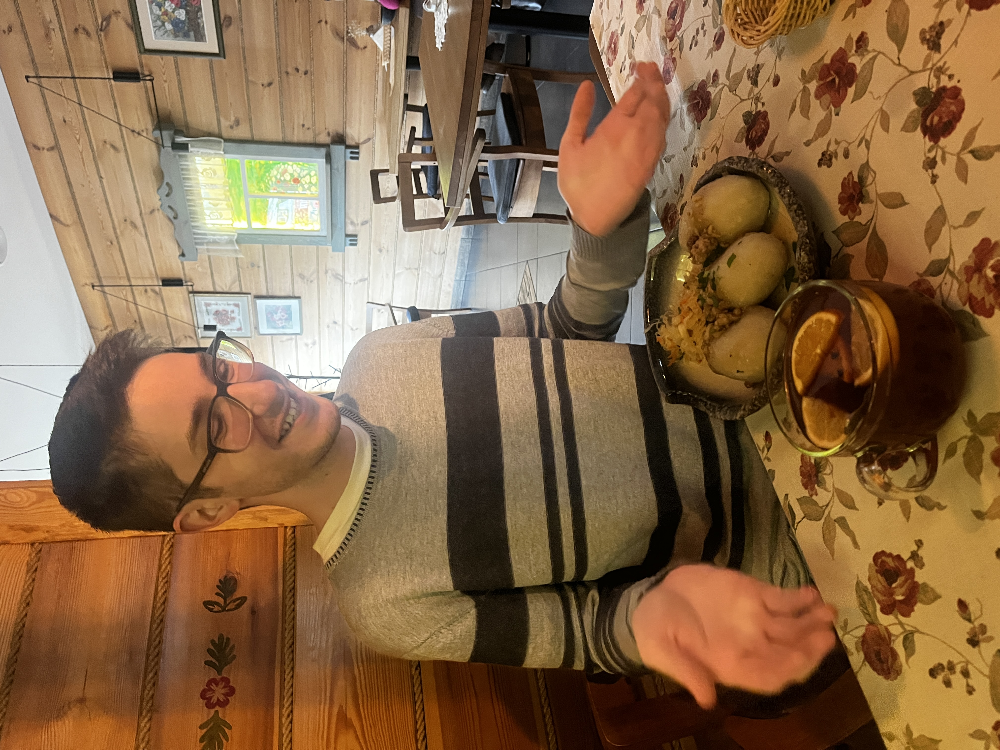
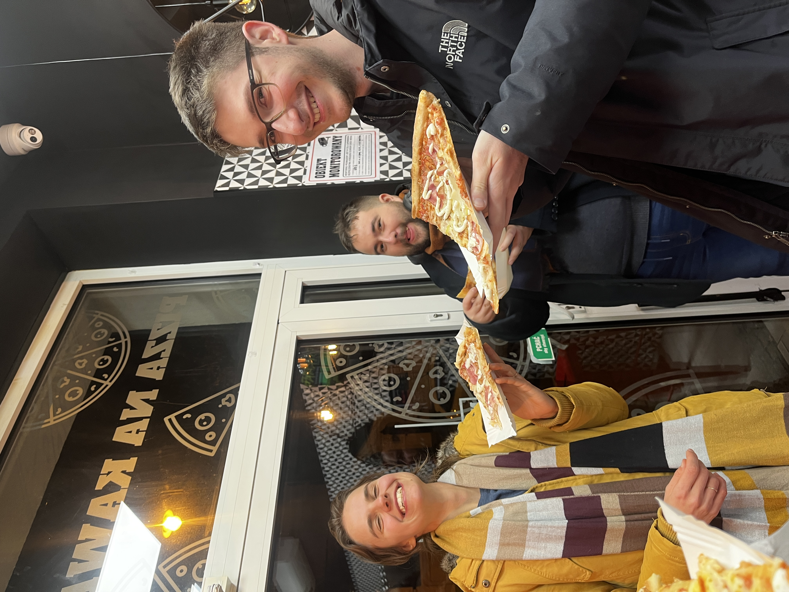
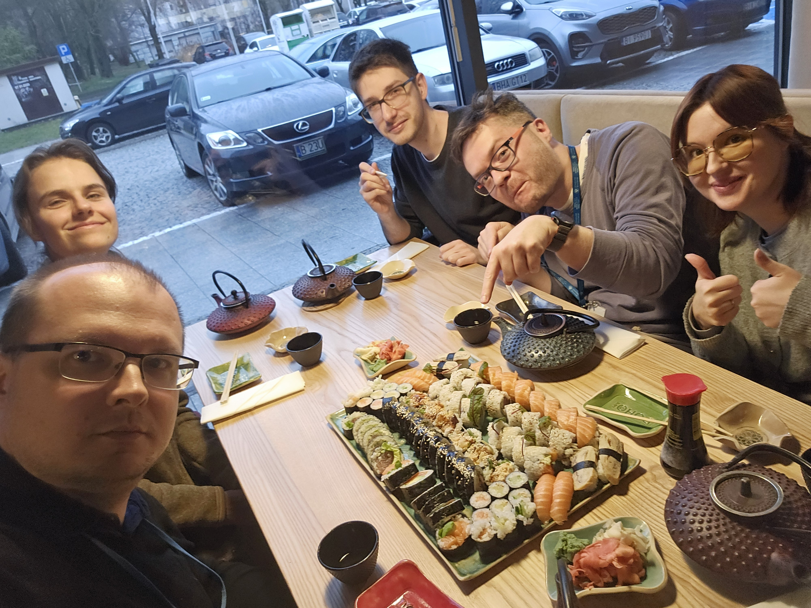
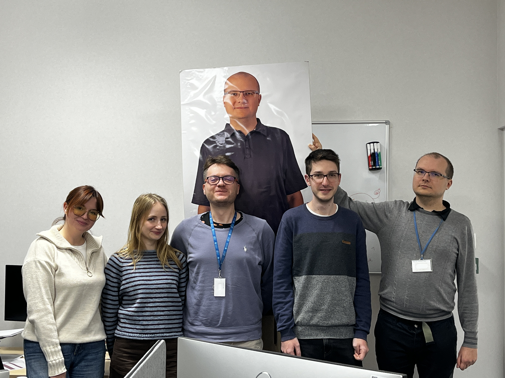

# Oriol visits BioGenies from sunny Barcelona! 🇪🇸🧬🕷️

team

NAWA

MUB

Our collaborator Oriol from the Autonomous University of Barcelona 🇪🇸 visited Białystok through the NAWA STER programme 🇵🇱 to work with Michał on StriFi — a comprehensive database of fibril structures 🧬🧱. Between coding and protein talk, we explored Polish cuisine, Białowieża forests and Oriol even got lucky enough to experience fresh Polish snow ❄️🥟🌲.

Published

December 8, 2025

🎉 **New collaboration energy incoming!**

This month, we were thrilled to host **Oriol**, our collaborator from the **Autonomous University of Barcelona** 🇪🇸. He came to Białystok through the **NAWA STER programme** 🇵🇱 to work closely with **Michał** on **StriFi, the Comprehensive Database of Fibril Structures** 🧬📊.

And he was in luck, **the first snow of the season fell the day after he arrived!** ❄️⛄  
A perfect welcome to Poland (and a dramatic contrast to Barcelona’s sunshine ☀️➡️❄️).

------------------------------------------------------------------------

# 🧠 Work & collaboration

Together, **Oriol and Michał** spent an intense week deep-diving into data pipelines, annotation workflows, and database design 💻💾. The StriFi prototype keeps growing, and Oriol’s expertise was crucial in shaping how we handle metadata and fibril structure representation 💡

Their discussions covered everything from data harmonization to possible links with AmyloGraph, lots of science, plenty of ideas, and a few “aha!” moments along the way 🧬✨.

------------------------------------------------------------------------

# 🥟 Food adventures

Of course, no BioGenies visit is complete without **a proper Polish food marathon** 😋🇵🇱.  
We introduced Oriol to:

- 🥟 **Pierogi**  
- 🍖 **Kartacze**  
- 🥘 **Babka ziemniaczana**  
- 🌯 And the legendary **Polish kebab**

He bravely tried everything and survived. Respect. 💚

    

------------------------------------------------------------------------

# 🌲 Trip to Białowieża

We took Oriol on a trip to **Białowieża**, our beloved escape to nature 🌳🦌.  
His review?

> **“I’ve never seen a flatter forest!”** 😅

We’re pretty sure he meant it lovingly.

------------------------------------------------------------------------

# 🎓 A special visitor

During Oriol’s stay, we were also visited by **Weronika**, who dropped by to celebrate her freshly defended PhD 🎓🥂 with Michał and the team. Perfect timing for a double celebration!

------------------------------------------------------------------------

# ❄️ Snow, science & good company

Polish winter greeted Oriol right away —  
**first snow, first babka ziemniaczana, first BioGenies adventures.**  
Not a bad combo. 😉

 
