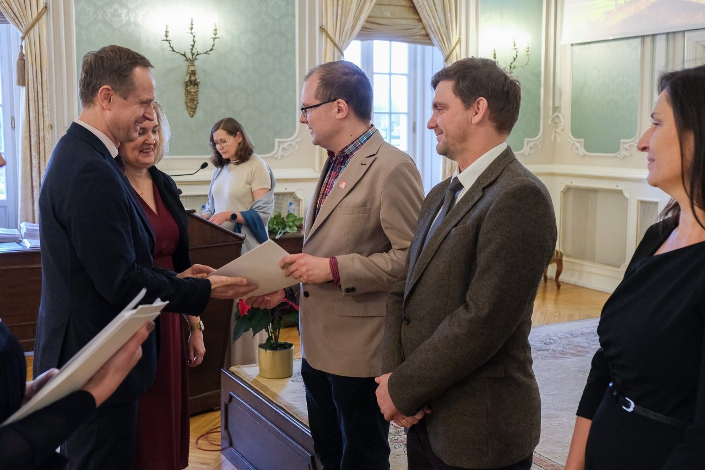
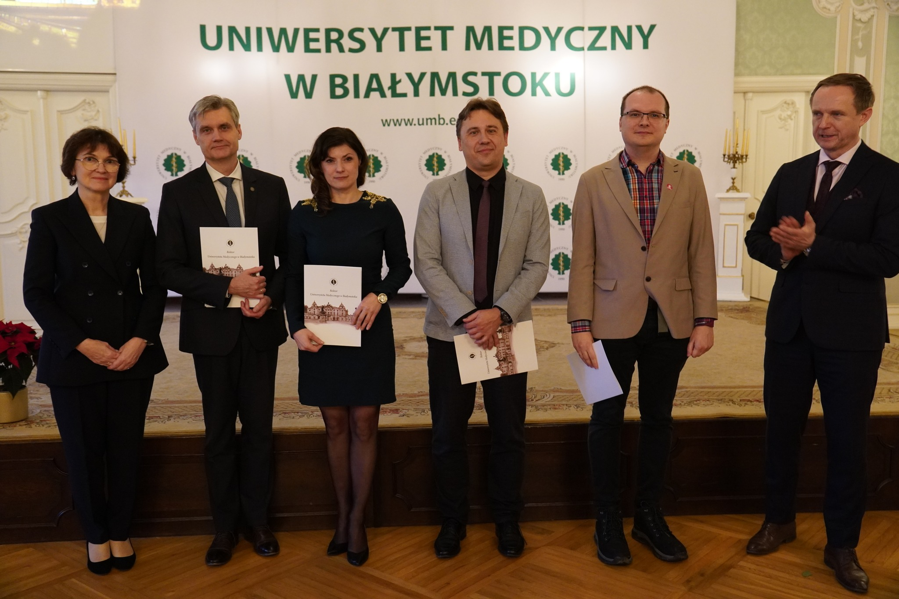
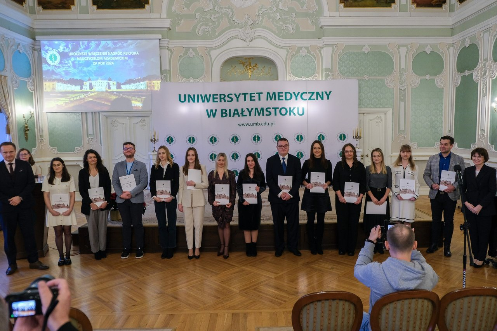

# BioGenies shine at the Rector’s Awards! 🏆🎓✨

MUB

awards

achievements

A proud day for BioGenies! 🎉 Michał and Jarek received First Degree Rector’s Awards for publications 🏆📚, Valen earned a Second Degree award, Michał was additionally recognised for his SONATA grant, and Jarek topped the list of young researchers with first-author papers of the highest IF 💪🧬

Published

December 16, 2025

🎉 **What a moment for BioGenies!** This year’s **Rector’s Awards** brought fantastic news for our team — a true celebration of hard work, great science, and persistence 🧬💚.

------------------------------------------------------------------------

# 🏆 Awards for publications

We’re incredibly proud to share that:

🥇 **Michał** received a **First Degree Rector’s Award** for publications  
🥇 **Jarek** also received a **First Degree Rector’s Award** for publications  
🥈 **Valen** was awarded a **Second Degree Rector’s Award** for publications

These distinctions recognise consistent, high-quality research output and impact and we couldn’t be happier to see it acknowledged at the university level 📚✨.

photo by Medyk Białostocki

------------------------------------------------------------------------

# 🚀 Extra recognition for Michał

As if that wasn’t enough, **Michał** also received an **additional Rector’s Award** for securing his **NCN SONATA grant** 💶🎯.  
This award highlights not only scientific excellence but also success in competitive national funding, a huge achievement and a major boost for our research directions 💪🧬.

photo by Medyk Białostocki

------------------------------------------------------------------------

# 📈 Jarek tops the young researchers list

Another amazing highlight:  
**Jarek ranked first among young researchers** for the **highest number of first-author publications with top Impact Factor (IF)** 📊🔥.

photo by Medyk Białostocki

That’s a serious accomplishment, leading impactful papers while building an independent research profile is no small feat 🧠🚀.

------------------------------------------------------------------------

# 💚 Congratulations!

These awards are a powerful reminder that teamwork, curiosity, and perseverance pay off 🏆✨.  
Huge congratulations to **Michał**, **Jarek**, and **Valen**, and a big thank-you to everyone who collaborates, supports, reviews and challenges our work every day 💚🧬.

Onward to more science, more papers, and more reasons to celebrate! 🥳🎉
