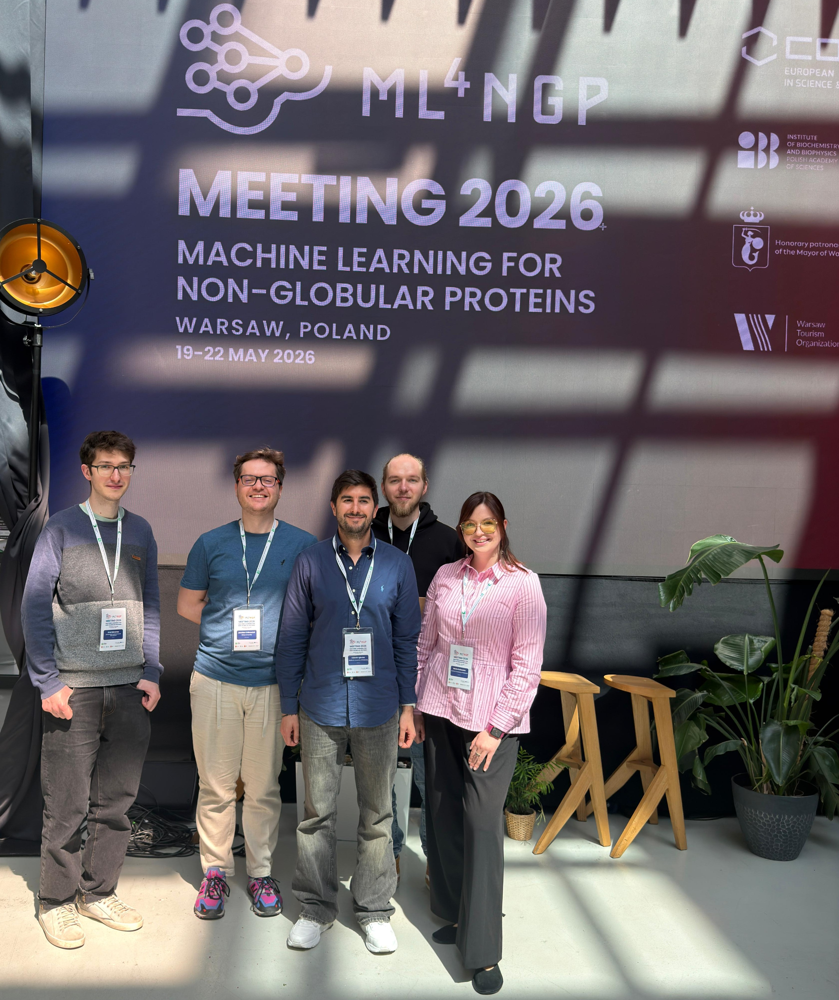
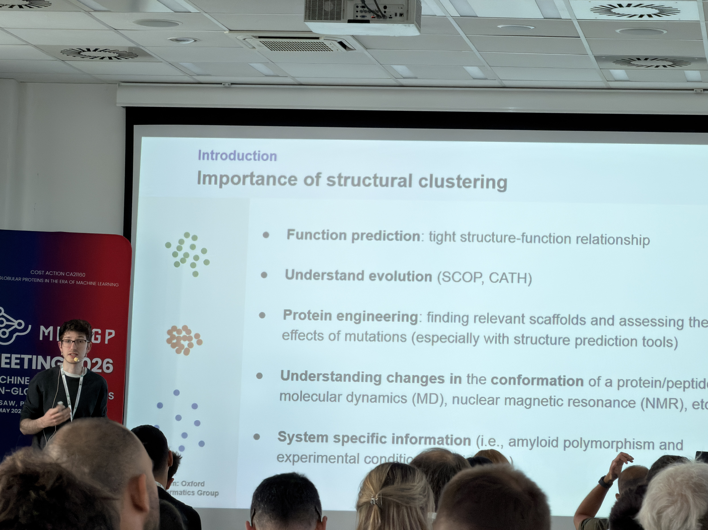
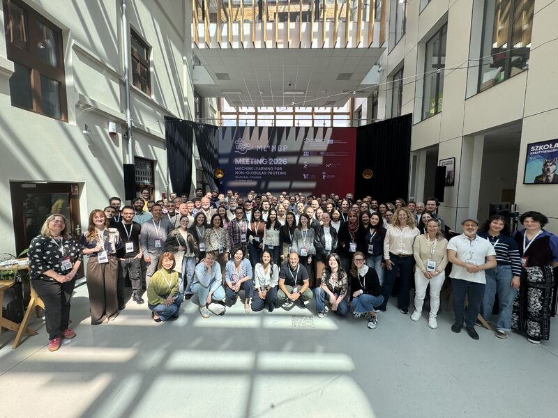

# BioGenies at the 4th ML4NGP Meeting in Warsaw! 🧬🤖🇵🇱

Poland

ML4NGP

Conferences & events

Valen, Jarek, Mariia, Damian and Oriol joined the 4th ML4NGP Meeting in Warsaw 🇵🇱 - with posters, Oriol’s Thursday talk, sightseeing, craft beers, social dinner, good food, uncomfy chairs and one unstoppable Mariia who still had energy for the club 🧬🤖🍻.

Author

BioGenies Lab

Published

June 8, 2026

The **4th ML4NGP Meeting on Machine Learning and Non-globular Proteins** brought the BioGenies crew to **Warsaw** 🇵🇱 and this time we came in force: **Valen, Jarek, Mariia, Damian and Oriol** joined the final main meeting of the *ML4NGP COST Action* 🧬🤖🚀.

The conference took place on **19–22 May 2026** in Warsaw and focused on machine learning, non-globular proteins, intrinsically disordered regions, aggregation, phase separation, specialised bioinformatics tools and databases, in other words: very BioGenies-coded science 😎💚.

The official programme featured keynote speakers including **Rohit Pappu**, **Ben Schuler**, **Andrea Sinz** and **Tuomas Knowles**, plus invited and selected talks on protein language models, condensates, fibrils, IDPs, amyloid prediction and AI-based protein analysis.

------------------------------------------------------------------------

# 🧠 Big names, big science

The programme was packed with fantastic speakers and topics, from **phase transitions of RNA-binding non-globular proteins** to **protein language models**, **cross-linking mass spectrometry**, **IDP phase behaviour**, **amyloid prediction** and **AI-based protein analysis**.

Among the keynote speakers were:

- 🧬 **Prof. Rohit Pappu** - phase transitions of RNA-binding NGPs  
- ⚡ **Prof. Ben Schuler** - rapid interaction dynamics of charged disordered proteins  
- 🧪 **Prof. Andrea Sinz** - IDPs studied by cross-linking mass spectrometry  
- 🌊 **Prof. Tuomas Knowles** - biophysical insights into IDP phase behaviour

Basically: if a protein was disordered, fuzzy, aggregating, phase-separating or confusing ML models, it probably appeared somewhere in the schedule 🌀🤖.

------------------------------------------------------------------------

# 🎤 Posters, talks and BioGenies everywhere

BioGenies had a strong presence throughout the meeting. We presented our work during **poster sessions** 🖼️🧬, discussed amyloids, fibrils, databases, predictors and all the strange protein behaviours we enjoy way too much.

And on **Thursday**, **Oriol** gave a selected talk:

**“TMcluster: Nuanced clustering of protein structures using similarity matrices and dimensionality reduction”** 🎤💪

His talk was part of the Thursday session focused on amyloid proteins, AI prediction tools, clustering, frustration analysis and other beautiful protein chaos.

Between posters, talks and coffee breaks, the team collected plenty of new ideas, feedback and “we should definitely test this” moments. Classic conference outcome 😅📚.

------------------------------------------------------------------------

# 🎒 Welcome pack = serious sightseeing support

The organisers welcomed participants with a very nice conference pack 🎁:

- 🎒 **ML4NGP backpack**
- 💧 **Warsaw-logo water bottle**
- 🚋 **four 24-hour public transportation tickets**

That last part was especially appreciated, because it meant we could explore Warsaw properly between science sessions. Public transport tickets: small detail, huge sightseeing enabler 😎🚇.

------------------------------------------------------------------------

# 🏛️ Wednesday sightseeing, food and craft beers

On **Wednesday**, after a day full of talks, posters and discussions, we went sightseeing around Warsaw 🏛️📸.

Then came the natural next step in any BioGenies conference workflow:

1.  science 🧬  
2.  sightseeing 🚶  
3.  food 🍲  
4.  craft beers 🍻  
5.  more science talk, but louder

Warsaw delivered beautifully.

------------------------------------------------------------------------

# 🍽️ Social dinner and Mariia’s legendary stamina

On **Thursday evening**, the conference programme included the official **social dinner** at Kameralna Restauracja Warszawa. The food was okish but lacked variety and epecially traditional Polish cuisine - pierogi.

After several packed conference days, most of us were already running on low battery 🔋😴.  
But not **Mariia**.

Only Mariia still had enough energy to join the ML4NGP folks and continue the evening in a club 💃🔥. We are not saying this was the most impressive performance of the conference… but it was definitely up there.

------------------------------------------------------------------------

# 🪑 Venue review: cool place, tragic chairs

The conference venue, **Targowa Creativity Centre**, was a cool and atmospheric place for the meeting. However, we must report one important scientific observation:

> **The chairs were very, very uncomfortable** 😭🪑

Luckily, this was partially compensated by the fact that the **food and lunches were good** 🍽️✨. A balanced conference ecosystem: painful chairs, happy stomachs.

------------------------------------------------------------------------

# 🌍 The final main ML4NGP meeting

This Warsaw meeting was also special because it marked the **4th and final main meeting** of the ML4NGP COST Action, a chance to celebrate the community built around machine learning and non-globular proteins.

For BioGenies, being part of this network has been a huge opportunity:

- 🤝 strengthening collaborations across Europe  
- 🧠 staying close to the newest ideas in ML-based protein science  
- 🚀 connecting our amyloid, fibril and prediction work with the broader NGP community  
- 💚 showing that BioGenies is very much part of this scientific ecosystem

------------------------------------------------------------------------

# 💚 See you next time, ML4NGP!

Huge thanks to the organisers, speakers and the whole *ML4NGP community* for such an inspiring meeting.

Big applause to **Valen, Jarek, Mariia, Damian and Oriol** for representing BioGenies in Warsaw!

We return with fresh ideas, stronger collaborations, sore backs from the chairs, and even more motivation to keep exploring the strange and wonderful world of non-globular proteins 🚀💚.

