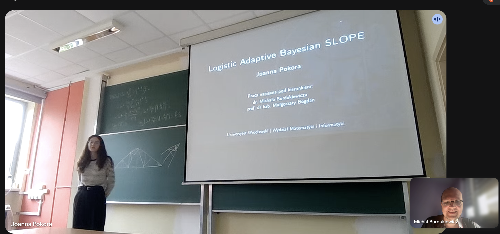

# Asia conquers the SLOPE and defends her MSc! 🎓📊🥳

Achievements

Team

Asia has successfully defended her MSc thesis at the University of Wrocław! 🎓📊 Her work brings Adaptive Bayesian SLOPE to binary classification, with Michał as co-supervisor and Krysia providing invaluable guidance along the way 💻🤝💚

Author

BioGenies Lab

Published

September 11, 2026

------------------------------------------------------------------------

🎉 **Another MSc milestone for BioGenies!** **Asia** has successfully defended her thesis, [**“Logistic Adaptive Bayesian SLOPE”**](../download_files/thesis/jp_msc.pdf), at the **University of Wrocław**! 🎓👏🌟

It might have been a challenging SLOPE to climb, but Asia has made it to the top 🔝 of this particular academic mountain 🧗‍♀️🏁😄

------------------------------------------------------------------------

# 🔎 Finding the signal in the noise

Biomedical datasets can contain far more measurements than samples, with many measurements carrying little useful information about the outcome. The challenge is not just making a prediction, it is working out **which variables actually matter**.

Asia’s work builds on **Adaptive Bayesian SLOPE**, a statistical method designed to select useful variables while estimating their effects. Her thesis extends it to **binary classification**: problems where the outcome belongs to one of two groups.

In everyday terms: moving from **“What numerical value should we expect?”** to **“Which of these two groups does this sample belong to?”** 📊🔍

------------------------------------------------------------------------

# 💻 From equations to working code

This was not just a theoretical exercise!️ Asia reworked the implementation into a **standalone C++ library with an R interface**, bringing the statistical method into software that researchers can use.

She also evaluated the logistic approach against **LASSO, SLOPE and spike-and-slab LASSO** using simulated datasets, examining prediction errors and the balance between finding real signals and selecting false positives.

Not just *“Does it run?”*, but *“What does it get right, and what might it miss?”* A very BioGenies approach to a machine learning project 😎

For the code-curious, the work is available through the [**slobe R package**](https://github.com/JoannaPokora/slobe) and the [**libslobe C++ library**](https://github.com/JoannaPokora/libslobe) 📦

------------------------------------------------------------------------

# 🤝 A special shout-out to Krysia

**Michał** co-supervised the thesis alongside **Prof. Małgorzata Bogdan**.

And a particularly big thank-you goes to **Krysia**, who was **the main person guiding and supporting Asia through the work**, helping her bring the thesis to completion 🧭💚👏

Her hands-on guidance deserves a proper place in this celebration. Good research needs good methods and good people in your corner! 💡🤝

------------------------------------------------------------------------

# 📸 One picture, plenty of pride

Our photo collection from the defence is rather compact: **one picture**. Our enthusiasm? Considerably less restrained 📷🥳

------------------------------------------------------------------------

# 💚 Congratulations, Asia!

A thesis defended, a challenging project completed. **Huge congratulations, Asia!** We’re proud of you and grateful to everyone who helped along the way. Here’s to new challenges, interesting datasets, and perhaps a slightly gentler SLOPE for the next few days! 🥳🏔️💚
