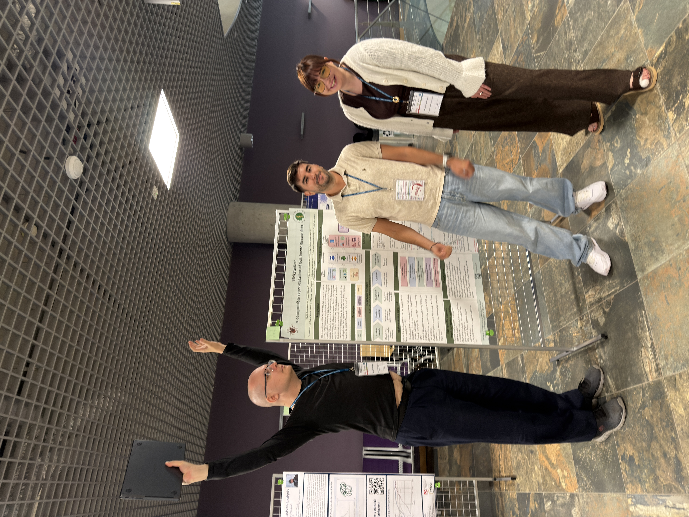
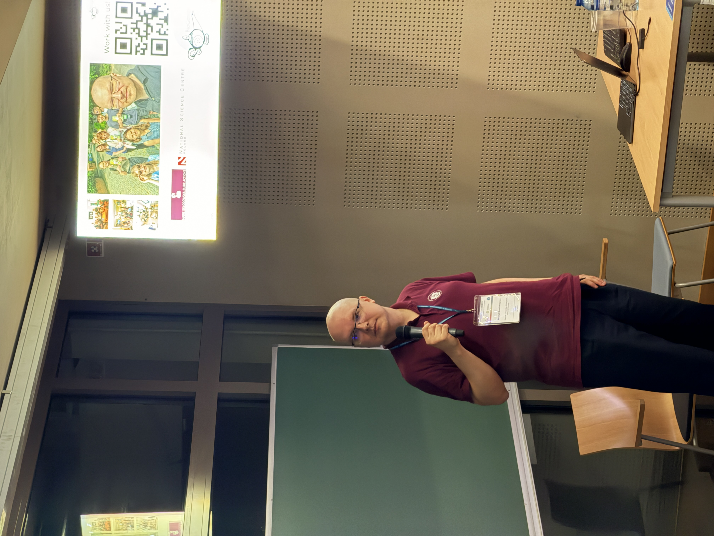
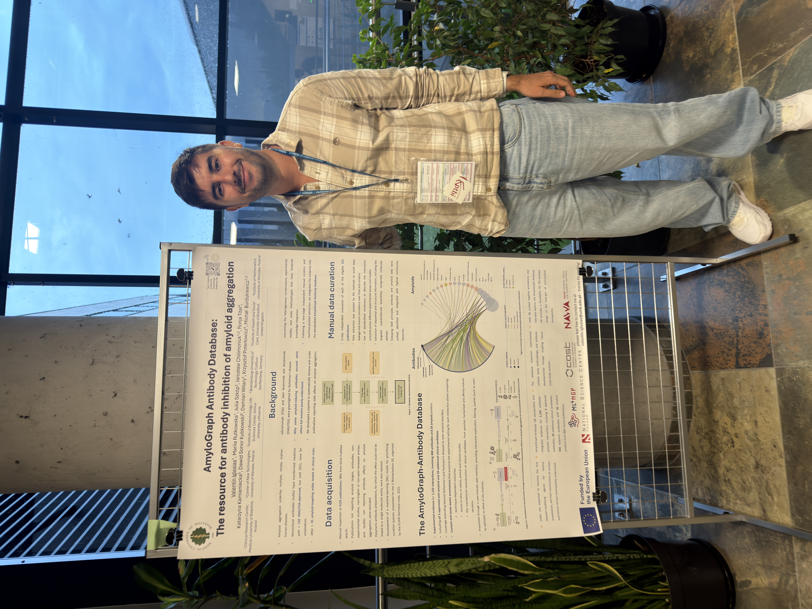
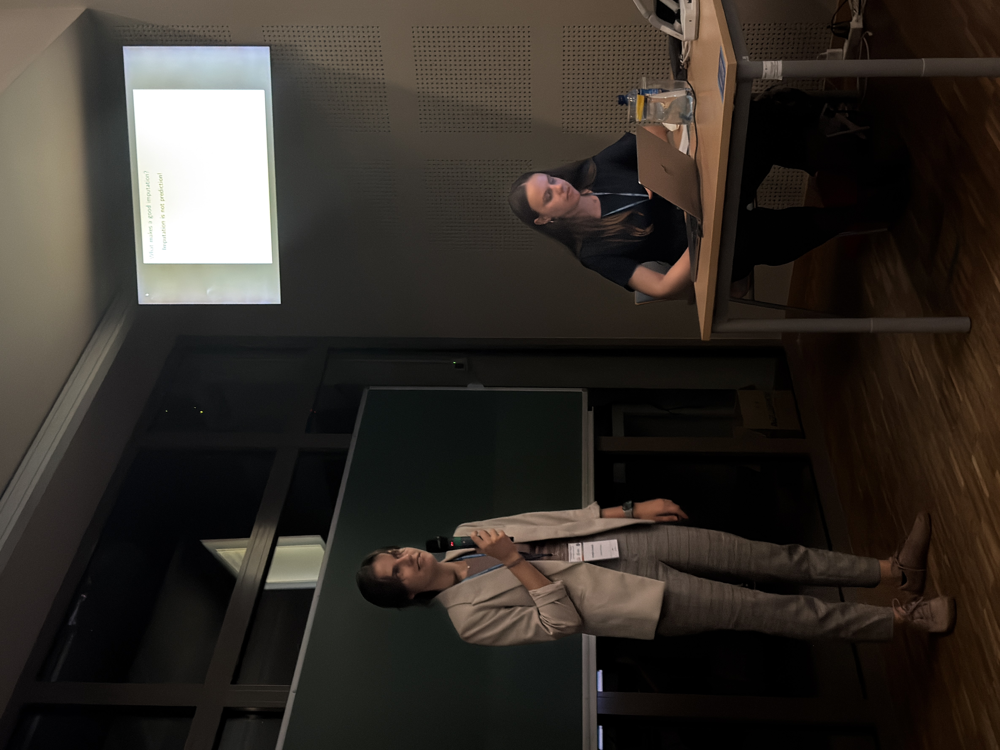
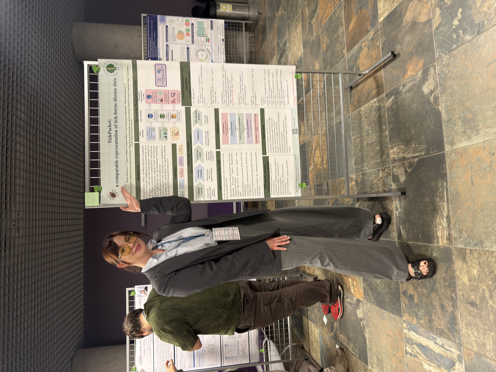
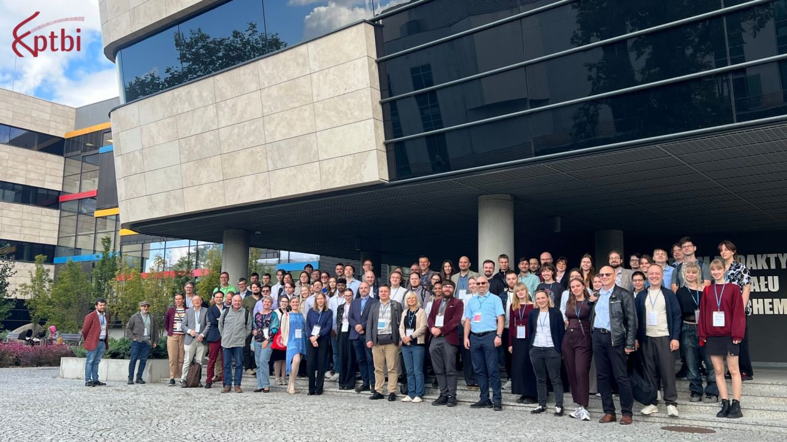

# BioGenies at PTBI 2026 in Poznań! 🧬🎤🇵🇱

Conferences & events

Poland

Michał, Krysia, Valen and Mariia represented BioGenies at PTBI 2026 in Poznań 🇵🇱🎤! From AI governance to amyloid–antibody interactions, imputation scoring and TickPacket. One talk, three flash presentations and plenty of poster science 🧬📊🕷.

Author

BioGenies Lab

Published

September 18, 2026

------------------------------------------------------------------------

🎉 **Another September, another PTBI meeting!** This time, **Michał, Krysia, Valen and Mariia** headed to **Poznań** for the [**XIX Symposium of the Polish Bioinformatics Society**](https://www.ptbi.org.pl/website/conferences/ptbiconf26/), held on **16–18 September 2026** at **Poznań University of Technology** 🇵🇱🏛️.

Our contribution? **One talk, three flash presentations and three posters**, covering AI governance, amyloid–antibody interactions, missing-value imputation and tick-borne disease data. Quite a range for a four-person delegation! 😎🧬📊

------------------------------------------------------------------------

# 🎤 Michał: algorithms meet governance

**Michał** gave a talk titled:

> **“European AI Act and biomedical data: more paperwork or more governance?”** 🤖⚖️

The title brought a different question to the bioinformatics stage: alongside developing and evaluating AI tools, how should their use with biomedical data be governed?

From algorithms and datasets to regulation and responsibility, without even changing conferences.

------------------------------------------------------------------------

# ⚡ Three flash talks, three posters

**Valen, Krysia and Mariia** each presented their work through a **flash talk and a poster** 🎙️🖼️.

The flash presentations offered a quick introduction; the posters provided room for the details. Because fitting a whole research project into a short presentation is practically a separate scientific discipline.

## 🧬 Valen: organising amyloid–antibody knowledge

> **“The AmyloGraph amyloid-antibody database: data acquisition, curation, extraction for amyloid-antibody interactions”**

His presentation focused on the work behind organising information about **amyloid–antibody interactions**. Acquiring the data, curating it and extracting the information needed for the database 🗂️🔍

A reminder that before researchers can explore a useful database, someone has to do the careful work of putting it together. The glamorous life of data curation! 📚🛠️

## 📊 Krysia: filling the gaps is only the beginning

> **“Iscores: proper scoring rules for evaluating missing-value imputation methods”**

Her topic tackled an important question: **after a method estimates the missing values in a dataset, how do we evaluate the quality of those estimates?** 🧩⚖️

**Iscores** provides tools for evaluating and comparing imputation methods using proper scoring rules. In other words, a dataset with no more `NA`s is not automatically a job well done. Someone still needs to check the homework!

## 🕷️ Mariia: TickPacket takes the stage

Introduced within the **OneTick** project, TickPacket focuses on **standardising data collection**, helping bring information about patients and their clinical histories into a consistent format 📋🔗.

Different research questions, one familiar challenge: making sure the data are organised before the analysis begins. A very BioGenies kind of problem! 🧬💚

------------------------------------------------------------------------

# 💚 Thank you, PTBI!

Huge thanks to the organisers and the PTBI community for bringing researchers together in Poznań! 🤝🇵🇱

And a big shout-out to **Michał, Krysia, Valen and Mariia** for representing BioGenies across talks, flash presentations and posters 🎤🖼️👏

**See you at the next PTBI meeting, with more questions, more projects and probably another presentation title that barely fits on a slide!** 😄📊🚀

