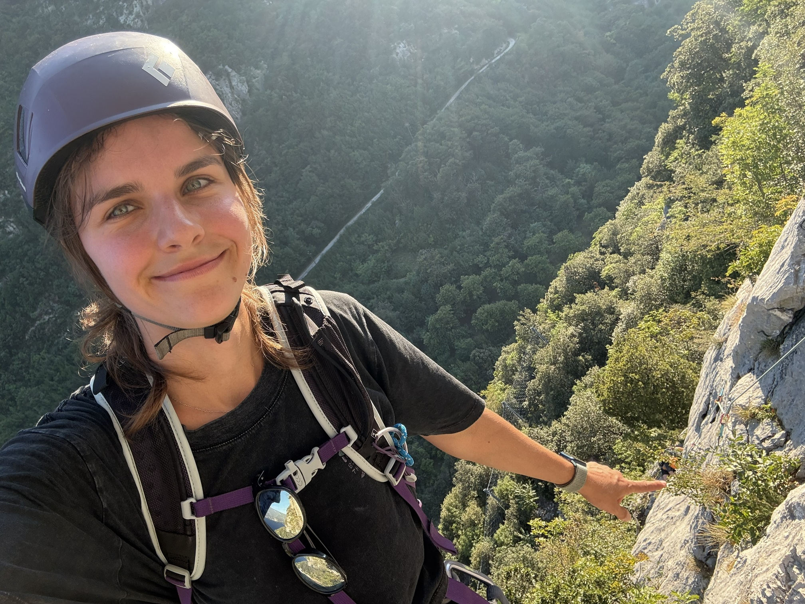

# Next stop, Geneva! Krysia is heading for a postdoc 🇨🇭🎓🚀

Team

Krysia will soon begin a postdoc at the University of Geneva, working with Jeffrey Näf! 🇨🇭📊 We’re celebrating her next scientific chapter, while trying to work out how to handle a Krysia-shaped missing value in our everyday lab life 🧩💚.

Author

BioGenies Lab

Published

September 21, 2026

------------------------------------------------------------------------

🎉 **Big news for Krysia!** 🥹💚

**Krysia** will soon start a **postdoctoral position at the University of Geneva**, where she will work with [**Prof. Jeffrey Näf**](https://www.unige.ch/gsem/en/research/faculty/all/jeffrey-naf), an assistant professor at the **University of Geneva** who completed his PhD in statistics at **ETH Zurich** 🎓🤝

His [research](https://jeffnaef.github.io/) focuses on **missing values, distributional prediction and robust estimation**, topics concerned with learning from incomplete data, understanding more than a single predicted outcome and developing methods that remain reliable when assumptions do not quite match reality.

With Krysia’s work on **evaluating missing value imputation methods**, including **Iscores**, there is plenty of scientific common ground 💻⚖️.

New countries, new office but missing values are not getting rid of her that easily 😄

------------------------------------------------------------------------

# 💚 More than the research

Krysia’s contribution to BioGenies goes beyond her own projects. It is also about **helping others move their research forward**, sharing knowledge and being there when a challenging project needs guidance. 🧭🤝

Most recently, she played a **central role in guiding and supporting Asia through her MSc work**, helping her bring the thesis to completion. 🎓👏 That kind of hands-on support deserves just as much appreciation as the code, analyses and presentations.

We’ll miss having her around, both for the science and for everything that makes working together more than just a collection of projects 🧬💬💚.

