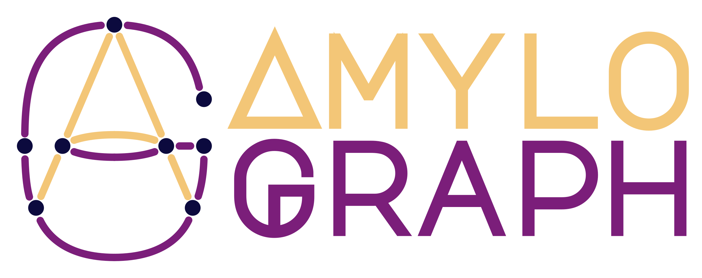

# Amyloids don’t aggregate alone 🤝🧬 Meet AmyloGraph

publications

amyloids

AmyloGraph is a curated database of experimentally validated amyloid–amyloid interactions, enabling systematic exploration of cross-seeding and aggregation modulation.

Author

BioGenies Lab

Published

October 16, 2023

Keywords

amyloids, protein aggregation, cross-seeding, AmyloGraph, database, bioinformatics, neurodegeneration

📌 **Project highlights**

- 🧬 First database of **amyloid–amyloid interactions**  
- 📊 Contains **883 experimentally validated interactions**  
- 📚 Curated from **~200 publications**  
- 🧠 Standardizes **cross-seeding, inhibition, co-aggregation**  
- 🚀 Available as **web server + R package**

------------------------------------------------------------------------

🎉 **New paper out!** This one tackles a *fundamental gap*:

👉 amyloids interacting with each other… but no structured data 😄

👉 [AmyloGraph: a comprehensive database of amyloid–amyloid interactions](https://doi.org/10.1093/nar/gkac882)

------------------------------------------------------------------------

# 🔗 Try it yourself

- [🌐 Web server](https://AmyloGraph.com/)  
- [💻 GitHub / R package](https://github.com/KotulskaLab/AmyloGraph)

👉 Explore the **amyloid interaction network directly**

------------------------------------------------------------------------

# 🎧 Audio summary

Amyloids don’t just aggregate…  
they **talk to each other, accelerate, inhibit, cross-seed** 😳

👉 Here’s a **short audio overview 🎧** explaining what AmyloGraph brings:

Your browser does not support the audio element.

👉 Perfect if you want the **big picture of amyloid cross-talk**

------------------------------------------------------------------------

# 🔬 What is this about?

Amyloids are typically studied as **individual aggregating proteins**

BUT in reality:

👉 they **interact with each other during aggregation**

These interactions can:

- ⚡ accelerate fibril formation  
- 🛑 inhibit aggregation  
- 🔀 create heterogeneous fibrils

👉 and may explain:

- Alzheimer’s + Parkinson’s overlap  
- prion-like propagation  
- complex disease mechanisms

------------------------------------------------------------------------

# ⚠️ The core problem

Before AmyloGraph:

- data scattered across **hundreds of papers**  
- inconsistent terminology  
- difficult to compare experiments

👉 even **contradictory conclusions**

There was:

❌ no centralized dataset  
❌ no standardized vocabulary  
❌ no way to model interactions

------------------------------------------------------------------------

# 🧠 What we built

👉 **AmyloGraph = curated database of amyloid–amyloid interactions**

------------------------------------------------------------------------

## 📊 Data scale

- **883 interactions**  
- **46 amyloid proteins**  
- **172 publications**

👉 all **experimentally validated**

------------------------------------------------------------------------

## ⚙️ Standardization (this is key)

AmyloGraph introduces **3 descriptors**:

1.  ⚡ Effect on aggregation speed  
2.  🤝 Physical binding evidence  
3.  🔀 Formation of mixed fibrils

👉 turning messy literature into **structured, comparable data**

------------------------------------------------------------------------

## 🔗 Graph-based representation

Data is presented as:

- nodes → amyloid proteins  
- edges → interactions

👉 forming an **amyloid interaction network**

------------------------------------------------------------------------

## 📊 Multiple views

- 🔗 graph (network exploration)  
- 📋 table (filter + download)  
- 🔍 single interaction (full details)

👉 usable both for:

- humans  
- ML pipelines

------------------------------------------------------------------------

# 📊 Key insights

## 🧬 Amyloids form a network

Aggregation is not isolated:

👉 proteins influence each other’s behavior

------------------------------------------------------------------------

## 🔀 Cross-talk is widespread

Interactions include:

- cross-seeding  
- inhibition  
- co-aggregation

👉 all encoded in a **standardized way**

------------------------------------------------------------------------

## ⚠️ Context matters

Results depend on:

- pH  
- concentration  
- experimental setup

👉 biology is messy (and the database reflects that)

------------------------------------------------------------------------

# 🚀 Why this matters

## 🧠 Disease understanding

Helps explain:

- overlapping neurodegenerative diseases  
- propagation of aggregation

------------------------------------------------------------------------

## 🤖 Machine learning & modeling

Finally enables:

- prediction of cross-interactions  
- tools like **PACT / AmyloComp** built on top

------------------------------------------------------------------------

## 💊 Therapeutic strategies

If we know:

👉 which amyloids interact

we can:

- block interactions  
- design inhibitors  
- target aggregation pathways

------------------------------------------------------------------------

# 💚 BioGenies perspective

This is a **foundational dataset paper** 🧱

👉 not flashy, but extremely powerful

# 📌 Publication metadata

- **Title:** AmyloGraph: a comprehensive database of amyloid–amyloid interactions  
- **Journal:** Nucleic Acids Research  
- **Year:** 2023  
- **DOI:** https://doi.org/10.1093/nar/gkac882  
- **Authors:** Michał Burdukiewicz, Dominik Rafacz, Agnieszka Barbach, Katarzyna Hubicka, Laura Bakała, Anna Lassota, Jakub Stecko, Natalia Szymańska, Jakub W. Wojciechowski, Dominika Kozakiewicz, Natalia Szulc, Jarosław Chilimoniuk, Izabela Jeśkowiak, Marlena Gąsior-Głogowska, Małgorzata Kotulska
- **Type:** Database + manual curation  
- **Domain:** amyloids / protein aggregation  
- **Focus:** interaction networks

------------------------------------------------------------------------

# 🏷️ Keywords

amyloids, protein aggregation, cross-seeding, amyloid interactions, neurodegeneration, database, bioinformatics, systems biology
