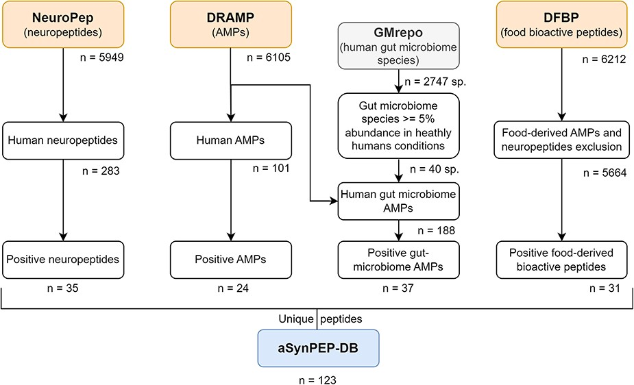
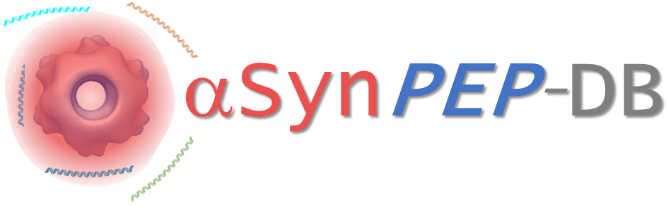

# aSynPEP-DB: mining peptides against Parkinson’s 🧬🧠

publications

peptides

A database of biogenic peptides predicted to inhibit α-synuclein aggregation, enabling peptide-based therapeutic discovery.

Author

BioGenies Lab

Published

November 27, 2023

Keywords

alpha-synuclein, Parkinson’s disease, peptides, database, bioinformatics, AMP, neuropeptides

------------------------------------------------------------------------

📌 **Project highlights**

- 🧠 Targets **α-synuclein aggregation (Parkinson’s hallmark)**  
- 🧬 Screens **neuropeptides, AMPs, microbiome + food peptides**  
- 🤖 Uses **physicochemical rules-based algorithm**  
- 📊 Identifies **123 candidate inhibitory peptides**  
- 🌐 Provides **interactive database + prediction tool**

------------------------------------------------------------------------

🎉 **New paper!**

👉 building a **peptide database to fight Parkinson’s**

👉 [aSynPEP-DB: a database of biogenic peptides for inhibiting α-synuclein aggregation](https://doi.org/10.1093/database/baad084)

# 🔗 Try it yourself

- [🌐 Database](https://asynpepdb.ppmclab.com/)

------------------------------------------------------------------------

# 🎧 Audio summary

What if your body already contains molecules  
that can slow Parkinson’s disease? 🤯

👉 This paper builds a **database to find them 🎧**

------------------------------------------------------------------------

# 🔬 What is this about?

Parkinson’s disease (PD) is driven by:

👉 aggregation of **α-synuclein (aSyn)** into toxic species

BUT:

- no therapies stop aggregation  
- designing molecules is hard  
- aSyn is **intrinsically disordered**

👉 difficult drug target

------------------------------------------------------------------------

💡 Key idea:

Some **natural peptides** can:

- bind toxic aSyn oligomers  
- block aggregation  
- reduce toxicity

👉 so… can we systematically find them?

------------------------------------------------------------------------

# ⚙️ The core concept

The study builds: 👉 **aSynPEP-DB**

A database of peptides predicted to: 👉 **inhibit α-synuclein aggregation**

------------------------------------------------------------------------

📊 It integrates:

- 🧠 human neuropeptides  
- 🦠 antimicrobial peptides (AMPs)  
- 🧫 gut microbiome peptides  
- 🥛 food-derived bioactive peptides

------------------------------------------------------------------------

# 🧠 The key insight

From prior experiments (e.g. LL-37):

👉 active peptides share **3 properties**:

- 🌀 α-helical structure  
- ⚖️ amphipathicity  
- ➕ positive net charge

These allow binding to 👉 **negatively charged, hydrophobic aSyn aggregates**

------------------------------------------------------------------------

# 🧩 What they did

## 🔍 Step 1: dataset collection

From multiple databases:

- NeuroPep (neuropeptides)  
- DRAMP (AMPs)  
- GMrepo (microbiome)  
- DFBP (food peptides)

👉 thousands of peptides screened

------------------------------------------------------------------------

## 🤖 Step 2: discriminative algorithm

Heuristic filtering based on:

- α-helical propensity (AGADIR)  
- amphipathicity (hydrophobic moment)  
- net charge

👉 also scans **sub-sequences (sliding window)**

------------------------------------------------------------------------

## 🧬 Step 3: candidate selection

👉 **123 unique peptides identified**

------------------------------------------------------------------------

## 🌐 Step 4: database construction

Each entry includes:

- sequence + inhibitory region  
- structure (AlphaFold)  
- toxicity prediction  
- BBB permeability  
- tissue expression

------------------------------------------------------------------------

# 🔍 Key results

## 🧬 A new peptide landscape

- 123 candidate inhibitors  
- spanning multiple biological sources

👉 many previously unexplored

------------------------------------------------------------------------

## 🧠 Biologically relevant hits

Examples include:

- **Neuropeptide Y (NPY)** → neuroprotective, brain-expressed  
- **BMAP-28** → antimicrobial + food-derived  
- **Lactoferricin-H** → immune-related peptide  
- **OR-7 (microbiome)** → gut-brain axis relevance

------------------------------------------------------------------------

## ⚠️ Most are NOT experimentally validated

👉 database = **hypothesis generator**

- only a few peptides (e.g. LL-37) validated  
- majority remain predictions

------------------------------------------------------------------------

# 💡 Key insight

👉 Nature already encodes peptides with:

- antimicrobial activity  
- anti-amyloid potential  
- immune modulation

👉 these functions may be **evolutionarily linked**

------------------------------------------------------------------------

# 🚀 Why this matters

## 🧠 New therapeutic strategy

Instead of small molecules:

👉 use **peptides to block aggregation**

- potentially safer  
- biologically compatible  
- target-specific

------------------------------------------------------------------------

## 🌍 Systems-level view

Combines:

- brain peptides  
- gut microbiome  
- diet

👉 connects **gut–brain axis + PD**

------------------------------------------------------------------------

## 🤖 Tool for discovery

The database includes:

👉 a **screening algorithm**

- test new peptides  
- design synthetic ones  
- expand datasets

------------------------------------------------------------------------

# 💚 BioGenies perspective

This paper is powerful because it:

👉 shifts from *prediction → infrastructure*

Instead of one model:

- builds a **resource**  
- encodes **biophysical rules**  
- enables **future discoveries**

# 📌 Publication metadata

- **Title:** aSynPEP-DB: a database of biogenic peptides for inhibiting α-synuclein aggregation  
- **Journal:** Database (Oxford)  
- **Year:** 2023  
- **DOI:** https://doi.org/10.1093/database/baad084  
- **Authors:** Carlos Pintado‐Grima, Oriol Bárcenas, Valentín Iglesias, Jaime Santos, Zoe Manglano-Artuñedo, Irantzu Pallarès, Michał Burdukiewicz, Salvador Ventura
- **Type:** Database + computational study  
- **Focus:** Peptide discovery for Parkinson’s

------------------------------------------------------------------------

# 🏷️ Keywords

alpha-synuclein, Parkinson’s disease, peptides, AMP, neuropeptides, microbiome, bioinformatics, database, aggregation inhibition
