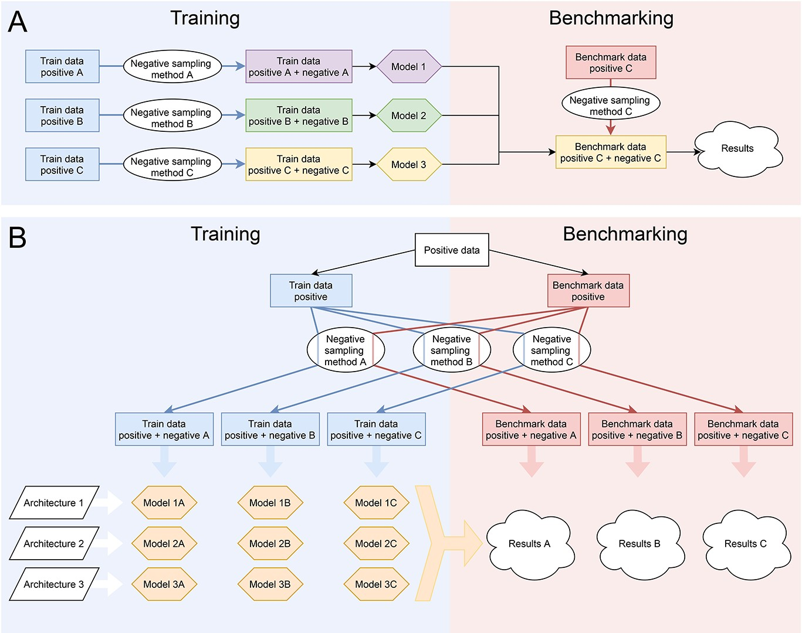

# Are AMP models lying to us? 🤖🧬 The benchmarking problem

publications

peptides

A large-scale study reveals that antimicrobial peptide predictors are heavily biased due to how negative datasets are constructed.

Author

BioGenies Lab

Published

September 1, 2022

Keywords

AMP, machine learning, benchmarking, negative dataset, bias, bioinformatics, reproducibility

📌 **Highlights**

- 🤖 Built **660 ML models across 12 architectures**  
- 🧪 Tested **11 negative sampling strategies**  
- ⚠️ Shows **benchmarking in AMP prediction is biased**  
- 📊 Performance depends on **dataset similarity (not model quality)**  
- 🌐 Introduces **AMPBenchmark for fair evaluation**

------------------------------------------------------------------------

🎉 **New paper out!** This one tackles a *very uncomfortable truth*:

👉 your “state-of-the-art” AMP model might just be lucky 😄

👉 [Benchmarks in antimicrobial peptide prediction are biased due to the selection of negative data](https://doi.org/10.1093/bib/bbac343)

------------------------------------------------------------------------

# 🔗 Try it yourself

- [🌐 Web server](http://BioGenies.info/AMPBenchmark)  
- [💻 GitHub](https://github.com/BioGenies/AMPBenchmark)

👉 finally, a way to **benchmark AMP models fairly**

------------------------------------------------------------------------

# 🎧 Audio summary

Many AMP predictors claim:

👉 “we outperform previous methods”

But… what if the benchmark itself is broken? 😅

👉 Here’s a **short audio overview 🎧** explaining the problem:

Your browser does not support the audio element.

👉 Perfect if you want the **big picture of ML bias in bioinformatics**

------------------------------------------------------------------------

# 🔬 What is this about?

Antimicrobial peptides (AMPs):

- 🧬 short bioactive peptides  
- 🦠 kill bacteria, viruses, cancer cells  
- 💊 promising alternative to antibiotics

👉 Because of that:

- dozens of **ML predictors** exist  
- each claiming **better performance**

💡 BUT:

👉 all of them depend on **training data**

especially:

👉 **negative data (non-AMPs)**

------------------------------------------------------------------------

# ⚠️ The core problem

There are:

- thousands of known AMPs ✅  
- almost **no confirmed non-AMPs** ❌

👉 so researchers:

- *generate artificial negatives*  
- using different **sampling strategies**

💥 Problem:

👉 these strategies create **very different datasets**

And ML models:

👉 learn dataset artifacts, not biology

------------------------------------------------------------------------

# 🧠 What they did

## 🧪 Massive benchmark

- **12 ML architectures**  
- **11 negative sampling methods**  
- **660 models total**

------------------------------------------------------------------------

## 🔁 Full cross-evaluation

Each model:

- trained on one dataset  
- tested on ALL others

👉 not just “friendly benchmarks”

------------------------------------------------------------------------

## 📊 Evaluation metric

- ROC curves  
- AUC scores

------------------------------------------------------------------------

# 🔍 Key results

## ⚠️ Benchmarking is biased

👉 Models perform best when:

- training set = benchmark set

📉 Performance drops when:

- datasets differ

👉 meaning:

**models don’t generalize, they memorize dataset structure**

------------------------------------------------------------------------

## 🧬 Dataset similarity drives performance

Strong correlations found between:

- amino acid composition similarity  
- sequence length similarity

and model performance

👉 not biology  
👉 just dataset artifacts

------------------------------------------------------------------------

## 🤖 Architecture matters… but less than you think

- Random Forest models performed best  
- Deep learning ≠ automatically better

👉 but dataset choice still dominates

------------------------------------------------------------------------

## 🔁 Reproducibility crisis 🚨

- ~70% models **not reproducible**  
- lack of code / data sharing

👉 slows down the field

------------------------------------------------------------------------

# 💡 Key insight

👉 We don’t actually know:

**which AMP model is the best**

Because:

- benchmarks are biased  
- comparisons are unfair  
- datasets are inconsistent

👉 “state-of-the-art” = often **dataset-specific**

------------------------------------------------------------------------

# 🚀 What we have built

## 🌐 AMPBenchmark

A platform for:

- fair model comparison  
- standardized datasets  
- reproducible evaluation

👉 similar idea to:

- Kaggle-style benchmarking

👉 solves:

- hidden bias  
- unfair comparisons  
- reproducibility issues

------------------------------------------------------------------------

# 🚀 Why this matters

## 🧠 For ML in biology

This is not just AMP problem:

👉 affects:

- protein function prediction  
- interaction prediction  
- genomics ML

------------------------------------------------------------------------

## ⚠️ For researchers

You should:

- question benchmarks  
- test cross-dataset generalization  
- avoid overfitting to dataset design

------------------------------------------------------------------------

## 💊 For drug discovery

Bad models =

👉 missed therapeutic candidates  
👉 false positives

------------------------------------------------------------------------

# 💚 BioGenies perspective

This paper is 🔥 because it says:

👉 “your model is not as good as you think”

And more importantly:

👉 shows **WHY**

# 📌 Publication metadata

- **Title:** Benchmarks in antimicrobial peptide prediction are biased due to the selection of negative data  
- **Journal:** Briefings in Bioinformatics  
- **Year:** 2022  
- **DOI:** https://doi.org/10.1093/bib/bbac343  
- **Authors:** Katarzyna Sidorczuk, Przemysław Gagat, Filip Pietluch, Jakub Kała, Dominik Rafacz, Laura Bąkała, Jadwiga Słowik, Rafał Kolenda, Stefan Rödiger, Legana C.H.W. Fingerhut, Ira R. Cooke, Paweł Mackiewicz, Michał Burdukiewicz
- **Type:** Benchmark + methodological study  
- **Domain:** machine learning / bioinformatics  
- **Focus:** dataset bias in AMP prediction

------------------------------------------------------------------------

# 🏷️ Keywords

antimicrobial peptides, machine learning, benchmarking, dataset bias, negative sampling, reproducibility, bioinformatics
