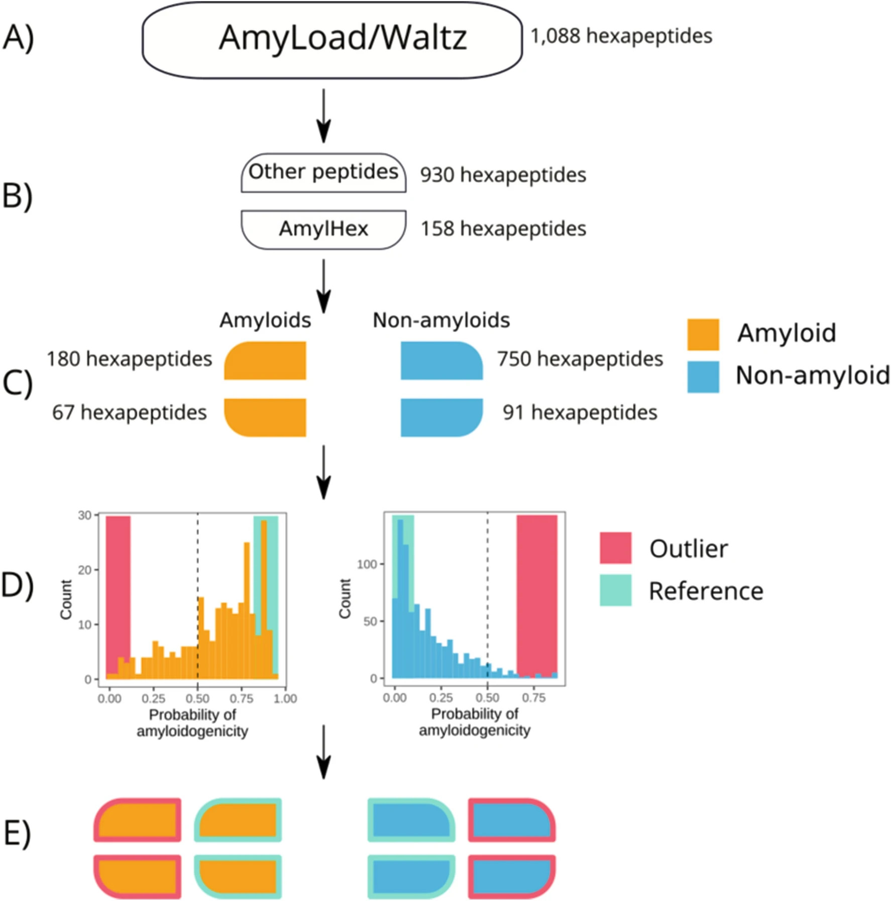

# Can ML predictors detect mislabeled amyloids? 🧠🧬

publications

amyloids

A fascinating study showing that amyloid prediction tools can identify misannotated training data, even when those wrong labels were part of the training set.

Author

BioGenies Lab

Published

April 26, 2021

Keywords

amyloid, AmyloGram, machine learning, bioinformatics, IR spectroscopy, AFM, weak supervision

------------------------------------------------------------------------

📌 **Project highlights**

- 🧬 Tests robustness of amyloid prediction tools  
- ⚠️ Investigates mislabeled experimental datasets  
- 🤖 AmyloGram successfully identifies annotation errors  
- 🔬 Combines ML with IR spectroscopy & AFM validation  
- 🧠 Demonstrates resilience to weak supervision

------------------------------------------------------------------------

🎉 **New paper out!**

What happens when the *training data itself is wrong*? 😅

👉 [Bioinformatics methods for identification of amyloidogenic peptides show robustness to misannotated training data](https://www.nature.com/articles/s41598-021-86530-6)

------------------------------------------------------------------------

# 🔗 Paper links

- 📄 [Nature Scientific Reports article](https://www.nature.com/articles/s41598-021-86530-6)  
- 🌐 [AmyloGram](http://www.smorfland.uni.wroc.pl/shiny/AmyloGram/)

------------------------------------------------------------------------

# 🎧 Audio summary

Machine learning models are only as good as their training data… right? 🤔

But what if:

- experiments disagree,
- databases contain annotation errors,
- and the model was trained on mislabeled sequences?

This paper tested exactly that.

Your browser does not support the audio element.

------------------------------------------------------------------------

# 🔬 What is this about?

Amyloid aggregation is central to diseases such as:

- Alzheimer’s disease  
- Parkinson’s disease  
- systemic amyloidoses

But identifying whether a peptide is amyloidogenic is difficult.

Researchers typically rely on:

- 🔬 AFM or electron microscopy  
- 🌈 Thioflavin T staining  
- 📈 infrared spectroscopy (IR)

------------------------------------------------------------------------

The problem?

👉 these methods do not always agree.

Especially for:

- oligomers,
- transient aggregates,
- partially aggregated peptides.

This can produce:

❌ mislabeled databases  
❌ noisy training sets  
❌ weak supervision problems

------------------------------------------------------------------------

# 🤖 The core question

Can machine learning models:

👉 detect errors in their own training data?

That’s a *very dangerous test* for overfitting 😄

------------------------------------------------------------------------

# 🧠 What we tested

The study analyzed:

- AmyloGram  
- PATH  
- FoldAmyloid  
- PASTA 2.0

We have selected:

- peptides strongly agreeing with database labels ✅  
- peptides strongly disagreeing with database labels ❌

and then re-tested them experimentally.

------------------------------------------------------------------------

# 🔬 Experimental validation

To verify peptide behavior, the team used:

## 🧪 IR spectroscopy

Two complementary IR methods:

- ATR-FTIR  
- IR microscopy

## 🔬 Atomic Force Microscopy (AFM)

Used for direct visualization of aggregates and fibrils.

------------------------------------------------------------------------

# 🧬 The cool part: oligomers

The paper highlights something very important:

👉 amyloid prediction is NOT binary.

There are at least 3 experimentally relevant classes:

- non-amyloid  
- oligomer  
- mature amyloid fibril

And oligomers are especially tricky because:

- they are often highly toxic,
- experimentally unstable,
- difficult to classify.

------------------------------------------------------------------------

# 📊 Key results

## ⚠️ Massive misannotation discovered

Among 24 experimentally tested “outlier” peptides:

- **17 were actually misannotated in databases**

That means:

👉 the ML model was often RIGHT  
👉 the database labels were WRONG 😅

------------------------------------------------------------------------

## 🤖 AmyloGram resisted overfitting

Even though those mislabeled peptides were:

👉 already present in the training set,

AmyloGram still identified many as suspicious.

This is a huge result.

It suggests:

🧠 ML models can sometimes act as *quality-control filters* for biological databases.

------------------------------------------------------------------------

# 📈 Spectroscopy + PCA worked beautifully

The paper also used:

- principal component analysis (PCA)
- on IR spectra

to separate:

- amyloids
- non-amyloids
- ambiguous oligomers

------------------------------------------------------------------------

# 🔬 Experimental insights

## 🧪 IR microscopy outperformed ATR-FTIR

The authors conclude that:

👉 IR microscopy was generally more reliable

because ATR-FTIR could be influenced by:

- water interactions
- sample thickness
- surface effects

------------------------------------------------------------------------

## 🧬 Oligomers complicate annotations

Some sequences behaved differently depending on the method used.

Example:

- SFLIFL formed oligomers but not mature fibrils

This explains why database labels may become inconsistent.

------------------------------------------------------------------------

# 🧠 Why this matters

## 📚 For machine learning

This paper is a great example of:

👉 weak supervision in biology.

The training labels are not absolute truth.

------------------------------------------------------------------------

## 🔬 For amyloid research

It shows that:

- experimental methods have biases
- annotation errors are common
- computational tools can help detect inconsistencies

------------------------------------------------------------------------

## 🚀 For bioinformatics pipelines

The work suggests that prediction tools can serve as:

- classifiers
- benchmarkers
- and dataset-cleaning systems

------------------------------------------------------------------------

# 💚 BioGenies perspective

This paper quietly delivers a *very deep message*:

👉 biological databases are messy.

And sometimes:

🤖 the model understands the biology better than the labels.

------------------------------------------------------------------------

# 📌 Publication metadata

- **Title:** Bioinformatics methods for identification of amyloidogenic peptides show robustness to misannotated training data  
- **Journal:** Scientific Reports  
- **Year:** 2021  
- **DOI:** https://doi.org/10.1038/s41598-021-86530-6  
- **Authors:** Natalia Szulc, Michał Burdukiewicz, Marlena Gąsior-Głogowska, Jakub W. Wojciechowski, Jarosław Chilimoniuk, Paweł Mackiewicz, Tomas Šneideris, Vytautas Smirnovas, Małgorzata Kotulska
- **Domain:** amyloid bioinformatics / machine learning  
- **Focus:** robustness of amyloid predictors to weak supervision

------------------------------------------------------------------------

# 🏷️ Keywords

amyloid, AmyloGram, machine learning, weak supervision, mislabeled data, IR spectroscopy, AFM, peptide aggregation, bioinformatics
