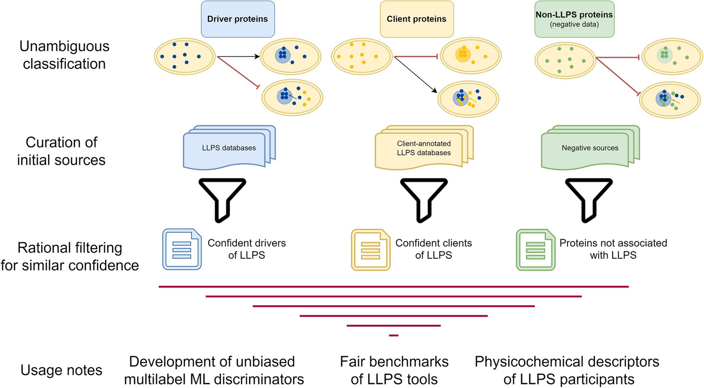

# LLPS datasets & benchmarking: bringing order to condensate chaos 🧬📊

publications

LLPS

We present curated datasets of proteins involved in liquid–liquid phase separation (LLPS), enabling robust benchmarking and improved machine learning predictions in condensate biology.

Author

BioGenies Lab

Published

July 9, 2025

Keywords

LLPS, liquid-liquid phase separation, biomolecular condensates, protein datasets, machine learning, bioinformatics, benchmarking

------------------------------------------------------------------------

📌 **Project highlights**

- 🧬 First **integrated datasets of LLPS proteins** (drivers, clients, negatives)  
- ⚖️ Introduces **standardized negative datasets** (structured + disordered proteins)  
- 📊 **Benchmark of 16 LLPS prediction tools** - the most comprehensive to date  
- 🧠 Reveals **limitations of current ML models** for phase separation  
- 🌐 Public resource: datasets + website for reproducible research

------------------------------------------------------------------------

🎉 **New paper out!** And this one is a big one, not just another tool, but a **foundation for the whole field** 😄

👉 [Comprehensive protein datasets and benchmarking for liquid–liquid phase separation studies](https://doi.org/10.1186/s13059-025-03668-6)

------------------------------------------------------------------------

# 🔗 Data & resources

This is not just a paper, it’s a **community resource** for building and benchmarking LLPS models.

- [🌐 Dataset website](https://llpsdatasets.ppmclab.com)  
- [💻 GitHub](https://github.com/PPMC-lab/llps-datasets)

------------------------------------------------------------------------

# 🎧 Audio summary

Not everyone wants to read about κ parameters and sticker–spacer distributions over coffee ☕😄

👉 We’ve attached a **short audio explanation 🎧** to make things easier.

Your browser does not support the audio element.

------------------------------------------------------------------------

# 🔬 What is this about?

**Liquid–liquid phase separation (LLPS)** is a process where proteins form **biomolecular condensates**, membrane-less compartments that organize cellular processes.

These condensates are crucial for:

- gene regulation  
- stress response  
- disease mechanisms (e.g. neurodegeneration)

But studying LLPS computationally has a major problem:

👉 **data is messy, inconsistent, and fragmented across databases**

------------------------------------------------------------------------

# 🚨 The problem we tackled

Existing LLPS databases:

- use **different definitions**  
- contain **inconsistent annotations**  
- lack **reliable negative examples**

👉 This makes:

- machine learning unreliable  
- benchmarking unfair  
- results hard to compare

------------------------------------------------------------------------

# 🧠 What we built

We created **high-confidence datasets of proteins involved in LLPS**, based on:

### 🧬 Protein roles

- **Drivers** → form condensates independently  
- **Clients** → join existing condensates  
- **Negatives** → proteins not associated with LLPS

👉 Importantly, we introduced **two types of negative datasets**:

- structured proteins (PDB-like)  
- disordered proteins (DisProt-like)

This is critical because: 👉 disorder alone ≠ LLPS (big source of bias!)

------------------------------------------------------------------------

# ⚙️ How it works

We used:

- 📚 **integration of multiple LLPS databases**  
- 🧹 **strict filtering criteria for data quality**  
- 🧬 annotation of:
  - disorder  
  - prion-like domains  
  - physicochemical features

Then we:

👉 analyzed protein properties  
👉 and benchmarked prediction tools

------------------------------------------------------------------------

# 📊 Benchmarking LLPS predictors

We evaluated **16 bioinformatics tools** on independent datasets.

## Key findings:

- 🤖 **ML-based tools perform best**  
- ⚠️ Many tools still have **high false positive rates**  
- 🧠 Models often confuse:
  - disorder  
  - with actual phase separation

👉 Translation: **we are still not great at predicting LLPS reliably** 😄

------------------------------------------------------------------------

# 🧬 Key biological insights

From the analysis:

- 🧩 LLPS is **multi-factorial**, not driven by a single feature  
- ⚡ properties like:
  - charge distribution  
  - aggregation propensity  
  - interaction regions  
    matter more than simple sequence features  
- 🧠 **drivers and clients are different**, but subtle

👉 And importantly: **you cannot model LLPS properly without good negative data**

------------------------------------------------------------------------

# 🚀 Why this matters

This work:

- 📊 sets a **new standard for benchmarking**  
- 🧠 improves **machine learning reliability**  
- 🔬 enables **better biological interpretation of condensates**

👉 In short: **we finally have a clean dataset to stop guessing and start learning properly**

------------------------------------------------------------------------

# 💚 BioGenies context

This project connects directly to our interests in:

- amyloids 🧬  
- protein aggregation 🧊  
- phase separation ⚡

👉 and gives us a **solid foundation for future tools and models**

# 📌 Publication metadata

- **Title:** Comprehensive protein datasets and benchmarking for liquid–liquid phase separation studies  
- **Journal:** Genome Biology  
- **Year:** 2025  
- **DOI:** https://doi.org/10.1186/s13059-025-03668-6
- **Authors:** Carlos Pintado‐Grima, Oriol Bárcenas, Eva Arribas-Ruiz, Valentín Iglesias, Michał Burdukiewicz, Salvador Ventura
- **Dataset size:** ~2,876 proteins  
- **Tool type:** dataset + benchmark  
- **Domain:** biomolecular condensates / LLPS  
- **Output:** curated datasets, benchmarking framework

------------------------------------------------------------------------

# 🏷️ Keywords

LLPS, liquid-liquid phase separation, biomolecular condensates, protein datasets, bioinformatics, machine learning, benchmarking, intrinsically disordered proteins, protein aggregation
