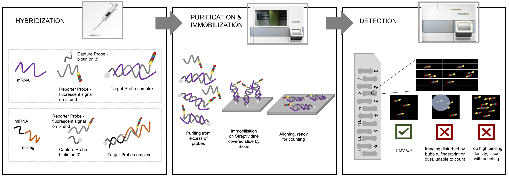

# NanoString nCounter data analysis: challenges, workflows & best practices 🧬📊

publications

A comprehensive review of NanoString nCounter data processing workflows, highlighting key steps, challenges and available bioinformatics tools for mRNA and miRNA analysis.

Author

BioGenies Lab

Published

April 30, 2024

Keywords

NanoString, nCounter, gene expression, mRNA, miRNA, bioinformatics, normalization, differential expression

------------------------------------------------------------------------

📌 **Project highlights**

- 🧬 Standardized **nCounter data analysis workflow (5 key steps)**  
- ⚙️ Review of **11 R packages + nSolver software**  
- 📊 Covers **QC, normalization, background correction, DE analysis**  
- ⚠️ Highlights **sources of noise and bias**  
- 🚀 Practical recommendations for **mRNA vs miRNA workflows**

------------------------------------------------------------------------

# 🔗 Explore the paper

🎉 **New review out!** This time we tackle something very practical:

👉 how to actually **analyze NanoString nCounter data properly** 😄

- 📚 Paper (open access): [Challenges and opportunities in processing NanoString nCounter data](https://doi.org/10.1016/j.csbj.2024.04.061)

👉 A must-read if you’ve ever wondered *“which pipeline should I even use?”*

------------------------------------------------------------------------

# 🎧 Audio summary

NanoString workflows, normalization strategies, and 11 different tools?  
Yeah… that can escalate quickly 😄

👉 Here’s a **short audio walkthrough 🎧** explaining what’s going on and what actually matters:

Your browser does not support the audio element.

👉 Perfect if you want the **practical overview before diving into pipelines**

------------------------------------------------------------------------

# 🔬 What is NanoString nCounter?

NanoString nCounter is a **medium-throughput gene expression technology** used for:

- mRNA analysis  
- miRNA profiling  
- clinical and low-quality samples

👉 Key advantage:

- ❌ **no amplification step** → less bias  
- ✅ works well on **low-quality samples** :

It sits somewhere between:

- qPCR (high sensitivity)  
- RNA-seq (high coverage)

------------------------------------------------------------------------

# ⚙️ The core problem

Despite its advantages:

👉 there is **no standard analysis pipeline**

This leads to:

- inconsistent results  
- difficult comparisons between studies  
- confusion about best practices

------------------------------------------------------------------------

# 🧠 What we did

We structured the entire workflow into **5 key steps**:

### 🧪 1. Pre-processing

### 🔍 2. Quality control (QC)

### 🧊 3. Background correction

### ⚖️ 4. Normalization

### 📊 5. Differential expression

👉 This provides a **common framework for comparing tools**

------------------------------------------------------------------------

# 📊 The workflow (big picture)

The *diagram on page 5* clearly shows how tools map to workflow steps:

👉 Not a single tool covers everything  
👉 nSolver covers most but still incomplete

➡️ Result: fragmented ecosystem

------------------------------------------------------------------------

# ⚙️ Tools we analyzed

We reviewed **11 R packages**, including:

- NanoTube  
- NanoStringNorm  
- NanoStringDiff  
- NACHO  
- nanoR

👉 Key observation:

- most tools cover only **subset of the pipeline**  
- very few support **full workflow integration**

------------------------------------------------------------------------

# ⚠️ Major sources of bias

nCounter data is affected by:

### 🔬 Technical variation

- batch effects  
- probe-specific background

### 🧬 Biological variation

- sample differences  
- RNA quality

### ⚖️ Normalization trade-offs

- removing bias may **increase noise**

👉 This is why preprocessing decisions matter so much

------------------------------------------------------------------------

# 🧪 Key steps explained

## 🔍 Quality control (QC)

Checks include:

- FOV (imaging quality)  
- binding density  
- positive/negative controls  
- limit of detection

👉 ensures data is **reliable before analysis**

------------------------------------------------------------------------

## 🧊 Background correction

Two main strategies:

- thresholding → keeps distribution  
- subtraction → shifts distribution

👉 Each has trade-offs (especially for low-expression genes)

------------------------------------------------------------------------

## ⚖️ Normalization

Critical step to remove technical variation:

- positive controls  
- housekeeping genes  
- spike-ins

👉 Different methods → different results

------------------------------------------------------------------------

## 📊 Differential expression

Common approaches:

- t-test  
- limma  
- negative binomial models  
- Bayesian methods

👉 choice depends on:

- data distribution  
- experimental design

------------------------------------------------------------------------

# 🧬 Key conclusions

- ⚠️ No **single best pipeline**  
- ⚙️ Workflow must be **carefully tailored**  
- 🧠 Data processing decisions strongly impact results  
- 🔬 Tool choice depends on:
  - mRNA vs miRNA  
  - experimental design  
  - available controls

👉 In short: **analysis matters as much as the experiment itself**

------------------------------------------------------------------------

# 🚀 Practical recommendations

- 🧬 Use **NanoTube** for mRNA (robust + GUI)  
- 🧠 Use **nSolver** for miRNA (ligation controls!)  
- ⚙️ Always:
  - perform QC first  
  - test normalization strategies  
  - validate results biologically

👉 No shortcuts here 😄

------------------------------------------------------------------------

# 💚 BioGenies perspective

This paper reinforces something we keep seeing:

👉 **data processing = hidden source of variability**

And more broadly:

- tools matter ⚙️  
- pipelines matter 📊  
- but understanding assumptions matters most 🧠

# 📌 Publication metadata

- **Title:** Challenges and opportunities in processing NanoString nCounter data  
- **Journal:** Computational and Structural Biotechnology Journal  
- **Year:** 2024  
- **DOI:** https://doi.org/10.1016/j.csbj.2024.04.061  
- **Authors:** Jarosław Chilimoniuk, Anna Erol, Stefan Rödiger, Michał Burdukiewicz  
- **Type:** Mini-review  
- **Domain:** transcriptomics / bioinformatics  
- **Focus:** data processing workflows

------------------------------------------------------------------------

# 🏷️ Keywords

NanoString, nCounter, gene expression, mRNA, miRNA, bioinformatics pipelines, normalization, differential expression, transcriptomics
